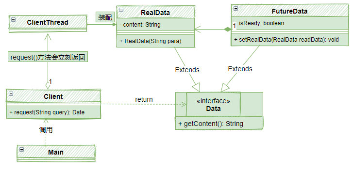
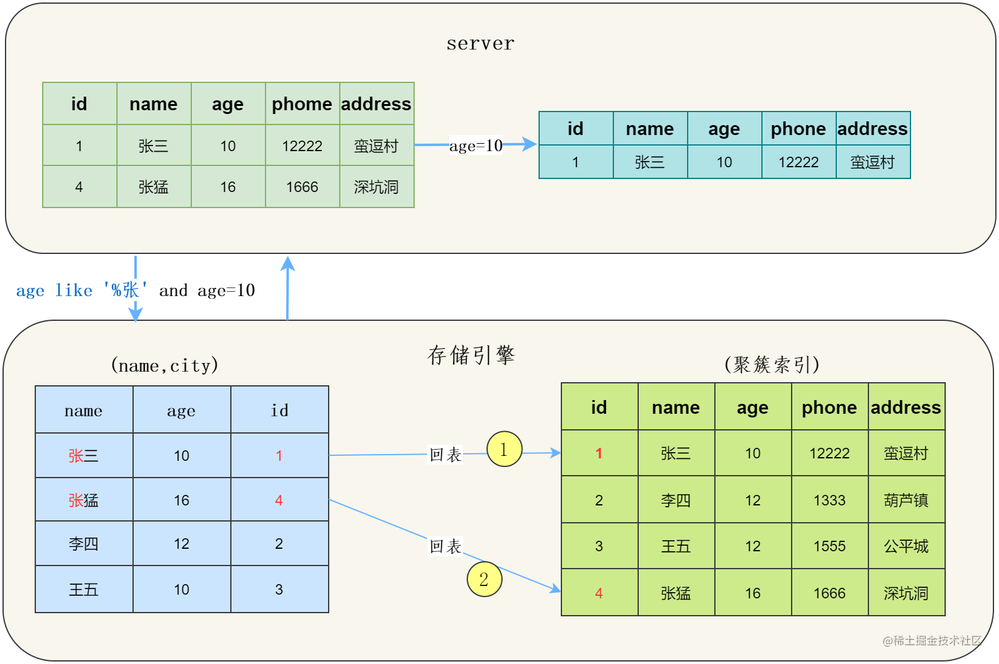
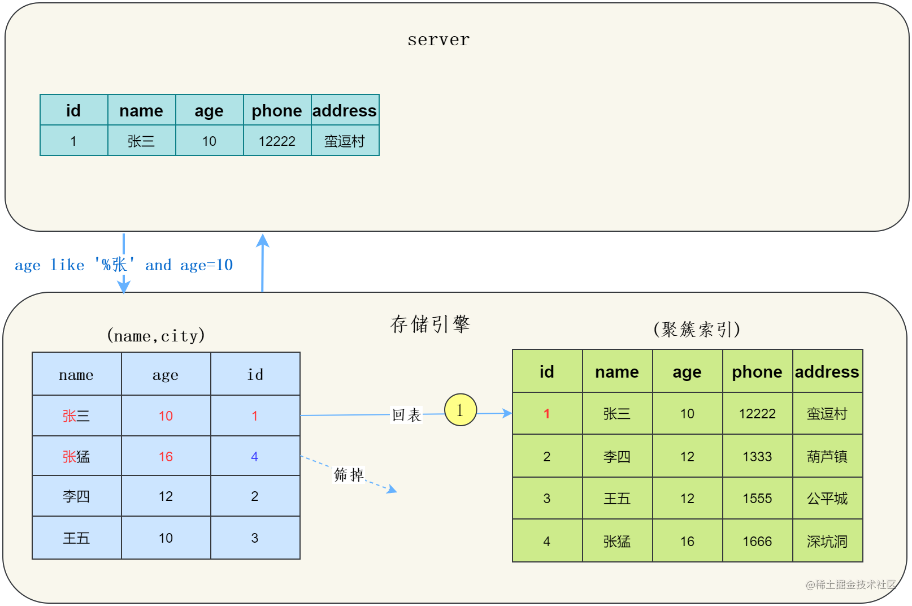
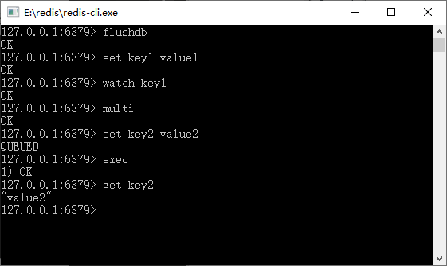
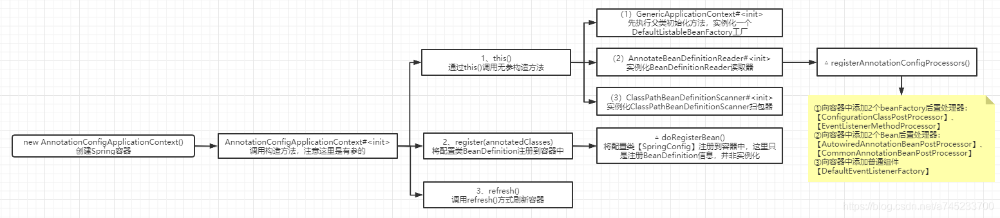

# Basic Knowledge

## 操作系统

### 进程和线程

 #### 数据模型


JDK1.8之前是方法区（永久代），JDK1.8之后是元空间。

永久代是方法区的具体实现，类似于接口和实现类。


**问：为什么要将永久代替换成元空间？**

永久代有固定的大小上限，无法进行调整，所以可能出现内存溢出的问题。而元空间使用的是直接内存，可以动态地区调整大小，不会出现内存溢出的问题。

另外，运行时常量池从JDK1.7之后从方法区移到了堆中，这也避免了内存溢出的问题。

**问：JVM三大调优参数 -Xms -Xmx -Xss的含义？**


**问：Java内存模型中堆和栈的区别？**

栈存储程序执行的临时数据。每个线程都有自己栈的程序指针。

堆存储应用数据，各种各样结构的数据。

程序运行时的内存分配策略：


**联系：**引用对象数组时，栈里定义变量，保存堆中目标的首地址。

**区别：**

1）管理方式：栈自动释放，堆需要GC

2）空间大小：栈比堆小

3）碎片相关：栈产生的碎片远小于堆

4）分配方式：栈支持静态和动态分配，而堆仅支持动态分配

5）效率：栈的效率比堆高

**问：不同JDK版本之间的intern()方法的区别？**

JKD1.6：当调用intern()方法时，如果字符串常量池先前已创建出该字符串对象，则返回池中的该字符串的引用。否则，将此字符对象添加到字符串常量池中，并且返回该字符串对象的引用。

JDK1.6+：当调用intern()方法时，如果字符串常量池先前已创建出该字符串对象，则返回池中的该字符串的引用。否则，如果该字符串对象已经存在于Java堆中，则将堆中对此对象的引用添加到字符串常量池中，并且返回该引用；如果堆中不存在，则在池中创建该字符串并返回其引用。

也就是说JDK1.6之前，intern()会将堆中的对象副本放入常量池（如果常量池没有），而JDK1.6+，可以将堆中对象的引用放入常量池。

note：String a = new String("a"),new出来的对象都会存在于堆中；String a = "a"，这种方式创建出来的字符串会直接存在常量池中。

##### 对象创建


###### 1. 拿到内存创建指令

当虚拟机遇到内存创建的指令的时候（new 类名），来到了方法区，根据new的参数在常量池中定位一个类的符号引用。

###### 2. 检查符号引用

检查该符号引用有没有被加载、解析和初始化过，如果没有则执行类加载过程，否则直接准备为新的对象分配内存

###### 3. 分配内存

虚拟机为对象分配内存（堆）分配内存分为指针碰撞和空闲列表两种方式；分配内存还要要保证并发安全，有两种方式。

###### 4. 初始化

1. 分配完内存后要对对象的头（Object Header）进行初始化，这些信息包括：该对象对应类的元数据、该对象的GC代、对象的哈希码。
2. 抽象数据类型默认初始化为null，基本数据类型为0，布尔为false....

###### 5. 调用对象的初始化方法

也就是执行构造方法。

##### 内存分配

- 指针碰撞：假设Java堆中内存是绝对规整的，所有被使用过的内存都被放在一边，空闲的内存被放在另一边，中间放着一个指针作为分界点的指示器，那所分配内存就仅仅是把那个指针向空闲空间方向挪动一段与对象大小相等的距离，这种分配方式称为“指针碰撞”。

- 空闲列表：如果Java堆中的内存并不是规整的，已被使用的内存和空闲的内存相互交错在一起，那就没有办法简单地进行指针碰撞了，虚拟机就必须维护一个列表，记录上哪些内存块是可用的，在分配的时候从列表中找到一块足够大的空间划分给对象实例，并更新列表上的记录，这种分配方式称为“空闲列表”。

  

  **安全性问题的思考**

  假如分配内存策略是指针碰撞，如果在高并发情况下，多个对象需要分配内存，如果不做处理，肯定会出现线程安全问题，导致一些对象分配不到空间等。

  下面是解决方案：

  - 线程同步策略

    也就是每个线程都进行同步，防止出现线程安全。

  - 本地线程分配缓冲

    也称TLAB（Thread Local Allocation Buffer），在堆中为每一个线程分配一小块独立的内存，这样以来就不存并发问题了，Java 层面与之对应的是 ThreadLocal 类的实现

##### 对象结构


##### 对象访问定位

- 通过句柄访问：栈上的reference数据存储对象的句柄地址，而句柄中包含了对象实例数据与类型数据各自具体的地址信息。
- 通过指针访问：reference中存储的直接就是对象地址，如果只是访问对象本身的话，就不需要多一次间接访问的开销。

#### 进程

进程是程序的一次执行过程，是程序运行的基本单位，比如任务管理器的每一个程序就是一个进程，而系统运行一个程序就是一个进程从创建、运行到消亡的过程。

##### 孤儿进程

一个父进程退出，而它的一个或多个子进程还在运行，那么那些子进程将成为孤儿进程。孤儿进程将被init进程(进程号为1)所收养，并由init进程对它们完成状态收集工作。

**孤儿进程是没有父进程的进程，孤儿进程这个重任就落到了init进程身上**，每当出现一个孤儿进程的时候，内核就把孤 儿进程的父进程设置为init，而init进程会循环地wait()它的已经退出的子进程。**因此孤儿进程并不会有什么危害。**

##### 僵尸进程

一个进程使用fork创建子进程，如果子进程退出，而父进程并没有调用wait或waitpid获取子进程的状态信息，那么子进程的进程描述符仍然保存在系统中。这种进程称之为僵尸进程。

**任何一个子进程(init除外)在exit()之后，并非马上就消失掉，而是留下一个称为僵尸进程(Zombie)的数据结构，等待父进程处理。**

unix提供了一种机制可以保证只要父进程想知道子进程结束时的状态信息，就可以得到。这种机制就是: 在每个进程退出的时候,内核释放该进程所有的资源,包括打开的文件,占用的内存等。 但是仍然为其保留一定的信息(包括进程号the process ID,退出状态the termination status of the process,运行时间the amount of CPU time taken by the process等)。直到父进程通过wait / waitpid来取时才释放。 但这样就导致了问题，**如果进程不调用wait / waitpid的话，** **那么保留的那段信息就不会释放，其进程号就会一直被占用，但是系统所能使用的进程号是有限的，如果大量的产生僵死进程，将因为没有可用的进程号而导致系统不能产生新的进程. 此即为僵尸进程的危害，应当避免。**

当我们寻求如何消灭系统中大量的僵死进程时，答案就是把产生大量僵死进程的那个元凶枪毙掉（也就是通过kill发送SIGTERM或者SIGKILL信号啦）。枪毙了元凶进程之后，它产生的僵死进程就变成了孤儿进程，这些孤儿进程会被init进程接管，init进程会wait()这些孤儿进程，释放它们占用的系统进程表中的资源，这样，这些已经僵死的孤儿进程 就能瞑目而去了。

#### 线程

线程是程序运行的最小单位，一个进程在执行过程中可以产生多个线程，比如QQ这个进程，它可以在聊天的时候打开QQ空间，这就是不同的线程在工作。另外，java程序就是天生的多线程程序，一个java程序的运行就是main线程和其他线程同时运行。

**由来：**


进程和线程的区别：

一个进程中可以有多个线程，多个线程共享进程的**堆**和**方法区 (JDK1.8 之后的元空间)资源，但是每个线程有自己的程序计数器**、**虚拟机栈** 和 **本地方法栈**。

**线程是进程划分成的更小的运行单位。线程和进程最大的不同在于基本上各进程是独立的，而各线程则不一定，因为同一进程中的线程极有可能会相互影响。线程执行开销小，但不利于资源的管理和保护；而进程正相反。**

##### 线程状态


##### 线程安全问题

###### 诱因

1）存在共享数据

2）存在一个以上的线程操作这些共享数据

###### 解决方法

统一时刻保证只有一个线程操作这些数据，其他线程必须等到该线程处理完数据后才能对这些共享数据进行操作。

###### Synchronized

互斥锁的特性：

1）互斥性：即在同一时间只允许一个线程持有某个对象锁，通过这种特性来实现多线程的协调机制。这样在同一时间只有一个线程对需要同步的代码块进行访问。互斥性也称为操作的原子性。

2）可见性：必须保证在锁被释放之前，对共享变量所作的修改，对随后获得该锁的另一个线程是可见的，否则另一个线程可能在本地缓存的某个副本上继续操作，从而引起不一致。

**Synchronized锁的不是代码，而是对象。**

根据锁的分类，可以分为对象锁和类锁。

获取对象锁的两种方法：

1）同步代码块（synchronized(this)，synchronized(类实例对象)，锁是()中的实例对象）

2）同步非静态方法（synchronized method），锁是当前对象的实例对象

**当锁同一个对象时，多个线程会互斥。**

**对象锁和类锁互不影响。**

获取类锁的两种方法：

1）同步代码块（synchronized(类.class)，锁是()中的类对象）

2）同步静态方法（synchronized static method，锁的当前对象是类对象）

**不管多少对象都共用同一把锁，同步执行，一个线程执行结束、其他的才能够调用同步的部分。**

**Synchronized如何保证可见性、有序性和可重入性？**

可见性：

- 线程加锁前，将清空工作内存中共享变量的值，从而使用共享变量时需要从主内存中重新读取最新的值。
- 线程加锁后，其它线程无法获取主内存中的共享变量。
- 线程解锁前，必须把共享变量的最新值刷新到主内存中。

有序性：Synchronized具有排他性，一次只能有一个线程执行，所以可以保证执行结果的有序性（但是无法保证执行指令的有序性，也就是不能保证指令是否重排序）。

可重入性：synchronized 锁对象有个计数器，会随着线程获取锁后 +1 计数，当线程执行完毕后 -1，直到清零释放锁。

**Synchronized的底层实现原理？**

1）同步**代码块**采用**monitorenter**、**monitorexit指令**显式的实现。

2）同步**方法**则使用**ACC_SYNCHRONIZED**标记符隐式的实现。

每一个对象都有一个monitor，一个monitor只能被一个线程拥有。

Synchronized锁是可重入锁，也就是同一个线程可以多次获得锁。

在 HotSpot 虚拟机中，对象在内存中的布局分为三块区域：对象头，实例数据和对齐填充。对象头中包含两部分：MarkWord 和 类型指针。如果是数组对象的话，对象头还有一部分是存储数组的长度。

- Mark Word 用于存储对象自身的运行时数据，如 HashCode、GC分代年龄、锁状态标志、线程持有的锁、偏向线程ID等等。占用内存大小与虚拟机位长一致（32位JVM -> MarkWord是32位，64位JVM -> MarkWord是64位）。
- 类型指针 虚拟机通过这个指针确定该对象是哪个类的实例。
- 对象头的长度

多线程下 synchronized 的加锁就是对同一个对象的对象头中的 MarkWord 中的变量进行CAS操作。

**优化后synchronized锁的分类：**

级别从低到高依次是（锁可以升级，但不能降级）：

1. 无锁状态

   | 25bit          | 4bit         | 1bit(是否是偏向锁) | 2bit(锁标志位) |
   | -------------- | ------------ | ------------------ | -------------- |
   | 对象的hashCode | 对象分代年龄 | 0                  | 01             |

2. 偏向锁状态

   | 23bit  | 2bit  | 4bit         | 1bit | 2bit |
   | ------ | ----- | ------------ | ---- | ---- |
   | 线程ID | epoch | 对象分代年龄 | 1    | 01   |

3. 轻量级锁状态

   | 30bit                  | 2bit |
   | ---------------------- | ---- |
   | 指向线程栈锁记录的指针 | 00   |

   这里指向栈帧中的 Lock Record 记录。

4. 重量级锁状态

   | 30bit              | 2bit |
   | ------------------ | ---- |
   | 指向锁监视器的指针 | 10   |

   这里指向了内存中对象的 ObjectMonitor 对象。

###### 偏向锁

jdk中偏向锁存在延迟4秒启动，也就是说一个对象在创建4秒后才会处于可偏向状态。

偏向锁的获取：

1. 偏向锁标志是未偏向状态，使用 CAS 将 MarkWord 中的线程ID设置为自己的线程ID，
   1. 如果成功，则获取偏向锁成功。
   2. 如果失败，则进行锁升级。
2. 偏向锁标志是已偏向状态
   1. MarkWord 中的线程 ID 是自己的线程 ID，成功获取锁
   2. MarkWord 中的线程 ID 不是自己的线程 ID，需要进行锁升级


偏向锁的撤销：

1. 对象是不可偏向状态
   1. 不需要撤销
2. 对象是可偏向状态
   1. MarkWord 中指向的线程不存活
      1. 允许重偏向：退回到可偏向但未偏向的状态
      2. 不允许重偏向：变为无锁状态
   2. MarkWord 中的线程存活
      1. 线程ID指向的线程仍然拥有锁
         1. 升级为轻量级锁，将 mark word 复制到线程栈中
      2. 不再拥有锁
         1. 允许重偏向：退回到可偏向但未偏向的状态
         2. 不允许重偏向：变为无锁状态


###### 轻量级锁

之所以是轻量级，是因为它仅仅使用 CAS 进行操作，实现获取锁。

轻量级锁的获取（线程结束后不会主动释放偏向锁，当出现偏向锁竞争时，等待全局进入安全点，然后挂起线程进行锁升级）：

如果线程发现对象头中Mark Word已经存在指向自己栈帧的指针，即线程已经获得轻量级锁，那么只需要将0存储在自己的栈帧中（此过程称为递归加锁）；在解锁的时候，如果发现锁记录的内容为0， 那么只需要移除栈帧中的锁记录即可，而不需要更新Mark Word。

线程尝试使用 CAS 将对象头中的 Mark Word 替换为指向锁记录（`Lock Record`）的指针， 如上图所示。如果成功，当前线程获得轻量级锁，如果失败，虚拟机先检查当前对象头的 Mark Word 是否指向当前线程的栈帧，如果指向，则说明当前线程已经拥有这个对象的锁，则可以直接进入同步块 执行操作，否则表示其他线程竞争锁，当前线程便尝试使用自旋来获取锁。当竞争线程的自旋次数达到界限值（`threshold`），轻量级锁将会膨胀为重量级锁。

轻量级锁的撤销：

轻量级锁解锁时，如果对象的Mark Word仍然指向着线程的锁记录，会使用CAS操作， 将Dispalced Mark Word替换到对象头，如果成功，则表示没有竞争发生。如果失败， 表示当前锁存在锁竞争，锁就会膨胀为重量级锁。

###### 重量级锁

重量级锁（`heavy weight lock`），是使用操作系统互斥量（`mutex`）来实现的传统锁。 当所有对锁的优化都失效时，将退回到重量级锁。它与轻量级锁不同的是竞争的线程不再通过自旋来竞争线程， 而是直接进入堵塞状态，此时不消耗CPU，然后等拥有锁的线程释放锁后，唤醒堵塞的线程， 然后线程再次竞争锁。但是注意，当锁膨胀（`inflate`）为重量锁时，就不能再退回到轻量级锁。

偏向锁适合一个线程对一个锁的多次获取的情况; 轻量级锁适合锁执行体比较简单(即减少锁粒度或时间), 自旋一会儿就可以成功获取锁的情况。

###### 自旋锁

1）许多情况下，共享数据的锁定状态持续时间极短，切换线程不值得。

2）通过让线程忙循环等待锁的释放，不让出CPU。

3）缺点：如果线程忙循环的时间过长，会浪费CPU性能。

因为由于自旋次数和自旋时间的不固定，为防止CPU性能的浪费，引入了自适应自旋锁。

###### 自适应自旋锁

1）自旋的次数不再固定。

2）由前一次在同一个锁上的自旋时间及锁的拥有者的状态来决定。

###### 锁消除

锁消除是指对于被检测出不可能存在竞争的共享数据的锁进行消除。

```
public static String concatString(String s1, String s2, String s3) {
  StringBuffer sb = new StringBuffer();
  sb.append(s1);
  sb.append(s2);
  sb.append(s3);
  return sb.toString();
}
```

append()操作是同步的，但是sb不可能被其他线程引用到，所以不必去加锁，jvm会自动进行锁消除处理。

###### 锁粗化

如果一系列的连续操作都对同一个对象反复加锁和解锁，频繁的加锁操作就会导致性能损耗。

```
public static String concatString(String s1) {
  StringBuffer sb = new StringBuffer();
  for(int i=0;i++;i<100){
      sb.append(s1);
  }
  return sb.toString();
}
```

如果JVM探测到由这样的一串零碎的操作都对同一个对象加锁，将会把加锁的范围扩展（粗化）到整个操作序列的外部。

**Synchronized的四种状态：无锁——>偏向锁——>轻量级锁——>重量级锁**


**偏向锁：**

大多数情况下，锁不存在多线程竞争，总是由同一线程多次获得。

如果一个线程获得了锁，那么锁就进入偏向模式，此时Mark Word的结构也变为了偏向锁结构，当该线程再次请求该锁时，无需再做任何同步操作，只需要检查Mark Word的锁标记位为偏向锁以及当前线程Id等于Mark Word的ThreadID即可，这样就省去了大量关于锁申请的操作。

**轻量级锁：**

轻量级锁是由偏向锁升级而来的，偏向锁运行在一个线程进入同步块的情况下，当第二个线程加入锁竞争的时候，偏向锁就会升级为轻量级锁。

适用场景：线程交替执行同步块。

若存在同一时间访问同一锁，就会导致轻量级锁升级为重量级锁。

**锁的区别：**


###### 对象锁和类锁


**CPU如何实现原子操作**

- **1）在硬件层面，CPU依靠总线加锁和缓存锁定机制来实现原子操作。**
  - 使用总线锁保证原子性。如果多个CPU同时对共享变量进行写操作（i++），通常无法得到期望的值。CPU使用总线锁来保证对共享变量写操作的原子性，当CPU在总线上输出LOCK信号时，其他CPU的请求将被阻塞住，于是该CPU可以独占共享内存。
  - 使用缓存锁保证原子性。频繁使用的内存地址的数据会缓存于CPU的cache中，那么原子操作只需在CPU内部执行即可，不需要锁住整个总线。缓存锁是指在内存中的数据如果被缓存于CPU的cache中，并且在LOCK操作期间被锁定，那么当它执行锁操作写回到内存时，CPU修改内部的内存地址，并允许它的缓存一致性来保证操作的原子性，因为缓存一致性机制会阻止同时修改由两个以上处理器 缓存的 内存区域数据。当其他CPU回写被锁定的cache行数据时候，会使cache行无效。

###### 死锁

死锁满足条件：

1、互斥等待   即要有锁  ——>  一般无法破除，因为保证多线程安全常常就需要加锁

2、hold and wait    抢到锁还在等待其他锁  ——>  一次性获取所有资源，拿到所有锁  *

3、循环等待    a等待b的锁、b等待a的锁  ——>  按顺序获取资源  

4、无法剥夺的等待    一直等待锁  ——>  加入超时

##### StampedLock

StampedLock是一种重入锁和读写锁的重要补充。它提供了一种乐观锁的策略，是一种与众不同的锁实现。StampedLock内部使用了大量的锁自旋。

使用StampedLock还需要特别注意两点：第一StampedLock不是可重入的；第二，StampedLock没有等待/通知机制。

##### AQS

Java 中的大部分同步类（Semaphore、ReentrantLock 等）都是基于 AbstractQueuedSynchronizer（简称为 AQS）实现的。AQS 是一种提供了原子式管理同步状态、阻塞和唤醒线程功能以及队列模型的简单框架。AQS 核心思想是，如果被请求的共享资源空闲，那么就将当前请求资源的线程设置为有效的工作线程，将共享资源设置为锁定状态；如果共享资源被占用，就需要一定的阻塞等待唤醒机制来保证锁分配。这个机制主要用的是 CLH 队列的变体实现的，将暂时获取不到锁的线程加入到队列中。

AQS是一个用于构建锁和同步器的框架，许多同步器都可以通过AQS很容易并且高效地构造出来。不仅ReentrantLock和Semaphore，还包括CountDownLatch、ReentrantReadWriteLock、SynchronousQueue和FutureTask，都是基于AQS构造的。

**AQS 定义两种资源共享方式**

- Exclusive（独占）：只有一个线程能执行，如ReentrantLock。又可分为公平锁和非公平锁：
  - 公平锁：按照线程在队列中的排队顺序，先到者先拿到锁
  - 非公平锁：当线程要获取锁时，无视队列顺序直接去抢锁，谁抢到就是谁的
- Share（共享）：多个线程可同时执行，如` CountDownLatch`、`Semaphore`、 `CyclicBarrier`、`ReadWriteLock`。

在并发环境下，加锁和解锁需要以下三个部件的协调：

1. 锁状态。我们要知道锁是不是被别的线程占有了，这个就是 state 的作用，它为 0 的时候代表没有线程占有锁，可以去争抢这个锁，用 CAS 将 state 设为 1，如果 CAS 成功，说明抢到了锁，这样其他线程就抢不到了，如果锁重入的话，state进行 +1 就可以，解锁就是减 1，直到 state 又变为 0，代表释放锁，所以 lock() 和 unlock() 必须要配对啊。然后唤醒等待队列中的第一个线程，让其来占有锁。
2. 线程的阻塞和解除阻塞。AQS 中采用了 LockSupport.park(thread) 来挂起线程，用 unpark 来唤醒线程。
3. 阻塞队列。因为争抢锁的线程可能很多，但是只能有一个线程拿到锁，其他的线程都必须等待，这个时候就需要一个 queue 来管理这些线程，AQS 用的是一个 FIFO 的队列，就是一个链表，每个 node 都持有后继节点的引用。AQS 采用了 CLH 锁的变体来实现。

state表示锁的状态，waitState表示下一个节点的状态。

waitState五种状态：

- cancelled(1):表示当前节点已取消调度。当timeout或者中断情况下，会触发变更为此状态，进入该状态后的节点不再变化
- signal(-1)，表示当前节点释放锁的时候，需要唤醒下一个节点。或者说后继节点在等待当前节点唤醒，后继节点入队时候，会将前驱节点更新给signal
- condition(-2)，当其他线程调用了condition的signal方法后，condition状态的节点会从等待队列转移到同步队列中，等待获取同步锁。
- propagate(-3),共享模式下，前驱节点不仅会唤醒其后继节点，同时也可能唤醒后继的后继节点。
- 0 ，新节点入队时候的默认状态。

**acquire方法流程：**

线程获取锁，如果获取了锁就 保存当前获得锁的线程，如果没获取就创造一个节点通过compareAndSetTail(CAS操作)操作的方式将创建的节点加入同步队列的尾部，在同步队列中的节点通过自旋的操作不断去获取同步状态【当然由于FIFO先进先出的特性】等待时间越长就越先被唤醒。当头节点释放同步状态的时候，首先查看是否存在后继节点，如果存在就唤醒自己的后继节点，如果不存在就获取等待时间最长的符合条件的线程。

**为什么 AQS 需要一个虚拟 head 节点？**

每个节点都必须设置前置节点的 ws 状态为 SIGNAL（-1），因为每个节点在休眠前，都需要将前置节点的 ws 设置成 SIGNAL。否则自己永远无法被唤醒，所以必须要一个前置节点，而这个前置节点，实际上就是当前持有锁的节点。
由于第一个节点他是没有前置节点的，就创建一个假的。
总结下来就是：每个节点都需要设置前置节点的 ws 状态（这个状态为是为了保证数据一致性），而第一个节点是没有前置节点的，所以需要创建一个虚拟节点。

###### ReentrantLock 


**synchronized 和 ReentrantLock 的区别**：

- 两者都是可重入锁

  ```
  **“可重入锁”** 指的是自己可以再次获取自己的内部锁。比如一个线程获得了某个对象的锁，此时这个对象锁还没有释放，当其再次想要获取这个对象的锁的时候还是可以获取的，如果是不可重入锁的话，就会造成死锁。同一个线程每次获取锁，锁的计数器都自增 1，所以要等到锁的计数器下降为 0 时才能释放锁。
  ```

- synchronized 依赖于 JVM 而 ReentrantLock 依赖于 API

  ```
  `synchronized` 是依赖于 JVM 实现的，前面我们也讲到了 虚拟机团队在 JDK1.6 为 `synchronized` 关键字进行了很多优化，但是这些优化都是在虚拟机层面实现的，并没有直接暴露给我们。`ReentrantLock` 是 JDK 层面实现的（也就是 API 层面，需要 lock() 和 unlock() 方法配合 try/finally 语句块来完成），所以我们可以通过查看它的源代码，来看它是如何实现的。
  ```

- ReentrantLock 比 synchronized 增加了一些高级功能

  ```
  相比`synchronized`，`ReentrantLock`增加了一些高级功能。主要来说主要有三点：
  - **等待可中断** : `ReentrantLock`提供了一种能够中断等待锁的线程的机制，通过 `lock.lockInterruptibly()` 来实现这个机制。也就是说正在等待的线程可以选择放弃等待，改为处理其他事情。
  - **可实现公平锁** : `ReentrantLock`可以指定是公平锁还是非公平锁。而`synchronized`只能是非公平锁。所谓的公平锁就是先等待的线程先获得锁。`ReentrantLock`默认情况是非公平的，可以通过 `ReentrantLock`类的`ReentrantLock(boolean fair)`构造方法来制定是否是公平的。
  - **可实现选择性通知（锁可以绑定多个条件）**: `synchronized`关键字与`wait()`和`notify()`/`notifyAll()`方法相结合可以实现等待/通知机制。`ReentrantLock`类当然也可以实现，但是需要借助于`Condition`接口与`newCondition()`方法。
  ```

###### 公平锁和非公平锁

公平锁和非公平锁只有两处不同：

1. 非公平锁在调用 lock 后，首先就会调用 CAS 进行一次抢锁，如果这个时候恰巧锁没有被占用，那么直接就获取到锁返回了。
2. 非公平锁在 CAS 失败后，和公平锁一样都会进入到 tryAcquire 方法，在 tryAcquire 方法中，如果发现锁这个时候被释放了（state == 0），非公平锁会直接 CAS 抢锁，但是公平锁会判断等待队列是否有线程处于等待状态，如果有则不去抢锁，乖乖排到后面。

公平锁和非公平锁就这两点区别，如果这两次 CAS 都不成功，那么后面非公平锁和公平锁是一样的，都要进入到阻塞队列等待唤醒。

相对来说，非公平锁会有更好的性能，因为它的吞吐量比较大。当然，非公平锁让获取锁的时间变得更加不确定，可能会导致在阻塞队列中的线程长期处于饥饿状态。

###### Condition

在使用 condition 时，必须先持有相应的锁。这个和 Object 类中的方法有相似的语义，需要先持有某个对象的监视器锁才可以执行 wait(), notify() 或 notifyAll() 方法。condition 是依赖于 ReentrantLock的，不管是调用 await 进入等待还是 signal 唤醒，**都必须获取到锁才能进行操作**。

```
	final Lock lock = new ReentrantLock();
    // condition 依赖于 lock 来产生
    final Condition notFull = lock.newCondition();
    final Condition notEmpty = lock.newCondition();
```


Condition处理流程：

1. 条件队列和阻塞队列的节点，都是 Node 的实例，因为条件队列的节点是需要转移到阻塞队列中去的；
2. 我们知道一个 ReentrantLock 实例可以通过多次调用 newCondition() 来产生多个 Condition 实例，这里对应 condition1 和 condition2。注意，ConditionObject 只有两个属性 firstWaiter 和 lastWaiter；
3. 每个 condition 有一个关联的**条件队列**，如线程 1 调用 `condition1.await()` 方法即可将当前线程 1 包装成 Node 后加入到条件队列中，然后阻塞在这里，不继续往下执行，条件队列是一个单向链表；
4. 调用`condition1.signal()` 触发一次唤醒，此时唤醒的是队头，会将condition1 对应的**条件队列**的 firstWaiter（队头） 移到**阻塞队列的队尾**，等待获取锁，获取锁后 await 方法才能返回，继续往下执行。

本来有个线程，它是排在条件队列的后面的，但是因为它被中断了，那么它会被唤醒，然后它发现自己不是被 signal 的那个，但是它会自己主动去进入到阻塞队列。**即使发生了中断，节点依然会转移到阻塞队列。**

超时await的思路还是很简单的，不带超时参数的 await 是 park，然后等待别人唤醒。而现在就是调用 parkNanos 方法来休眠指定的时间，醒来后判断是否 signal 调用了，调用了就是没有超时，否则就是超时了。超时的话，自己来进行转移到阻塞队列，然后抢锁。

如果我们要取消一个线程的排队，我们需要在另外一个线程中对其进行中断。比如某线程调用 lock() 老久不返回，我想中断它。一旦对其进行中断，此线程会从 `LockSupport.park(this);` 中唤醒，然后 `Thread.interrupted();` 返回 true。

interrupted 只是用来记录是否发生了中断，然后用于方法返回值，其他没有做任何相关事情。lock() 方法处理中断的方法就是，你中断归中断，我抢锁还是照样抢锁，几乎没关系，只是我抢到锁了以后，设置线程的中断状态而已，也不抛出任何异常出来。调用者获取锁后，可以去检查是否发生过中断，也可以不理会。

```
// Thread 类中的实例方法，持有线程实例引用即可检测线程中断状态
public boolean isInterrupted() {}

// Thread 中的静态方法，检测调用这个方法的线程是否已经中断
// 注意：这个方法返回中断状态的同时，会将此线程的中断状态重置为 false
// 所以，如果我们连续调用两次这个方法的话，第二次的返回值肯定就是 false 了
public static boolean interrupted() {}

// Thread 类中的实例方法，用于设置一个线程的中断状态为 true
public void interrupt() {}
```

###### InterruptedException 概述

它是一个特殊的异常，不是说 JVM 对其有特殊的处理，而是它的使用场景比较特殊。通常，我们可以看到，像 Object 中的 wait() 方法，ReentrantLock 中的 lockInterruptibly() 方法，Thread 中的 sleep() 方法等等，这些方法都带有 `throws InterruptedException`，我们通常称这些方法为阻塞方法（blocking method）。

阻塞方法一个很明显的特征是，它们需要花费比较长的时间（不是绝对的，只是说明时间不可控），还有它们的方法结束返回往往依赖于外部条件，如 wait 方法依赖于其他线程的 notify，lock 方法依赖于其他线程的 unlock等等。

当我们看到方法上带有 `throws InterruptedException` 时，我们就要知道，这个方法应该是阻塞方法，我们如果希望它能早点返回的话，我们往往可以通过中断来实现。 

除了几个特殊类（如 Object，Thread等）外，感知中断并提前返回是通过轮询中断状态来实现的。我们自己需要写可中断的方法的时候，就是通过在合适的时机（通常在循环的开始处）去判断线程的中断状态，然后做相应的操作（通常是方法直接返回或者抛出异常）。当然，我们也要看到，如果我们一次循环花的时间比较长的话，那么就需要比较长的时间才能**感知**到线程中断了。

##### CountDownLatch

```
public CountDownLatch(int count) {
    if (count < 0) throw new IllegalArgumentException("count < 0");
    this.sync = new Sync(count);
}
// 老套路了，内部封装一个 Sync 类继承自 AQS
private static final class Sync extends AbstractQueuedSynchronizer {
    Sync(int count) {
        // 这样就 state == count 了
        setState(count);
    }
    ...
}
```

AQS 里面的 state 是一个整数值，这边用一个 int count 参数其实初始化就是设置了这个值，所有调用了 await 方法的等待线程会挂起，然后有其他一些线程会做 state = state - 1 操作，当 state 减到 0 的同时，那个将 state 减为 0 的线程会负责唤醒 所有调用了 await 方法的线程。

CountDownLatch，需要关心两个方法，一个是 countDown() 方法，另一个是 await() 方法。

countDown() 方法每次调用都会将 state 减 1，直到 state 的值为 0；而 await 是一个阻塞方法，当 state 减为 0 的时候，await 方法才会返回。await 可以被多个线程调用，也就是：所有调用了 await 方法的线程阻塞在 AQS 的阻塞队列中，等待条件满足（state == 0），将线程从队列中一个个唤醒过来。

##### CyclicBarrier

CyclicBarrier 其实就是就是可重复的CountDownLatch。

CyclicBarrier 的源码实现和 CountDownLatch 大相径庭，CountDownLatch 基于 AQS 的共享模式的使用，而 CyclicBarrier 基于 Condition 来实现。


栅栏打破时机：

1. 中断，如果某个等待的线程发生了中断，那么会打破栅栏，同时抛出 InterruptedException 异常；
2. 超时，打破栅栏，同时抛出 TimeoutException 异常；
3. 指定执行的操作抛出了异常，这个我们前面也说过。

打破栅栏会唤醒等待的线程。

##### Semaphore

Semaphore 类似一个资源池（可以类比线程池），每个线程需要调用 acquire() 方法获取资源，然后才能执行，执行完后，需要 release 资源，让给其他的线程用。默认是非公平锁。

创建 Semaphore 实例的时候，需要一个参数 permits，这个基本上可以确定是设置给 AQS 的 state 的，然后每个线程调用 acquire 的时候，执行 state = state - 1，release 的时候执行 state = state + 1，当然，acquire  的时候，如果 state = 0，说明没有资源了，需要等待其他线程 release。

##### Phare

实现线程屏障的一种框架。可以通过它实现上述的类的能力。

##### CLH

尾部插入，头部删除。节点插入通过CAS操作。

##### 内存不一致

多个线程在某一相对时刻，对同一个数据读取到了不同的值。这是由于**CPU的分级缓存策略**以及**CPU指令重排**导致的。


可以通过volatile关键字解决；jdk1.9之后可以通个AtomicReference<T>解决 acquire/release，比volatile性能高，因为AtomicReference的指令重排约束比volatile更松弛，约束性更好。

###### happens-before

- 程序顺序规则：一个线程中的每个操作，happens-before于该线程中的任意后续操作。
- 监视器锁规则：对一个锁的解锁，happens-before于随后对这个锁的加锁。
- volatile变量规则：对一个volatile域的写，happens-before于任意后续对这个volatile域的读。
  传递性：如果A happens-before B，且B happens-before C，那么A happens-before C。
- start()规则：如果线程A执行操作ThreadB.start()（启动线程B），那么A线程的ThreadB.start()操作happens-before于线程B中的任意操作。
- join()规则：如果线程A执行操作ThreadB.join()并成功返回，那么线程B中的任意操作happens-before于线程A从ThreadB.join()操作成功返回。
- 程序中断规则：对线程interrupted()方法的调用先行于被中断线程的代码检测到中断时间的发生。
  对象finalize规则：一个对象的初始化完成（构造函数执行结束）先行于发生它的finalize()方法的开始。

**happens-before规则提供跨线程的内存可见性保证**，让JMM不会对指令重排序（这里的重排序指的是会对结果造成影响的重排序，如果重排序并不会影响程序的正常执行结果，那么重排序就是合法的）。

##### 读写锁

Java读写锁，也就是`ReentrantReadWriteLock`，其包含了读锁和写锁，其中读锁是可以多线程共享的，即共享锁，而写锁是排他锁，在更改时候不允许其他线程操作。读写锁底层是同一把锁（基于同一个AQS），所以会有同一时刻不允许读写锁共存的限制。

对于读写锁来说，如果已加读锁，写锁会阻塞；如果已加写锁，读锁会阻塞。

##### LockSupport

LockSupport使用park()和unpark()来挂起和唤醒线程，LockSupport很类似于二元信号量(**只有1个许可证**可供使用)，如果这个许可还没有被占用，当前线程获取许可并继续执行；如果许可已经被占用，当前线程阻塞，等待获取许可。**许可证默认是被占用的。**

**LockSupport是不可重入**的，如果一个线程连续2次调用LockSupport.park()，那么该线程一定会一直阻塞下去。

**线程如果因为调用park而阻塞的话，能够响应中断请求(中断状态被设置成true)，但是不会抛出InterruptedException**。

LockSuport主要是针对Thread进进行阻塞处理，可以指定阻塞队列的目标对象，每次可以指定具体的线程唤醒。Object.wait()是以对象为纬度，阻塞当前的线程和唤醒单个(随机)或者所有线程。

##### 线程和进程区别

一个进程拥有多个线程、堆和方法区。

一个线程拥有虚拟机栈、本地方法栈和程序计数器。（虚拟机栈就是线程执行java方法的的内存模型，本地方法栈是线程执行本地方法的内存模型）

总结：进程是程序运行的基本单位，线程是程序运行的最小单位；多个进程之间相互隔离，互不影响，而一个进程中的多个线程共享进程的堆和方法区，之间可能会相互影响；线程执行开销小，易相互切换，但是不利于资源的管理，进程则相反。

程序计数器为什么是私有的？

程序计数器的作用：1、控制代码的执行流程  2、记录当前线程的执行位置

程序计数器的私有主要是为了线程切换后能恢复到原来正确的执行位置。

虚拟机栈和本地方法栈为什么私有？

每个java方法或者本地方法执行的时候都会创建一个栈帧用于存储局部变量表、操作数栈、常量池引用等信息，所以为了保证线程中的局部变量不被其他线程访问到，所以都是私有的。

堆和方法区：

堆和方法区是所有线程共享的区域，堆是进程中最大的一块儿内存，主要存放新创建的对象（所有对象都在这里分配内存），方法区存放的是已经被加载的类信息、常量、静态变量、编译器编译后的代码等。

**问：start()和run()方法的区别？**

1）调用start()方法会创建一个新的子线程并启动。

2）run()方法只是一个Thread的一个普通方法的调用，还是在主线程执行。

**问：	Thread和Runnable是什么关系?**

1）Thread是实现了Runnable接口的类，使得run支持多线程。

2）因类的单一继承原则，推荐多使用Runnable接口

**问：如何处理线程的返回值？**

1）主线程等待法：让主线程休眠一段时间

2）使用Thread类的join()方法阻塞当前线程以等待子线程处理完毕 

eg：t.join() 等待t线程执行完毕后再执行

3）通过Callable接口实现：通过Feature task或者线程池获取

Feature task：isDone()和get()

```
FutureTask<String> futureTask = new FutureTask<String>(new MyCallable());
        new Thread(futureTask).start();
        if (!futureTask.isDone()){
            System.out.println("task is not done");
        }
        System.out.println("task return " + futureTask.get());
```

**问：sleep()和wait()的区别？**

1）sleep()是Thread类的方法，wait()是object类的方法

2）sleep()可以在任何地方使用，wait()只能在synchronized()或者synchronized块中使用

3）sleep()仅让出cpu时间片，并不会释放锁；wait()既让出cpu时间片，并且释放锁

**问：notify()和notifyAll()的区别？**

notify()会唤醒等待池的某一个线程（随机线程），notifyAll()会唤醒等待池中的所有线程。

唤醒线程的意思就是让线程重新执行run()方法的内容。

锁池和等待池：

争夺锁的线程会被放置在锁池；释放了锁的线程会被放在等待池

**问：什么是yield()？**

当调用Thread.yield()时，会给线程调度器一个当前线程愿意让出CPU时间片的暗示，但是线程调度器可能会忽视这个暗示。

**问：如何中断线程？**

调用interrupt()，通知线程应该中断了。

1）如果线程正处于被阻塞状态，那么线程立即退出阻塞状态，并抛出一个InterruptedException异常。

2）如果线程处在正常活动状态，那么会将该线程的中断标志设置为true。被设置中断标志的线程将继续运行，不受影响。

interrupt()需要线程自身配合使用，线程自身经常检查本线程的中断标志，如果检查到中断标志为true，那就自动停止线程。

**问：保证多线程顺序执行的几种方法？**

- 在子线程中通过join()方法指定顺序。
- 在主线程中通过join()方法指定顺序。
- 通过倒数计时器CountDownLatch实现。
- 通过创建单一化线程池newSingleThreadExecutor()实现。

**问：Java如何统计多线程执行完毕后的总耗时(CountDownLatch)？**

CountDownLatch简称：闭锁、倒计时锁

主要使用的是两个方法：await()、countDown()

await()：会阻塞所有调用了该方法的线程，当CountDownLatch的计数器为0时才放行

countDown()：会使CountDownLatch的计数器减1

**问：如何将一个任务拆分成多个子任务执行，最后合并结果？**

Fork/Join 它可以将一个大的任务拆分成多个子任务进行并行处理，最后将子任务结果合并成最后的计算结果，并进行输出。Fork/Join 框架要完成两件事情：

Fork：把一个复杂任务进行分拆，大事化小。
Join：把分拆任务的结果进行合并。

ForkJoinTask:我们要使用 Fork/Join 框架，首先需要创建一个 ForkJoin 任务。该类提供了在任务中执行 fork 和 join 的机制。通常情况下我们不需要直接集成 ForkJoinTask 类，只需要继承它的子类，Fork/Join 框架提供了两个子类：

RecursiveAction：用于没有返回结果的任务。
RecursiveTask：用于有返回结果的任务。
ForkJoinPool：ForkJoinTask 需要通过ForkJoinPool 来执行。

RecursiveTask: 继承后可以实现递归(自己调自己)调用的任务。

```
import java.util.concurrent.RecursiveTask;
/**
* 递归累加
*/
public class TaskExample extends RecursiveTask<Long> {
          private int start;
          private int end;
          private long sum;

         public TaskExample(int start, int end){
                  this.start = start;
                  this.end = end;
          }

        protected Long compute() {
             System.out.println("任务" + start + "=========" + end + "累加开始");
            //大于 100 个数相加切分,小于直接加
            if(end - start <= 100){
                  for (int i = start; i <= end; i++) {
                         //累加
                        sum += i;
                 }
           }else {
               //切分为 2 块
             int middle = start + 100;
            //递归调用,切分为 2 个小任务
            TaskExample taskExample1 = new TaskExample(start, middle);
            TaskExample taskExample2 = new TaskExample(middle + 1, end);
             //执行:异步
            taskExample1.fork();
            taskExample2.fork();
            //同步阻塞获取执行结果
            sum = taskExample1.join() + taskExample2.join();
           }
               //加完返回
             return sum;
        }
  }

import java.util.concurrent.ForkJoinPool;
import java.util.concurrent.ForkJoinTask;
/**
* 分支合并案例
*/public class ForkJoinPoolDemo {
 /**
 * 生成一个计算任务，计算 1+2+3.........+1000
 * @param args
 */
         public static void main(String[] args) {
                      //定义任务
                       TaskExample taskExample = new TaskExample(1, 1000);
                       //定义执行对象
                       ForkJoinPool forkJoinPool = new ForkJoinPool();
                       //加入任务执行
                       ForkJoinTask<Long> result = forkJoinPool.submit(taskExample);
                       //输出结果
                       try {
                           System.out.println(result.get());
                        }catch (Exception e){
                           e.printStackTrace();
                       }finally {
                           forkJoinPool.shutdown();
                       }
            }
    }
```

**两个线程如何进行数据交换？**

 使用到的是Exchanger<V>类，在java.util.concurrent包中。使用的时候需要指定交换的类型。
 调用Exchanger类对象的exchange(V x)方法，两个线程都传入要交换的数据 v 。
 使用该类是两个线程都调用了exchange(V v)方法才能交换。
 如果只有一个线程调用了exchange(V v)，程序会一直等待。

```
public class Test {
    public static void main(String[] args) {
        Exchanger<Integer> change= new Exchanger<>();
        new Thread(new Runnable() {
            @Override
            public void run() {
                Thread.currentThread().setName("线程1");
                try{
                    Integer t = 1;
                    t = change.exchange(t);
                    System.out.println( Thread.currentThread().getName()+" t = " +t);
                }catch (Exception e){
                }
            }
        }).start();

        new Thread(new Runnable() {
            @Override
            public void run() {
                Thread.currentThread().setName("线程2");
                try{
                    Integer t = 5;
                    t = change.exchange(t);
                    System.out.println( Thread.currentThread().getName() +" t = " +t);
                }catch(Exception e){
                }
            }
        }).start();
    }
}
```

#### JMM

主内存：

1）存储Java实例对象

2）包括成员变量，类信息，常量，静态变量等

3）属于数据共享的区域，多线程并发操作时会引发线程安全问题

工作内存：

1）存储当前方法的所有本地变量信息，本地变量对其他线程不可见

2）字节码行号指示器、Native方法信息

3）属于线程私有数据区域，不存在线程安全问题


在当前的 Java 内存模型下，线程可以把变量保存**本地内存**（比如机器的寄存器）中，而不是直接在主存中进行读写。这就可能造成一个线程在主存中修改了一个变量的值，而另外一个线程还继续使用它在寄存器中的变量值的拷贝，造成**数据的不一致**。

##### 并发编程的三个重要特性

1. **原子性** : 一次操作或者多次操作，要么所有的操作全部都得到执行并且不会受到任何因素的干扰而中断，要么都不执行。`synchronized` 可以保证代码片段的原子性。
2. **可见性** ：当一个线程对共享变量进行了修改，那么另外的线程都是立即可以看到修改后的最新值。`volatile` 关键字可以保证共享变量的可见性。
3. **有序性** ：代码在执行的过程中的先后顺序，Java 在编译器以及运行期间的优化，代码的执行顺序未必就是编写代码时候的顺序。`volatile` 关键字可以禁止指令进行重排序优化。

##### volatile

JVM提供的轻量级同步机制

1）保证被volatile修饰的共享变量对所有线程总是可见的

2）禁止指令重排序优化


**volatile变量为何是立即可见的？**

当写一个volatile变量时，JMM会把该线程对应的工作内存中的共享变量值刷新到主内存中；当读一个volatile变量时，JMM会把该线程对应的工作内存置为无效，只能从主内存读。

**volatile变量如何禁止指令重排序优化？**

通过插入内存屏障指令禁止在内存屏障前后的指令执行重排序优化。

`volatile`在字节码层面，就是使用访问标志：**ACC_VOLATILE**来表示，供后续操作此变量时判断访问标志是否为ACC_VOLATILE，来决定是否遵循volatile的语义处理。volatile的语义处理也就是插入内存屏障（汇编层面就是通过lock指令）。

Intel对lock前缀的说明如下：

- 1）确保对内存的读-改-写操作原子执行（基于总线锁或缓存锁）
- 2）禁止该指令，与 之前 和 之后 的读写指令重排序
- 3）把写缓冲区中的所有数据刷新到内存中。

内存屏障：1）保证特定操作的执行顺序；2）保证某些变量的内存可见性；

重排序：

- 1、编译优化重排序。编译器在不改变单线程程序语义的前提下，可以重新安排语句执行顺序。
- 2、指令级并行的重排序。CPU采用了指令级并行技术将多条指令重叠执行。
- 3、内存系统的重排序。由于CPU使用cache和读/写缓冲区，因此加载和存储操作可能在乱序执行。

1属于编译器重排序，2和3属于处理器重排序。

##### 阻塞队列

**volatile和Synchronized区别？**


##### Atomic 原子类

AtomicInteger 类的原理：

AtomicInteger 类主要利用 CAS (compare and swap) + volatile 和 native 方法来保证原子操作，从而避免 synchronized 的高开销，执行效率大为提升。

CAS 的原理是拿期望的值和原本的一个值作比较，如果相同则更新成新的值。UnSafe 类的 objectFieldOffset() 方法是一个本地方法，这个方法是用来拿到“原来的值”的内存地址，返回值是 valueOffset。另外 value 是一个 volatile 变量，在内存中可见，因此 JVM 可以保证任何时刻任何线程总能拿到该变量的最新值。

##### CAS

一种高效实现线程安全性的方法

1）支持原子更新操作，适用于计数器、序列发生器等场景。

2）属于乐观锁机制，号称lock-free。

3）CAS操作失败时由开发者决定是继续尝试还是执行其他操作。

包含三个操作数：内存位置（V）、预期原值（A）和新值（B）

每次都会把A操作完之后与V进行比较，如果一致，则将B刷到V，否则重试。

缺点：

1）若循环时间长，则开销很大。

2）只能保证一个共享变量的原子操作。Java从1.5开始JDK提供了AtomicReference类来保证引用对象之间的原子性，可以把多个变量放在一个对象里来进行CAS操作。

3）ABA问题。当一个值从A变成B，又更新回A，普通CAS机制会误判通过检测。利用版本号比较可以有效解决ABA问题。（AtomicStampedReference、AtomicMarkableReference）

##### Lock Free

无锁编程的两个重要点：

- 线程之间互相隔离。

- 总有一个线程在进步。

  自旋锁不是Lock Free

##### ThreadLocal

通常情况下，我们创建的变量是可以被任何一个线程访问并修改的。**如果想实现每一个线程都有自己的专属本地变量该如何解决呢？**`ThreadLocal`类主要解决的就是让每个线程绑定自己的值，可以将`ThreadLocal`类形象的比喻成存放数据的盒子，盒子中可以存储每个线程的私有数据。可以使用 `get（）` 和 `set（）` 方法来获取默认值或将其值更改为当前线程所存的副本的值，从而避免了线程安全问题。

**每个`Thread`中都具备一个`ThreadLocalMap`，而`ThreadLocalMap`可以存储以`ThreadLocal`为 key ，Object 对象为 value 的键值对。**也就是说，变量**并不是存在 `ThreadLocal` 上，`ThreadLocal` 可以理解为只是`ThreadLocalMap`的封装，传递了变量值。**

ThreadLocalMap的hash算法（解决散列表数组冲突问题）：

```java
int i = key.threadLocalHashCode & (len-1);
i就是当前 key 在散列表中对应的数组下标位置。
每当创建一个ThreadLocal对象，这个ThreadLocal.nextHashCode 这个值就会增长 0x61c88647。
这个值很特殊，它是斐波那契数也叫黄金分割数。hash增量为这个数字，带来的好处就是hash分布非常均匀。
```

冲突解决：

- 如果hash计算出来的位置上已经存在Entry数据，那么就会向后遍历，找到第一个Entry为null的位置。
- 如果hash计算出来的位置上已经存在Entry数据，且该位置的key与当前key相同，则直接更新该位置的数据。
- 槽位数据不为空，往后遍历过程中，在找到`Entry`为`null`的槽位之前，遇到`key`过期的`Entry`，清除Entry，设置新值。

ThreadLocal过期key清理：

- 探测式清理

  探测式清理，也就是`expungeStaleEntry`方法，遍历散列数组，从开始位置向后探测清理过期数据，将过期数据的`Entry`设置为`null`，沿途中碰到未过期的数据则将此数据`rehash`后重新在`table`数组中定位，如果定位的位置已经有了数据，则会将未过期的数据放到最靠近此位置的`Entry=null`的桶中，使`rehash`后的`Entry`数据距离正确的桶的位置更近一些。

  触发时机：set/get遍历发现数据桶的key为null，就会触发。

- 启发式清理

  启发式清理是以当前`Entry` 往后清理，遇到值为`null`则结束清理，属于**线性探测清理**。

ThreadLocal扩容机制：

首先是会进行探测式清理工作，从`table`的起始位置往后清理。清理完成之后，`table`中可能有一些`key`为`null`的`Entry`数据被清理掉，所以此时通过判断`size >= threshold - threshold / 4` 也就是`size >= threshold * 3/4` 来决定是否扩容。

**注意rehash和resize的阈值不一样**：rehash()`的阈值是`size >= threshold。这里的threshold是len * 2/3，len初始16。resize会扩容为原来的2倍。

ThreadLocal 内存泄露问题：

`ThreadLocalMap` 中使用的 key 为 `ThreadLocal` 的弱引用，而 value 是强引用。所以，如果 `ThreadLocal` 没有被外部强引用的情况下，在垃圾回收的时候，key 会被清理掉，而 value 不会被清理掉。这样一来，`ThreadLocalMap` 中就会出现 key 为 null 的 Entry。假如我们不做任何措施的话，value 永远无法被 GC 回收，这个时候就可能会产生内存泄露。ThreadLocalMap 实现中已经考虑了这种情况，在调用 `set()`、`get()`、`remove()` 方法的时候，会清理掉 key 为 null 的记录。使用完 `ThreadLocal`方法后 最好手动调用`remove()`方法。

- set()：设置数据、清理数据、优化数据桶的位置等操作。
- get()：通过查找`key`值计算出散列表中`slot`位置，然后该`slot`位置中的`Entry.key`和查找的`key`一致，则直接返回；如果`slot`位置中的`Entry.key`和要查找的`key`不一致，需要继续往后迭代查找，如果遇到`Entry.key=null`，触发一次探测式数据回收操作，执行`expungeStaleEntry()`方法，后面的数据前移，直到找到对应的key，如果找不到则返回null。

###### InheritableThreadLocal

子线程共享父线程中创建的线程副本数据。实现原理是子线程是通过在父线程中通过调用`new Thread()`方法来创建子线程，`Thread#init`方法在`Thread`的构造方法中被调用。在`init`方法中拷贝父线程数据到子线程中。

#### Java线程池

**创建线程池的好处：**

1）降低资源消耗。通过重复利用已创建的线程降低线程创建和销毁造成的消耗。

2）提高响应速度。当任务到达时，任务可以不需要等到线程创建就能立即执行。

3）提高线程的可管理性。使用线程池对线程进行统一的分配、调优和管理。


work-stealing：某个线程从其他队列里窃取任务来执行

Fork/Join框架：把大任务分割成若干小任务并行执行，最终汇总每个小任务的结果后得到大任务结果的框架。

线程池：Blocking Queue（任务队列）、线程

##### CompletionService

CompletionService将Executor和BlockingQueue的概念融合在一起，你可以将Callable任务提交给它来执行，然后使用类似于队列操作的take和poll等方法来获得已完成的结果，而这些结果会在完成时封装为Future。ExecutorCompletionService实现了CompletionService并将计算任务委托给一个Executor。

ExecutorCompletionService的实现非常简单，在构造函数中创建一个BlockingQueue来保存计算完成的结果。当计算完成时，调用FutureTask的done方法。当提交某个任务时，该任务将首先包装为一个QueueingFuture，这是FutureTask的一个子类，然后再改写子类的done方法，并将结果放入BlockingQueue中。take和poll方法委托给了BlockingQueue，这些方法会在得出结果之前阻塞。

多个ExecutorCompletionService可以共享一个Executor，因此可以创建一个对于特定计算私有，又能共享一个公共Executor的ExecutorCompletionService。

```
public class CompletionServiceTest {
    public void test() throws InterruptedException, ExecutionException {
        ExecutorService exec = Executors.newCachedThreadPool();
        CompletionService<Integer> completionService = new ExecutorCompletionService<Integer>(exec);
        for (int i = 0; i < 10; i++) {
            completionService.submit(new Task());
        }
        int sum = 0;
        for (int i = 0; i < 10; i++) {
        //检索并移除表示下一个已完成任务的 Future，如果目前不存在这样的任务，则等待。  
            Future<Integer> future = completionService.take();
            sum += future.get();
        }
        System.out.println("总数为：" + sum);
        exec.shutdown();
    }
}
```

线程池（ThreadPoolExecutor）的参数：

1、corePoolSize：线程池中的初始线程数量，可能处于等待状态。

2、maximumPoolSize：线程池中的最大线程数量，当排队任务较多时，会在初始线程数量的基础上，额外创建一些线程。

3、keepAliveTime：线程存活时间，超出corePoolSize部分线程等待这些时间会被收回。

**线程池的状态：**


- java 线程池有哪些关键属性？

  ```
  corePoolSize，maximumPoolSize，workQueue，keepAliveTime，rejectedExecutionHandler
  
  corePoolSize 到 maximumPoolSize 之间的线程会被回收，当然 corePoolSize 的线程也可以通过设置而得到回收（allowCoreThreadTimeOut(true)）。
  
  workQueue 用于存放任务，添加任务的时候，如果当前线程数超过了 corePoolSize，那么往该队列中插入任务，线程池中的线程会负责到队列中拉取任务。
  
  keepAliveTime 用于设置空闲时间，如果线程数超出了 corePoolSize，并且有些线程的空闲时间超过了这个值，会执行关闭这些线程的操作
  
  rejectedExecutionHandler 用于处理当线程池不能执行此任务时的情况，默认有抛出 RejectedExecutionException 异常、忽略任务、使用提交任务的线程来执行此任务和将队列中等待最久的任务删除，然后提交此任务这四种策略，默认为抛出异常。
  ```

  workQueue：可以选择以下几个阻塞队列：

  - a）ArrayBlockingQueue：基于数组的有界阻塞队列，FIFO
  - b)  LinkedBlockingQueue：基于链表的无界阻塞队列，FIFO，吞吐量高于ArrayBlockingQueue，Executors.newFixedThreadPoll()使用了这个队列
  - c）SynchronousQueue：一个只存储一个元素的阻塞队列，每个插入操作必须等到另一个线程调用移除操作，否则插入一直处于阻塞状态，吞吐量高于LinkedBlockingQueue，Executors#newCachedThreadPoll()使用了这个队列
  - d）PriorityBlockingQueue：具有优先级的无界阻塞队列

- 说说线程池中的线程创建时机？

  ```
  如果当前线程数少于 corePoolSize，那么提交任务的时候创建一个新的线程，并由这个线程执行这个任务；
  如果当前线程数已经达到 corePoolSize，那么将提交的任务添加到队列中，等待线程池中的线程去队列中取任务；
  如果队列已满，那么创建新的线程来执行任务，需要保证池中的线程数不会超过 maximumPoolSize，如果此时线程数超过了 maximumPoolSize，那么执行拒绝策略。
  * 注意：如果将队列设置为无界队列，那么线程数达到 corePoolSize 后，其实线程数就不会再增长了。因为后面的任务直接往队列塞就行了，此时 maximumPoolSize 参数就没有什么意义。
  ```

- 任务执行过程中发生异常怎么处理？

  ```
  如果某个任务执行出现异常，那么执行任务的线程会被关闭，而不是继续接收其他任务。然后会启动一个新的线程来代替它。
  ```

- 什么时候会执行拒绝策略？
  1. workers 的数量达到了 corePoolSize（任务此时需要进入任务队列），任务入队成功，与此同时线程池被关闭了，而且关闭线程池并没有将这个任务出队，那么执行拒绝策略。这里说的是非常边界的问题，入队和关闭线程池并发执行，读者仔细看看 execute 方法是怎么进到第一个 reject(command) 里面的。
  2. workers 的数量大于等于 corePoolSize，将任务加入到任务队列，可是队列满了，任务入队失败，那么准备开启新的线程，可是线程数已经达到 maximumPoolSize，那么执行拒绝策略。

- 执行 execute()方法和 submit()方法的区别是什么呢？
  1. `execute()`方法用于提交不需要返回值的任务，所以无法判断任务是否被线程池执行成功与否；
  2. `submit()`方法用于提交需要返回值的任务。线程池会返回一个 `Future` 类型的对象，通过这个 `Future` 对象可以判断任务是否执行成功，并且可以通过 `Future` 的 `get()`方法来获取返回值，`get()`方法会阻塞当前线程直到任务完成，而使用 `get(long timeout，TimeUnit unit)`方法则会阻塞当前线程一段时间后立即返回，这时候有可能任务没有执行完。

**推荐使用 `ThreadPoolExecutor` 构造函数自定义参数的方式来创建线程池。**

**线程池大小的规定：**

如果我们设置的线程池数量太小的话，如果同一时间有大量任务/请求需要处理，可能会导致大量的请求/任务在任务队列中排队等待执行，甚至会出现任务队列满了之后任务/请求无法处理的情况，或者大量任务堆积在任务队列导致 OOM。这样很明显是有问题的！ CPU 根本没有得到充分利用。

但是，如果我们设置线程数量太大，大量线程可能会同时在争取 CPU 资源，这样会导致大量的上下文切换，从而增加线程的执行时间，影响了整体执行效率。

任务的等待时间与计算时间的比值决定线程池的线程数量。比值大：I/O 密集型任务；比值小：CPU 密集型任务

- **CPU 密集型任务(N+1)**
- **I/O 密集型任务(2N)**

**线程池的大小是可以动态修改的！！！**

线程池执行任务流程：


#### 寻址和存储

32位操作系统：2的32次方 4g寻址空间

64位操作系统：2的64次方

**线程的状态：**

当线程被NEW出来的时候就进入了**新建**状态，然后调用start()方法，线程进入就绪状态，等到cpu时间片后进入运行中状态，就绪和运行中统称为**RUNNABLE**，调用wait()方法，线程会进入**等待**状态，使用notify()后，会唤醒线程，然后进入线程池等待cpu时间片，调用wait(long)或者sleep(long)后，线程会进入**超时等待**状态，如果没有被主动唤醒，那么long时间后，会自动唤醒进入线程池等待cpu时间片，当线程执行到同步方法或者进入同步代码块，会进入**阻塞**状态，当拿到锁的时候会继续执行，最终线程会执行完毕进入**终止**状态。

上下文切换：

多个线程都在等待cpu时间片然后执行，当一个线程cpu时间片用完然后另一个线程轮转得到cpu时间片执行的过程就叫做上下文切换。即任务从保存到再加载的过程就是一次上下文切换。线程切换意味着需要保存当前线程的上下文，留待线程下次占用 CPU 的时候恢复现场。并加载下一个将要占用 CPU 的线程上下文。

上下文切换的场景：

- 主动让出 CPU，比如调用了 `sleep()`, `wait()` 等。
- 时间片用完，因为操作系统要防止一个线程或者进程长时间占用CPU导致其他线程或者进程饿死。
- 调用了阻塞类型的系统中断，比如请求 IO，线程被阻塞。

## 计算机网络

### 七层协议


因为节点和节点发数据是不安全的，这种不安全首先来源于数据包的正确与否，所以通过**数据链路层**去校验数据是否正确（奇偶校验等方法），之后如果想要向其他地方的节点发送数据，这时就需要**网络层**，网络层就是将数据发送给路由，然后路由再去路由到其他节点，这层使用到了IP协议，虽然数据链路层可以保证数据包是正确的，但是无法判断在传输过程中是否出现丢包或重复包等问题，所以需要**传输层**解决这些问题，该层用到了TCP或UDP协议，最后如果想要知道是哪个应用发来的数据包，那么就需要**应用层**去判断，不同的应用有不同的协议，如HTTP、FTP等。

1、物理层

主要用来传输比特流，也就是01二进制数据，将其转化为电流进行传输，到达目的地后再转换为机器码。数模转换——模数转换。 网卡工作在此层。

2、数据链路层

物理层传输比特流的过程中，会产生错传、传输数据不完整的问题，数据链路层就是为了解决这些问题，它定义了如何格式化数据以及检测错误和纠正。 交换机工作在此层。

3、网络层

随着网络节点的不断增加，点对点通信需要通过多个节点，网络层的作用就是将网络地址转换为物理地址，并决定如何将数据由发送方路由到接收方。  IP协议、路由器工作在此层。

4、传输层

由于传输数据量大，而网络常常会出现中断问题，所以需要将数据切分成一段一段进行传输，而这样可能导致数据包丢失或重复，而传输层可以解决该问题，它可以控制流量，校验数据包。 TCP、UDP协议工作在此层。

5、会话层

前面四层可以保证正确的数据发给正确的计算机，但是寻址和收发包的过程是繁琐的，所以会话层解决了建立和管理应用程序自动寻址和自动收发包的过程。

6、表示层

为了解决不同系统之间的通信语法问题。

7、应用层

规定了发送方和接收方必须使用固定长度的消息头，消息头必须是某种固定的组成。 HTTP协议工作在此层。

#### 滑动窗口

滑动窗口协议是服务于传输层，为了保证数据包在传输过程中的可靠性，发送方和接收方各有一个窗口，用来做为接收数据的缓存。当接受方收到发送方发送的数据的时候，会向发送方发送一个ACK，然后接收方的窗口向右滑动，即再次发送新的数据包，当发送方一直未收到接收方的某个数据包的ACK时，会触发超时重传机制。滑动窗口的出现是为了提高校验数据包的吞吐量问题。

滑动窗口可以在发送数据包的过程中随时调整窗口大小。

滑动窗口参与流量控制（接受方来不及收，控制发送方的发送速率）和拥塞控制（出现网络拥塞时，控制发送方的发送速率）。


发送端滑动窗口相关概念：

- 蓝色框内，就是接收窗口。
- REV.WND: 表示接收窗口的大小, 上图虚线框的格子就是 9 个。
- REV.NXT: 下一个接收的位置，它指向未收到但可以接收的第一个字节的序列号。


- 深蓝色框里就是发送窗口。
- SND.WND: 表示发送窗口的大小, 上图虚线框的格子数是 10个，即发送窗口大小是 10。
- SND.NXT：下一个发送的位置，它指向未发送但可以发送的第一个字节的序列号。
- SND.UNA: 一个绝对指针，它指向的是已发送但未确认的第一个字节的序列号。


流量控制和拥塞控制的出发点不同：前者是因为接收方来不及收，而后者是因为网络拥塞。

拥塞控制的方式：

拥塞窗口：拥塞窗⼝ **cwnd**（Congestion Window）是发送⽅维护的⼀个的状态变量，它会根据⽹络的拥塞程度动态变化的。

1、慢开始与拥塞避免：最初执行慢开始，一次只发送一个报文段，然后依次翻倍。设置一个慢开始的门限，当每次发送报文段的数量达到这个门限，那么进入拥塞避免，每次只增加一个报文段发送，如果出现超时，那么让这个门限变为当前发送报文段数量的一半，重新执行慢开始。（为了防止 cwnd 增长过大引起网络拥塞，还需设置一个**慢启动阀值 ssthresh**（slow start threshold）状态变量。当`cwnd`到达该阀值后，就好像水管被关小了水龙头一样，减少拥塞状态。即当 **cwnd >ssthresh** 时，进入了**拥塞避免**算法。）

2、快重传与快恢复：网络拥塞发生丢包时，当发送端连续三次接收到同一报文段的ACK时，立即快重传下一报文段，而不必继续等待为其设置的重传计时器到期再重发。此时可以直接将门限设置为当前传送报文数量的一半，然后按照门限数量传送报文，直接进入拥塞避免，而不必从慢开始开始。

注意：有的快重传实现是把开始时的拥塞窗口cwnd值再增大一些（增大3个报文段，如下图），即等于ssthresh + 3*MSS 这样做的理由是：既然发送方收到三个重复的确认，就表明有三个分组已经离开了网络。这三个分组不再消耗网络资源而是停留在接收方的缓存中。可见现在网络中并不是堆积了分组而是减少了三个分组。因此可以适当把拥塞窗口扩大些。


#### Nagle 算法和延迟确认

**问：Nagle 算法和延迟确认是干什么的？**

当我们 TCP 报⽂承载的数据⾮常⼩的时候，例如⼏个字节，那么整个⽹络的效率是很低的，因为每个 TCP 报⽂中都会有 20 个字节的 TCP 头部，也会有 20 个字节的 IP 头部，⽽数据只有⼏个字节，所以在整个报⽂中有效数据占有的比例就会非常低。

**常见的两种策略，来减少⼩报⽂的传输，分别是：Nagle 算法、延迟确认。**

##### Nagle 算法

**任意时刻，最多只能有一个未被确认的小段**。所谓 “小段”，指的是小于 MSS 尺寸的数据块，所谓 “未被确认”，是指一个数据块发送出去后，没有收到对方发送的 ACK 确认该数据已收到。

Nagle 算法的策略：

- 没有**已发送未确认**报⽂时，立刻发送数据。
- 存在未确认报⽂时，直到「没有已发送未确认报⽂」或「数据⻓度达到 MSS 大小」时，再发送数据。

也就是说什么时候不发报文？发送端存在 已发送未确认的报文 并且这个报文长度没有达到MSS。

只要没满⾜上⾯条件中的⼀条，发送⽅⼀直在囤积数据，直到满⾜上⾯的发送条件。

##### **延迟确认**

事实上当没有携带数据的 ACK，它的⽹络效率也是很低的，因为它也有 40 个字节的 IP 头 和 TCP 头，但却没有携带数据报⽂。

为了解决 ACK 传输效率低问题，所以就衍⽣出了 **TCP** 延迟确认。

TCP 延迟确认的策略：

- 当有响应数据要发送时，ACK 会随着响应数据⼀起⽴刻发送给对⽅
- 当没有响应数据要发送时，ACK 将会延迟⼀段时间，以等待是否有响应数据可以⼀起发送
- 如果在延迟等待发送 ACK 期间，对⽅的第⼆个数据报⽂⼜到达了，这时就会⽴刻发送 ACK

#### TCP三次握手

1、TCP简介：

1）面向连接的、可靠的、基于字节流的传输层通信协议。

2）将应用层的数据流分割成报文段并发送给目标节点的TCP层。

3）将数据包编号，顺序发送，接收方收到则返回ACK确认，一段时间未返回ACK，则超时重传。

4）使用奇偶校验和函数来校验数据在传输过程中是否有误。

IP可以唯一标识计算机、端口唯一标识进程。

2、三次握手过程：


TCP Flags：

**ACK：**确认序号标志  TCP 协议规定，只有 ACK=1 时有效，也规定连接建立后所有发送的报文的
ACK 必须为 1。

**SYN：**同步序号，用于建立连接过程  当 SYN=1 而 ACK=0 时，表明这是一个连接请求报文。对方若同意建立连接，则应在响应报文中使 SYN=1 和 ACK=1。因此, SYN 置 1 就表示这是一个连接请求或连接接受报文。

**FIN：**finish标志，用于释放连接

**seq是数据包本身的序列号；ack是期望对方继续发送的那个数据包的序列号。**

**三次握手过程如下：**

1）建立连接时，客户端发送一个SYN包（seq为任意值x）到服务器，并进入SYN_SEND状态，等待服务器确认。

2）服务器收到SYN包，确认客户端的SYN（ack=x+1），并且回发一个SYN包（seq=y），也就是回发一个确认包ACK和一个同步包SYN，此时服务器进入SYN_RECV状态。

3）客户端接收到服务器的SYN+ACK包，向服务器发送一个ACK包（ack=y+1，seq=x+1），发送完毕，客户端和服务器进入ESDABLISHED状态。

**SYN包：用于建立连接；ACK包：用于确认连接**

**为什么要三次握手建立连接：**

为了初始化Sequence Number的初始值，因为TCP要根据这个值去判断数据包的顺序，进而拼接数据。

为了避免已失效连接重新回传。

**首次握手的隐患：**SYN超时。即客户端发送了SYN之后就掉线了，服务器回发了SYN+ACK之后收不到客户端的ACK，导致一直等待，浪费资源。

防护措施：通过tcp_syncookies参数回发SYN cookie

**保活机制**：建立连接后，client挂掉，向client发送保活探测报文，一段时间未响应后，自动断开连接。

##### QUE

**问：为什么不是两次握手建立连接？**

- 为了防止服务器端开启一些无用的连接增加服务器开销

  如果客户端第一次握手之后，服务端回发相关数据包给客户端，但是在这个过程中，由于网络问题，数据包丢失，那么客户端会一直等待服务端的握手确认信息，直至超时，然后再次发送握手请求，而此时服务端就会白白开启一个端口，增加无用开销。

- 防止已失效的连接请求报文段突然又传送到了服务端，因而产生错误。

  通过第三次握手的数据告诉服务端，客户端有没有收到服务器“第二次握手”时传过去的数据，以及这个连接的序号是不是有效的。若发送的这个数据是“`收到且没有问题`”的信息，接收后服务器就正常建立 TCP 连接，否则建立 TCP 连接失败，服务器关闭连接端口。由此减少服务器开销和接收到失效请求发生的错误。

**问：为什么不是四次握手建立连接？**

三次挥手已经足够创建可靠的连接，没有必要再多一次握手导致花费更多的时间建立连接。

**问：第三次握手可以携带数据嘛？**

可以，因为此时客户端已经处于ESTABLISHED状态。对于客户端来说，它已经建立连接成功，并且确认服务端的接收和发送能力是正常的。

**问：什么是半连接？**

TCP 进入三次握手前，服务端会从 **CLOSED** 状态变为 **LISTEN** 状态, 同时在内部创建了两个队列：半连接队列（SYN 队列）和全连接队列（ACCEPT 队列）。

半连接队列存放的是三次握手未完成的连接，全连接队列存放的是完成三次握手的连接。

- TCP 三次握手时，客户端发送 SYN 到服务端，服务端收到之后，便回复 **ACK 和 SYN**，状态由 **LISTEN 变为 SYN_RCVD**，此时这个连接就被推入了 **SYN 队列**，即半连接队列。
- 当客户端回复 ACK, 服务端接收后，三次握手就完成了。这时连接会等待被具体的应用取走，在被取走之前，它被推入 ACCEPT 队列，即全连接队列。

**问：什么是SYN FLOOD？如何解决？**

SYN Flood 是一种典型的 DDos（分布式拒绝服务：Distributed Denial of Service） 攻击，它在短时间内，伪造**不存在的 IP 地址**, 向服务器发送大量SYN 报文。当服务器回复 SYN+ACK 报文后，不会收到 ACK 回应报文，那么SYN队列里的连接就不会出队，久⽽久之就会占满服务端的 **SYN** 接收队列（半连接队列），使得服务器不能为正常⽤户服务。

解决方案主要有 **syn cookie** 和 **SYN Proxy 防火墙**等。

- **syn cookie**：在收到 SYN 包后，服务器根据一定的方法，以数据包的源地址、端口等信息为参数计算出一个 cookie 值作为自己的 SYNACK 包的序列号，回复 SYN+ACK 后，服务器并不立即分配资源进行处理，等收到发送方的 ACK 包后，重新根据数据包的源地址、端口计算该包中的确认序列号是否正确，如果正确则建立连接，否则丢弃该包。
- **SYN Proxy 防火墙**：服务器防火墙会对收到的每一个 SYN 报文进行代理和回应，并保持半连接。等发送方将 ACK 包返回后，再重新构造 SYN 包发到服务器，建立真正的 TCP 连接。

#### TCP四次挥手


四次挥手过程如下：

1）client向server发送一个FIN包（seq=x），通知server关闭连接，然后进入FIN_WAIT_1状态。

2）server收到client的FIN包，然后回发一个ACK包(seq=y，ack=x+1)，进入CLOSE_WAIT状态。

3）server向client发送一个FIN包和ACK包（seq=z，ack=x+1），进入LAST_ACK状态。

4）client接收到FIN包后，回发一个ACK包（seq=x+1，ack=z+1），进入CLOSED状态。

##### QUE

**问：为什么会有TIME_WAIT状态？**

确保有足够的时间让对方收到ACK包，如果服务器没有收到ACK包，那么会重发FIN包，两次就是两个MSL(Maximum Segment Lifetime）报文最大生存时间)时间。

避免新旧连接混淆。使得本次连接所发送的数据包全部失效（数据包生存时间是2MSL）

**问：为什么需要四次挥手？**

因为连接是全双工的，所以客户端和服务器端都需要FIN报文和ACK报文，所以就是四次挥手。

服务端通常需要等待完成数据的发送和处理，所以服务端的 `ACK` 和 `FIN` 一般都会分开发送，从而比三次握手导致多了一次。

**问：TCP如何保证可靠性？**

TCP主要提供了**连接管理、最大消息长度、序列号/确认应答、检验和、滑动窗口控制、超时重传、拥塞控制**等方法实现了可靠性传输。

- **连接管理**：TCP使用三次握手和四次挥手保证可靠地建立连接和释放连接。
- **最大消息长度**：在建立TCP连接的时候，双方约定一个最大的长度（MSS）作为发送的单位，重传的时候也是以这个单位来进行重传。理想的情况下是该长度的数据刚好不被网络层分块。
- **序列号/确认应答**：TCP 给发送的每一个包进行编号，接收方会对收到的包进行应答，发送方就会知道接收方是否收到对应的包，如果发现没有收到，就会重发，这样就能保证数据的完整性。比如客户端发送一个数据包（1-1000），服务端会回发1001，那么说明服务端接收数据无误。
- **校验和**：TCP 将保持它首部和数据的检验和。这是一个端到端的检验和，目的是检测数据在传输过程中的任何变化。如果接收端的检验和有差错，TCP 将丢弃这个报文段和不确认收到此报文段。
- **流量控制：**TCP 连接的每一方都有固定大小的缓冲空间，TCP的接收端只允许发送端发送接收端缓冲区能接纳的数据。当接收方来不及处理发送方的数据，能提示发送方降低发送的速率，防止包丢失。TCP 使用的流量控制协议是可变大小的滑动窗口协议。 （TCP 利用滑动窗口实现流量控制）。
- **超时重传：**超时重传是指发送出去的数据包到接收到确认包之间的时间，如果超过了这个时间会被认为是丢包了，需要重传。
- **拥塞控制：**如果网络非常拥堵，此时再发送数据就会加重网络负担，那么发送的数据段很可能超过了最大生存时间也没有到达接收方，就会产生丢包问题。为此TCP引入慢启动机制，先发出少量数据，就像探路一样，先摸清当前的网络拥堵状态后，再决定按照多大的速度传送数据。

**问：TCP的重传机制？**

重传包括**超时重传、快速重传、带选择确认的重传（SACK）、重复 SACK 四种**。

DSACK 的目的是帮助发送方判断，是否发生了包失序、ACK 丢失、包重复或伪重传。让 TCP 可以更好的做网络流控。

**问：什么是TCP粘包和拆包？如何解决？**

TCP 是面向流，没有界限的一串数据。TCP 底层并不了解上层业务数据的具体含义，它会根据 TCP 缓冲区的实际情况进行包的划分，所以在业务上认为，一**个完整的包可能会被 TCP 拆分成多个包进行发送**，**也有可能把多个小的包封装成一个大的数据包发送**，这就是所谓的 TCP 粘包和拆包问题。

- 要发送的数据小于 TCP 发送缓冲区的大小，TCP 将多次写入缓冲区的数据一次发送出去，将会发生粘包；
- 接收数据端的应用层没有及时读取接收缓冲区中的数据，将发生粘包；
- 要发送的数据大于 TCP 发送缓冲区剩余空间大小，将会发生拆包；
- 待发送数据大于 MSS（最大报文长度），TCP 在传输前将进行拆包。即 TCP 报文长度 - TCP 头部长度 > MSS。

解决方案：

- 发送端将每个数据包封装为固定长度。
- 在数据尾部增加特殊字符进行分割。
- 将数据分为两部分，一部分是头部，一部分是内容体；其中头部结构大小固定，且有一个字段声明内容体的大小。

#### UDP

**UDP的特点：**

1）面向非连接

2）不维护连接状态，支持同时向多个客户端传输相同的信息

3）数据包报头只有八个字节，额外开销较小

4）吞吐量只受限于数据生成速率、传输速率以及机器性能

5）尽最大努力交付，不保证可靠交付，不需要维持复杂的链接状态表

6）面向报文，不对应用程序提交的报文信息进行拆分或合并

**TCP和UDP的区别：**

1）面向连接 VS 无连接

2）可靠 VS 不可靠  tcp确认重传机制

3）有序 VS 无序  tcp利用序列号保证消息报的顺序，会进行排序

4）速度慢 VS 速度快  tcp创建连接导致速度变慢

5）量级大 VS 量级小  体现在报文头部字节数 tcp20个字节，udp8个字节

#### HTTP协议

##### 特点

1）支持客户/服务器模式

2）简单快速，请求时只需发送请求方法和路径即可

3）灵活，http支持多种传输对象，用contentType加以标记

4）无连接  每次只处理一个请求，处理结束即断开连接

5）无状态  协议对事物处理没有记忆能力，如果后续处理需要客户端信息，则需要重传

**请求结构**


请求行：GET/POST方法   URL   http版本

请求头：关键字/值 对组成 xxx:yyyy

空行：\r\n

请求体：请求的一些数据

**响应结构**


状态行：

响应头：

空行：

响应体：

##### HTTP请求/响应步骤

1）客户端与服务器建立TCP连接

2）客户端向服务器发送HTTP请求

3）服务器接收请求并返回HTTP响应

4）释放TCP连接（close/keep alive）

5）客户端解析响应内容

**问：在浏览器地址栏键入URL地址，按下回车之后经历的流程？**

1）DNS解析

2）建立TCP连接

3）发送HTTP请求

4）服务器接收请求并返回HTTP响应报文

5）客户端解析HTTP响应并渲染页面

6）释放TCP连接

##### HTTP状态码

1xx：指示信息——表示请求已接收、继续处理

2xx：成功——表示请求已被接收、理解、处理

3xx：重定向——表示要完成请求需要更进一步的操作

4xx：客户端错误——请求有语法错误或请求无法实现

5xx：服务端错误——服务器未能实现合法请求

eg：200——服务器成功处理了请求；301：永久重定向；302：暂时重定向；

​		400：请求参数错误；401——未授权，需要身份验证才能继续访问网站；

​        403——服务器拒绝请求；404——服务器找不到指定页面；

​		500——服务器内部错误；无法完成请求；502——网关错误；

**GET请求和POST请求的区别：**

1、Http报文层面：GET请求将请求信息放在URL中，POST放在请求体中。所以get请求是不安全的，并且请求数据有长度限制；post请求较为安全，请求内容没有长度限制。

2、数据库层面：GET请求是幂等和安全的，因为它不会对数据库内容造成改变；POST请求不是幂等和安全的，因为每次请求都会对数据库内容做出改变。

3、其他层面：GET请求可以被缓存，进而减轻web服务器的负担；Post请求不可以被缓存，因为它是不安全的，必须交给web服务器去处理。

##### Cookie和Session

HTTP协议是无状态的，就是HTTP协议中服务端不会保存客户端的任何信息。如果想保存状态，主要有两个办法，Session和Cookie。

1、Cookie简介：

1）是由服务器发送给客户端的特殊信息，以文本的形式存放在客户端。

2）客户端再次请求时，会把Cookie回发给服务器。

3）服务器接收到之后，会解析Cookie生成与客户端相对应的内容。

流程：客户端第一次访问服务器的时候，把一些信息（如个人信息）提交给服务器，然后服务器会把这些信息响应给客户端，等客户端再次访问服务器的时候，就会在cookie里携带这些信息，然后服务器就可以解析这些信息，从而响应与给客户端对应的具体信息。

Cookie的设置以及发送过程：


2、Session简介

1）服务器端的机制，在服务器上保存的信息。

2）解析客户端请求并操作session id，按需保存状态信息。

实现session的方式：

1）通过Cookie实现

2）通过URL回写实现（如果客户端禁用cookie）

Cookie和Session的区别：

1）Cookie数据存放在客户的浏览器上，Session数据存放在服务器上。

2）Session相对于Cookie来说更安全。

3）Session会增加服务器的负担。

HTTP和HTTPS的区别：


SSL（安全套接层）：

1）为网络通信提供安全及数据完整性的一种安全协议。

2）是操作系统对外的API，SSL3.0后更名为TLS。

3）采用身份验证和数据加密保证网络通信的安全以及数据的完整性。

加密方式：对称加密、非对称加密、哈希算法（MD5）、数字签名

HTTPS数据传输流程（单向认证）：


​	


区别：

1）HTTPS需要申请CA证书，HTTP不需要

2）HTTPS密文传输，HTTP明文传输

3）连接方式不同，HTTPS默认使用443端口，HTTP默认使用80端口

4）HTTPS=HTTP+加密+认证+完整性保护，较HTTP安全

HTTPS不是决对安全的，因为需要从HTTP跳转为HTTPS，此过程可能存在安全问题，可以使用HSTS优化。

**CA 签发证书的过程：**

- ⾸先 CA 会把持有者的公钥、⽤途、颁发者、有效时间等信息打成⼀个包，然后对这些信息进⾏ Hash 计算，得到⼀个 Hash 值；
- 然后 CA 会使⽤⾃⼰的私钥将该 Hash 值加密，⽣成 Certificate Signature，也就是 CA 对证书做了签名；
- 最后将 Certificate Signature 添加在⽂件证书上，形成数字证书；

**客户端校验服务端的数字证书的过程：**

- ⾸先客户端会使⽤同样的 Hash 算法获取该证书的 Hash 值 H1；
- 通常浏览器和操作系统中集成了 CA 的公钥信息，浏览器收到证书后可以使⽤ CA 的公钥解密 Certificate
- Signature 内容，得到⼀个 Hash 值 H2 ；
- 最后⽐较 H1 和 H2，如果值相同，则为可信赖的证书，否则则认为证书不可信。


##### Socket

Socket是对TCP/IP协议的抽象，是操作系统对外开放的接口。

Socket通信流程：


Socket = ip + port + 协议；WebSocket只是一个应用层通信协议。

#### Question

- **从浏览器地址栏输入 url 到显示主页的过程？**

  1. DNS 解析：将域名解析成对应的 IP 地址。DNS查找过程：浏览器缓存、本地DNS路由缓存、DNS解析服务。
  2. TCP连接：与服务器通过三次握手，建立 TCP 连接
  3. 向服务器发送 HTTP 请求
  4. 服务器处理请求，返回HTTp响应
  5. 浏览器解析并渲染页面
  6. 断开连接：TCP 四次挥手，连接结束

- **http1.0、1.1、2.0、3.0区别？**

  **Http1.0：**默认使用**短连接**，每次请求都需要建立一个 TCP 连接。它可以设置`Connection: keep-alive` 这个字段，强制开启长连接。

  **HTTP/1.1：**引入了持久连接，即 TCP 连接默认不关闭，可以被多个请求复用。

  **HTTP/2.0：**完全多路复用，在一个连接里，客户端和浏览器都可以同时发送多个请求或回应，而且不用按照顺序一一对应。

  **HTTP/3.0：**传输层基于UDP、使用QUIC保证UDP可靠性。

- **HTTP超时机制？**

  - HTTP 一般会有 httpd 守护进程，里面可以设置 **keep-alive timeout**，当 tcp 连接闲置超过这个时间就会关闭，也可以在 HTTP 的 header 里面设置超时时间

  - TCP 的 **keep-alive** 包含三个参数，支持在系统内核的 net.ipv4 里面设置；当 TCP 连接之后，闲置了 **tcp_keepalive_time**，则会发生侦测包，如果没有收到对方的 ACK，那么会每隔 tcp_keepalive_intvl 再发一次，直到发送了 **tcp_keepalive_probes**，就会丢弃该连接。

    ```
    1. tcp_keepalive_intvl = 15
    2. tcp_keepalive_probes = 5
    3. tcp_keepalive_time = 1800
    ```

## Java基础

### 字符串常量池

字符串常量池(String pool, String intern pool, String保留池) 是Java堆内存中一个特殊的存储区域, 当创建一个String对象时,假如此字符串值已经存在于常量池中,则不会创建一个新的对象,而是引用已经存在的对象。string pool中存的是引用值而不是具体的实例对象，具体的实例对象是在堆中开辟的一块空间存放的。

- “abc” 双引号String 对象会自动放入常量池
- 调用String的intern 方法也会将对象放入到常量池中

**String为什么是不可变的？**

- **字符串常量池的需要**：节约空间
- **允许String对象缓存HashCode**：字符串不变性保证了hash码的唯一性
- **安全性**：多线程下是安全的

总结来说，**并不是因为 char 数组是 `final` 才导致 `String` 的不可变，而是为了把 `String` 设计成不可变才把 char 数组设置为 `final` 的**。

### 值传递和引用传递

值传递是指基本类型的传递，其实是复制了一份传递出去，不会改变原来的基本类型的值。

将一个私有变量作为形参传递赋值并不会改变参数原有的值，但是如果将一个对象作为参数传递改变属性，对象的属性值就会随着改变。

引用传递是指引用类型的传递，传递的是变量的引用，外部对引用的修改也会影响原来的变量。但是如果传递出去的引用指向了新的引用，那么不会影响原来的变量的值。比如：像string = ""，相当于new String();

```

public class Hello {
    public static void main(String[] args) {
        Hello hello = new Hello();
        User user2 = new User();
        user2.setName("li");
        hello.pass2(user2);
        System.out.println("main:"+user2.getName());
    }
 
    public void pass2(User user) {
        user = new User();
        user.setName("java new");
        System.out.println("The name is :" + user.getName());
    }
 
}
输出：
The name is java new
main:li
```


### 反射

### 枚举

从Enum中我们可以看到，每个枚举都定义了两个属性，name和ordinal，name表示枚举变量的名称，而ordinal则是根据变量定义的顺序授予的整型值，从0开始。

**在枚举变量初始化的时候，会自动初始化这两个字段，设置相应的值**，所以会在Season()的构造方法中添加两个参数。

而且我们可以从Enum的源码中看到，大部分的方法都是final修饰的，特别是**clone、readObject、writeObject**这三个方法，**保证了枚举类型的不可变性**，不能通过克隆、序列化和反序列化复制枚举，这就保证了枚举变量只是一个实例，即是单例的。

总结一下，其实**枚举本质上也是通过普通的类来实现的**，只是编译器为我们进行了处理。每个枚举类型都继承自**Enum**类，并由**编译器自动添加了values()和valueOf()方法**，**每个枚举变量是一个静态常量字段，由内部类实现**，而这个内部类继承了此枚举类。

**所有的枚举变量都是通过静态代码块进行初始化**，也就是说在类加载期间就实现了。

另外，**通过把clone、readObject、writeObject这三个方法定义为final，保证了每个枚举类型及枚举常量都是不可变的**，也就是说，可以用枚举实现线程安全的单例。

### 对象

#### 对象的生命周期

- load：把.class文件加载进内存（字节码文件）；静态代码块初始化；触发load的原因：new、访问静态成员、loader的加载；
- create：创建对象实例，分配内存；执行构造方法；
- live：in use（root set可以找到并被使用）；invisible（泄露，root set可以找到但未被使用）；unreachable（不可达）；
- detroy/gc：被标记、执行finalize、被回收

#### Object在内存中的格式


#### 创建过程

- 类加载检查：检查类加载是否完成。

- 分配内存：两种方式，指针碰撞（堆内存规整）和空闲列表（堆内存零散）。

  内存分配并发问题：CAS+失败重试、TLAB

  TLAB：为每一个线程预先在Eden区分配一块儿内存，JVM在给线程中的对象分配内存时，首先在TLAB分配，当对象内存大于TLAB中的剩余内存或TLAB内存用尽时，再采用CAS进行内存分配。

- 初始化零值：初始化对象的实例字段，这里初始化的是字段的默认值，而不是代码中手动赋的值。

- 设置对象头：设置对象的哈希值、分代年龄、类的元数据信息等。

- 执行init方法：按照手动赋值的内容进行初始化。

访问对象的两种方式：

- 句柄

  

- 指针

  

### 多线程

- 继承于Thread类
- 实现Runnable接口
- 实现Callable接口
  - 相比run()方法，可以有返回值
  - 方法可以抛出异常
  - 支持泛型的返回值
  - 需要借助FutureTask类，比如获取返回结果

#### Java Future

Future模式用于解决那些需要返回值的异步调用，如上面的Callable接口。Future模式本质上是代理模式的一种实际应用。

一个典型的Future模式由以下几个部分组成：

- Main：系统启动，调用Client发出请求
- Client：返回Data对象，立即返回FutureData，并开启ClientThread线程装配RealData
- Data：返回数据的接口
- FutureData：Future数据，构造很快，但是是一个虚拟的数据，需要装配RealData，好比一个订单
- RealData：真实数据，其构造是比较慢的，好比上面例子中的肯德基午餐。



java中的future：


**Callable、Future、FutureTasK三者的关系：**

- Callable是Runnable封装的异步运算任务。
- Future用来保存Callable异步运算的结果
- FutureTask封装Future的实体类

**Future和FutureTask的区别？**

1. Future是一个接口，FutureTask是一个实现类；
2. 使用Future初始化一个异步任务结果一般需要搭配线程池的submit，且submit方法有返回值；而初始化一个FutureTask对象需要传入一个实现了Callable接口的类的对象，直接将FutureTask对象submit给线程池，无返回值；
3. Future + Callable获取结果需要Future对象的get，而FutureTask获取结果直接用FutureTask对象的get方法即可。

```
// 初始化线程池
ExecutorService threadPool = Executors.newFixedThreadPool(5);
// 初始化线程任务
MyTask myTask = new MyTask(5);
// 向线程池递交线程任务
Future<Integer> result = threadPool.submit(myTask);
// 获取结果
result.get()

// 初始化线程池
ExecutorService threadPool = Executors.newFixedThreadPool(5);
// 初始化MyTask实例
MyTask myTask = new MyTask(5);
// 用MyTask的实例对象初始化一个FutureTask对象
FutureTask<Integer> myFutureTask = new FutureTask<>(myTask);
// 向线程池递交线程任务
threadPool.submit(myFutureTask);
// 获取结果
myFutureTask.get()
```

##### CompletableFuture

Future模式虽然好用，但也有一个问题，那就是将任务提交给线程后，调用线程并不知道这个任务什么时候执行完，如果执行调用get()方法或者isDone()方法判断，可能会进行不必要的等待，那么系统的吞吐量很难提高。

为了解决这个问题，JDK对Future模式又进行了加强，创建了一个**CompletableFuture**，它可以理解为Future模式的升级版本，它最大的作用是提供了一个回调机制，可以在任务完成后，自动回调一些后续的处理。


#### Fork/Join

双端队列LinkedBlockingDeque适用于另一种相关模式，即工作窃取（work stealing）。每个消费者都有各自的双端队列。如果一个消费者完成了自己双端队列中的全部工作，那么它可以从其他消费者双端队列头部秘密地获取工作。

**做的事情：**

- 第一步分割任务。首先我们需要有一个fork类来把大任务分割成子任务，有可能子任务还是很大，所以还需要不停的分割，直到分割出的子任务足够小。
- 第二步执行任务并合并结果。分割的子任务分别放在双端队列里，然后几个启动线程分别从双端队列里获取任务执行。子任务执行完的结果都统一放在一个队列里，启动一个线程从队列里拿数据，然后合并这些数据。

**使用两个类去做：**

- ForkJoinTask：我们要使用ForkJoin框架，必须首先创建一个ForkJoin任务。它提供在任务中执行fork()和join()操作的机制（fork是执行子任务，join是取得子任务的结果，用于合并），通常情况下我们不需要直接继承ForkJoinTask类，而只需要继承它的子类，Fork/Join框架提供了以下两个子类：
  - RecursiveAction：用于没有返回结果的任务。
  - RecursiveTask ：用于有返回结果的任务。
- ForkJoinPool ：ForkJoinTask需要通过ForkJoinPool来执行，任务分割出的子任务会添加到当前工作线程所维护的双端队列中，进入队列的头部。当一个工作线程的队列里暂时没有任务时，它会随机从其他工作线程的队列的尾部获取一个任务。

THRESHOLD：临界值，根据这个值判断是否需要fork。

执行流程：

fork()：把分割的新任务push到队列中

join()：从队列获取任务执行得到结果（用LIFO的方法取出任务，也就后进队列的任务先取出来）

（窃取任务用LIFO的方法取出任务，也就后进队列的任务先取出来）


[Fork/Join工作原理解析_forkjoin原理](https://blog.csdn.net/sermonlizhi/article/details/123292813)

## JVM

**问：谈谈你对java的理解？**

平台无关性、GC、语言特性、面向对象、类库、异常处理

### 平台无关性

Java源码首先被编译成字节码文件，然后由不同平台的JVM进行解析，Java语言在不同平台上运行时不需要进行重新编译，Java虚拟机在执行字节码文件的时候，会根据不同的平台翻译成不同的机器指令。

程序员是面向JVM的编程，而不是面向具体操作系统的编程。JVM会把java程序翻译成特定平台的指令语言，至于如何翻译程序员无需关心。


**问：JVM如何加载.class文件？**

双亲委派加载class文件

### JVM结构


### 反射

Java反射机制是在运行状态中，对于任意一个类，都能够获取它的所有属性和方法，对于任意一个对象，都能调用的所有属性和方法。这种动态获取信息以及动态调用方法对象的功能成为java语言的反射机制。

Java反射就是将类的方法、字段变成方法、字段对象Method、Field。

#### 反射的三种方式：

1）使用 Class.forName 静态方法。前提：已明确类的全路径名。

 Class clazz1 = Class.forName("com.reflection.User");

2）使用 .class 方法。说明：仅适合在编译前就已经明确要操作的 Class

Class clazz1 = User.class;

3）使用类对象的 getClass() 方法。适合有对象实例的情况下

User user = new User();

Class clazz1 = user.getClass();


**问：类从编译到执行的过程？**

1）编译器首先将xxx.java源文件编译为xxx.class字节码文件

2）ClassLoader将字节码转换为JVM中的Class<xxx>对象

3）JVM利用Class<xxx>对象实例化为Robot对象

#### classLoader

ClassLoader主要工作在类加载阶段，其主要作用是从系统外部获得Class二进制数据流。它是java的核心组件，所有的Class都是由ClassLoader进行加载的，ClassLoader负责通过将class文件里的二进制数据流装载进系统，然后交给JVM进行连接、初始化等操作。

1）BootStrapClassLoader：C++编写，加载核心库java.*

2）ExtClassLoader：Java编写，加载扩展库javax.*

3）AppClassLoader：Java编写，加载程序所在目录

4）自定义ClassLoader：Java编写，定制化加载

自定义ClassLoader的实现：继承ClassLoader并覆盖两个方法：findClass()和defineClass()

#### 双亲委派加载机制


**问：为什么要使用双亲委派机制去加载类？**

避免多份同样字节码的加载，节约资源。

**问：如何破坏双亲委派机制？**

如果不想打破双亲委派模型，就重写ClassLoader类中的findClass()方法即可，无法被父类加载器加载的类最终会通过这个方法被加载。而如果想打破双亲委派模型则需要重写loadClass()方法。loadClass方法就是用来寻找父加载器的。

破坏双亲委派的例子：

- JDK1.2之前的新老代码兼容。
- JDBC 父类加载器去请求子类加载器完成类加载。
- OSGI 每个Bundle都有自己的类加载器。

Tomcat实际上也是破坏了双亲委派模型的。

Tomact是web容器，可能需要部署多个应用程序。不同的应用程序可能会依赖同一个第三方类库的不同版本，但是不同版本的类库中某一个类的全路径名可能是一样的。如多个应用都要依赖hollis.jar，但是A应用需要依赖1.0.0版本，但是B应用需要依赖1.0.1版本。这两个版本中都有一个类是com.hollis.Test.class。如果采用默认的双亲委派类加载机制，那么无法加载多个相同的类。

所以，Tomcat破坏了双亲委派原则，提供隔离的机制，为每个web容器单独提供一个WebAppClassLoader加载器。每一个WebAppClassLoader负责加载本身的目录下的class文件，加载不到时再交CommonClassLoader加载，这和双亲委派刚好相反。

**问：如何实现热部署功能？**

在类加载器中，Java类只能被加载一次，并且无法卸载。所以想要实现热部署，就可以直接把类加载器干掉。

实现热部署可以分以下三个步骤：

1. 销毁原来的自定义ClassLoader
2. 更新class类文件
3. 创建新的ClassLoader去加载更新后的class类文件。

#### 类的加载方式

1）隐式加载：new

2）显示加载：loadClass、forName

**问：loadClass和forName有什么区别？**

1）Class.forName得到的class是已经初始化完成的。使用情况：加载数据库驱动的时候。

2）ClassLoader.loadClass得到的class是没有链接的。使用情况：spring IOC注入Bean的时候。

#### 类的装载过程


### Java的内存模型

### Java垃圾回收

**什么是垃圾：**没有被其他对象引用。

**判断对象是否是垃圾的算法：**引用计数算法、可达性分析算法。

引用计数算法：

1）通过判断对象的引用数量来判断对象是否可以被回收。

2）每个对象实例都有一个引用计数器，被引用则+1，完成引用则-1。

3）任何引用计数器为0的对象实例，都可以被回收。

优点：执行效率高，程序执行受影响小。

缺点：无法检测出循环引用的情况，导致内存泄漏。

可达性分析算法：

通过判断对象的引用链是否可达来决定对象是否可以被回收。

这个算法的基本思想就是通过一系列的成为“GC Roots”的对象作为起点，从这些节点开始向下搜索，节点所走过的路径成为引用链，当一个对象到GC Roots没有任何引用链相连的话，则证明此对象是不可用的。

可以做为GC Root的对象


- 三色标记清除算法：用于处理Mark和Sweep之间的Mutation。解决或降低STW。

  三色：

  - 白色：没有检查（或者检查过了，确实没有引用指向它了）
  - 灰色：自身被检查了，成员没被检查完（可以认为访问到了，但是正在被检查，就是图的遍历里那些在队列中的节点）
  - 黑色：自身和成员都被检查完了

  如果标记结束后对象仍为白色，意味着已经“找不到”该对象在哪了，不可能会再被重新引用。例如没有任何引用指向H了，它是白色，也不可能再有对象引用指向它了。

  三色标记算法可能出现的问题：

  - 错标：把垃圾标记了，这种情况影响不大，多占用一点内存，下次GC会回收掉。

  - 漏标：没有把正在引用的对象标记到，这种情况不允许发生。

    解决漏标的方法：

    - G1：写屏障 + SATB （Snapshot At The Beginning：原始快照）

    - CMS：写屏障 + 增量更新
    - ZGC：读屏障

    原始快照相对增量更新来说效率更高（当然原始快照可能造成更多的浮动垃圾），因为不需要在重新标记阶段再次深度扫描被删除引用对象。
    而 CMS 对增量引用的根对象会做深度扫描，G1 因为很多对象都位于不同的 region，CMS 就一块老年代区域，重新深度扫描对象的话 G1 的代价会比 CMS 高，所以 G1 选择原始快照不深度扫描对象，只是简单标记，等到下一轮 GC 再深度扫描。
    而 ZGC 有一个标志性的设计是它采用的染色指针技术，染色指针可以大幅减少在垃圾收集过程中内存屏障的使用数量，设置内存屏障，尤其是写屏障的目的通常是为了记录对象引用的变动情况，如果讲这些信息直接维护在指针中，显然可以省去一些专门的记录操作。而 ZGC 没有使用写屏障，只使用了读屏障，显然对性能大有裨益的。

#### 垃圾回收算法

**标记-清除算法：**

标记：通过可达性分析算法去标记所有存活对象

清除：对堆内存从头到尾进行线性遍历，回收不可达对象的内存

不足：由于垃圾回收的时候不需要移动对象，而这些不可达对象可能是不连续的，所以清除之后会产生大量不连续的空间，也就是内存碎片化，这会导致需要分配大的连续空间的时候，导致内存不够，然后触发另一次垃圾回收。

**复制算法：**

分为对象面和空闲面；对象在对象面上创建；

存活的对象被从对象面复制到空闲面；将对象面的所有对象清除。

优点：解决碎片化的问题；顺序分配内存，简单高效；使用于对象存活率低的场景（年轻代）；

缺点：如果对象存活率较高，那么效率会变低；另外会浪费50%的空间。

**标记-整理算法：**

标记：通过可达性分析算法去标记所有存活对象

整理：将存活的对象都压缩到内存的一端，然后将其他的空间全部清除

优点：避免内存的不连续性；不设置两块内存互换；适合存活率高的场景（老年代）

缺点：成本更高

**分代收集算法：**

根据不同的对象特点采用不同的垃圾回收算法。目的是为了提高JVM的回收效率。

GC的分类：Minor GC、Full GC

**年轻代：**生命周期短的对象   Eden区（新生的对象）、两个Survivor区（存活的对象）


**问：对象如何从年轻代晋升到老年代？**

1）经历一定Minor次数（默认15）依然存活的对象

2）Survivor区中存放不下的对象

3）新生成的大对象（-XX：+PretenuerSizeThreshold）

常用的调优参数：


**老年代：**

Full GC /minor GC 

Full GC 比Minor GC慢，但是执行频率低。老年代出现了Full GC经常会伴随一次Minor GC。

触发Full GC条件：


手动调用System.gc()并不一定会触发垃圾回收，只是提醒虚拟机垃圾回收。

**stop the world**

1）JVM由于需要执行GC而停止了应用程序的执行

2）任何一种GC算法中都会发生

3）多数GC优化就是为了减少stop the world的时间进而提高程序性能

**Safepoint**

1）分析过程中对象引用关系不会发生变化的点

2）产生Safepoint的地方：方法调用；循环跳转；异常跳转等

3）安全点数量要适中。如果太多，会性能降低；如果太少，GC等待时间太长。

**OopMap**

在HotSpot中，有个数据结构（映射表）称为「OopMap」。一旦类加载动作完成的时候， HotSpot就会把对象内什么偏移量上是什么类型的数据计算出来，记录到OopMap。在即时编译过 程中，也会在「特定的位置」生成 OopMap，记录下栈上和寄存器里哪些位置是引用。

#### 垃圾回收器


1、年轻代的垃圾回收器：

1）Serial收集器（-XX：+UseSerialGC，复制算法）

单线程收集，进行垃圾收集时，必须暂停所有的工作线程；

简单高效，Client模式下默认的年轻代收集器；

2）ParNew收集器（-XX：+UseParNewGC，复制算法）

多线程收集，进行垃圾收集时，必须暂停所有的工作线程；

单核效率不如Serial收集器；

3）Parallel Scavenge收集器（-XX：+UseParallelGC，复制算法）

比起关注用户线程停顿时间，更关注**系统的吞吐量**；

（吞吐量：用户代码运行时间/用户代码运行时间+GC时间）

在多核下执行才有优势，是Server模式下默认的年轻代收集器；

2、老年代的垃圾回收器：

1）Serial Old收集器（-XX：+UseSerialOldGC，标记-整理算法）

单线程收集，进行垃圾收集时，必须暂停所有的工作线程；

简单高效，Client模式下默认的老年代收集器；

2）Parallel Old收集器（-XX：+UseParallelOldGC，标记-整理算法）

多线程，关注**系统的吞吐量**；

3）CMS收集器（-XX：+UseConcMarkSweepGC，标记-清除算法）


垃圾回收线程可以与用户线程几乎做到同时工作。尽可能缩小停顿时间。

缺点：无法处理浮动垃圾；使用标记-清除算法，会导致内存碎片的产生。

3、年轻代/老年代收集器：

G1收集器（-XX：+UseG1GC，标记-整理算法）

并发和并行；分代收集；空间整合；可预测的停顿；

特点：将整个Java堆内存划分成多个大小相等的Region；年轻代和老年代不再物理隔离。主要解决了CMS收集器带来的碎片问题。

G1收集器的运行过程大致可划分为以下四个步骤：

- **初始标记**（initial mark），标记了从GC Root开始直接关联可达的对象。STW（Stop the World）执行。
- **并发标记**（concurrent marking），和用户线程并发执行，从GC Root开始对堆中对象进行可达性分析，递归扫描整个堆里的对象图，找出要回收的对象。
- **最终标记**（Remark），STW，标记在并发标记过程中产生的垃圾。
- **筛选回收**（Live Data Counting And Evacuation），制定回收计划，选择多个Region 构成回收集，把回收集中Region的存活对象复制到空的Region中，再清理掉整个旧 Region的全部空间。需要STW。

**Java8使用的默认垃圾收集器是什么？**

`UseParallelGC` = `Parallel Scavenge + Parallel Old`，表示的是新生代用的`Parallel Scavenge`收集器，老年代用的是`Parallel Old` 收集器。

Parallel Scavenge的特点是什么？**高吞吐**。

**如何选用适合的垃圾收集器？**

关注系统吞吐量：Parallel Scavenge + Parallel Old；关注服务器响应速度：Parallel New`+`CMS；

G1不仅满足低停顿的要求，而且解决了CMS的浮动垃圾问题、内存碎片问题。

- Serial ：如果应用程序有一个很小的内存空间（大约100 MB）亦或它在没有停顿时间要求的单线程处理器上运行。
- Parallel：如果优先考虑应用程序的峰值性能，并且没有时间要求，或者可以接受1秒或更长的停顿时间。
- CMS/G1：如果响应时间比吞吐量优先级高，或者垃圾收集暂停必须保持在大约1秒以内。
- ZGC：如果响应时间是高优先级的，或者堆空间比较大。

**问：Object的finalize()方法的作用是否与C++的析构函数作用相同？**

1）析构函数调用确定，finalize()不确定（不一定被调用）。

2）将未被引用的对象放入F-Queue队列。

3）方法执行随时可能会终止。

4）给予对象最后一次重生机会。（对象死亡要被标记两次，第一次标记是判断是否与GC root相连，第二次标记是判断对象是否实现了finalize()，如果实现了并且还未执行该方法，那就将其放置在一个F-Queue队列中，并在稍后由一个由虚拟机自动建立的低优先级的Finalizer线程去执行它。）

两次标记（重生机会）的原因：**对象对我们还有用，不应该被回收，但是已经被标记啦**

**问：Java中的强引用、软引用、弱引用、虚引用有什么用？**

1）强引用：最普遍的引用，new对象的时候，就是强引用；抛出OutOfMemoryError终止程序也不会回收具有强引用的对象；通过将对象设置为null来弱化引用，使其被回收；

2）软引用：对象处在有用但非必须的状态；只有当内存空间不足时，才会回收对象；可用于高速缓存；

3）弱引用：非必须的对象，比软引用更弱；GC时被收回；被回收的几率也不大，因为GC线程优先级比较低；适用于偶尔被使用且不影响垃圾收集的对象。

4）虚引用：形同虚设，不会决定对象的生命周期，只是一个哨兵作用，跟踪对象被垃圾收集器回收的活动，必须与Reference Queue联合使用。

如果一个对象具有虚引用，那么GC在回收对象之前就会把虚引用加入引用队列中，程序可以通过判断引用队列是否有该对象的虚引用来决定是否回收该对象，这也就是哨兵的意思。


引用队列（Reference Queue）

无实际存储结构，存储逻辑依赖于内部节点之间的关系来表达；

存储关联的且被GC的软引用、弱引用以及虚引用。

#### 逃逸分析

对象一定会被分配在堆中吗？不一定。

Java Hotspot编译器能够分析出一个新的对象的引用的使用 范围，从而决定是否要将这个对象分配到堆上。


方法逃逸：当一个对象被new出来之后，它可能被外部所调用，如果是作为参数传递到外部了，就称之为方法逃逸。

线程逃逸：如果对象还有可能被外部线程访问到，例如赋值给可以在其它线程中访问的实例变量，这种就被称为线程逃逸。

**逃逸分析的好处**

- **栈上分配**

如果确定一个对象不会逃逸到线程之外，那么就可以考虑将这个对象在栈上分配，对象占用的内存随着栈帧出栈而销毁，这样一来，垃圾收集的压力就降低很多。

- **同步消除**

线程同步本身是一个相对耗时的过程，如果逃逸分析能够确定一个变量不会逃逸出线程，无法被其他线程访问，那么这个变量的读写肯定就不会有竞争， 对这个变量实施的同步措施也就可以安全地消除掉。

- **标量替换**

如果一个数据是基本数据类型，不可拆分，它就被称之为标量。把一个Java对象拆散，将其用到的成员变量恢复为原始类型来访问，这个过程就称为标量替换。假如逃逸分析能够证明一个对象不会被方法外部访问，并且这个对象可以被拆散，那么可以不创建对象，直接用创建若干个成员变量代替，可以让对象的成员变量在栈上分配和读写。

#### 方法区

方法区和堆一样，是各个线程共享的内存区域，它用于存储已被虚拟机加载的类信息、常量、 静态变量、即时编译后的代码等数据。

##### 永久代

方法区可以说是规范，而永久代就是jdk1.7之前对方法区的实现。永久代的方法区，和堆使用的物理内存是连续的，如果动态生成很多class的话，就很可能出现「java.lang.OutOfMemoryError: PermGen space错误」，因为永久代空间配置有限。

##### 元空间

元空间是jdk1.8之前对方法区的实现。物理内存不再与堆连续，而是直接存在于本地 内存中，理论上机器「内存有多大，元空间就有多大」。

**所以，为了避免出现OOM异常，用元空间代替了永久代**

### JVM调优

#### 调优原则

对JVM内存的系统级的调优主要的目的是减少GC的频率和Full GC的次数，过多的GC和Full GC是会占用很多的系统资源（主要是CPU)，影响系统的吞吐量。特别要关注Full GC，因为它会对整个堆进行整理。

- 1. 避免新生代大小设置过小，过小的话一是minor GC更加频繁，二是有可能导致minor GC对象直接进入老年代，此时如进入老年代的对象占据了老年代剩余空间，则触发Full GC。
- 2. 避免新生代大小设置过大，过大的话一是老年代变小了，有可能导致Full GC频繁执行，二是minor GC的耗时大幅度增加。
- 3. 避免Survivor区过小或过大
- 4. 合理设置新生代存活周期，存活周期决定了新生代的对象经过多少次Minor GC后进入老年代，对应的JVM参数是-XX;MaxTenuringThreshold。

#### 调优命令

- jps，JVM Process Status Tool,显示指定系统内所有的HotSpot虚拟机进程。 
- jstat，JVM statistics Monitoring是用于监视虚拟机运行时状态信息的命令，它可以显示出虚拟机进程中的类装载、内存、垃圾收集、JIT编译等运行数据。
-  jmap，JVM Memory Map命令用于生成heap dump文件。
- jhat，JVM Heap Analysis Tool命令是与jmap搭配使用，用来分析jmap生成的dump，jhat内置了一个微型的HTTP/HTML服务器，生成dump的分析结果后，可以在浏览器中查看。
- jstack，用于生成java虚拟机当前时刻的线程快照。比如可以分析线程死锁。
- jinfo，JVM Configuration info 这个命令作用是实时查看和调整虚拟机运行参数。

#### 调优工具

常用调优工具分为两类,jdk自带监控工具：jconsole和jvisualvm，第三方有：MAT(Memory Analyzer Tool)、GChisto。

- jconsole，Java Monitoring and Management Console是从java5开始，在JDK中自带的java监 控和管理控制台，用于对JVM中内存，线程和类等的监控。
- jvisualvm，jdk自带全能工具，可以分析内存快照、线程快照；监控内存变化、GC变化等。 
- MAT，Memory Analyzer Tool，一个基于Eclipse的内存分析工具，是一个快速、功能丰富的 Java heap分析工具，它可以帮助我们查找内存泄漏和减少内存消耗。
- GChisto，一款专业分析gc日志的工具

#### 调优参数

- **-Xms20M**：表示设置JVM启动内存的最小值为20M，必须以M为单位。
- **-Xmx20M**：表示设置JVM启动内存的最大值为20M，必须以M为单位。将-Xmx和-Xms设置为一样可以避免JVM内存自动扩展。
- **-Xss128k**：表示可以设置虚拟机栈的大小为128k。
- **-Xmn20M**：表示设置年轻代的大小为20M。
- **-XX:NewRatio=4**：表示设置 年轻代（包括Eden和两个Survivor区）/老年代 的大小比值为1：4。
- **-XX:SurvivorRatio=8**：表示设置2个Survivor区：1个Eden区的大小比值为2：8。
- **-XX:PretenureSizeThreshold=3145728**：表示对象大于3145728（3M）时直接进入老年代分配，这里只能以字节作为单位。
- **-XX:MaxTenuringThreshold=15**：表示对象年龄大于15（默认），自动进入老年代,如果设置为0的话，则年轻代对象不经过Survivor区，直接进入年老代。

## Java异常

### Java异常体系

java所有异常都继承自Throwable，Throwable分为error和exception，exception又分为RuntimeException和非RuntimeException。

**问：error和exception的区别？**

error：程序无法处理的系统错误，编译器不做检查

exception：程序可以处理的异常，捕获后可能恢复

RuntimeException：不可预知的，程序应当自行避免

非RuntimeException：可预知的，编译器会校验出的异常

### 常见的异常


### 异常处理原则


## Java集合框架

### Collection


#### list

ArrayList：基于动态数组实现，支持随机访问。

```
Add():首先会调用ensureCapacityInternal()判断当前容量是否足够添加，如果不够，调用grow()方扩容，扩容大小大约是原容量的1.5倍左右(oldCapacity + (oldCapacity >> 1))，扩容操作需要执行Arrays.copyOf() 把原数组整个复制到新数组中，代价较大。oldCapacity 为偶数就是 1.5 倍，否则是 1.5 倍左右。奇偶不同，比如 ：10+10/2 = 15, 33+33/2=49。如果是奇数的话会丢掉小数。
Delete():调用 System.arraycopy() 将 index+1 后面的元素都复制到 index 位置上，该操作的时间复杂度为 O(N)。
transient Object[] elementData；//底层是可变数组
ArrayList通过两个方法readObject、writeObject自定义序列化和反序列化策略，实际直接使用两个流ObjectOutputStream和ObjectInputStream来进行序列化和反序列化。
为什么不直接用elementData来序列化？
elementData是一个缓存数组，它通常会预留一些容量，等容量不足时再扩充容量，那么有些空间可能就没有实际存储元素，采用上诉的方式来实现序列化时，就可以保证只序列化实际存储的那些元素，而不是整个数组，从而节省空间和时间。
```

Vector：和 ArrayList 类似，但它是线程安全的。

```
相关方法与ArrayList相似，但是方法上都加了synchronized关键字，所以Vector是线程安全的。
扩容容量默认是原容量的2倍。(Vector 的构造函数可以传入 capacityIncrement 参数，它的作用是在扩容时使容量 capacity 增长 capacityIncrement。如果这个参数的值小于等于 0，扩容时每次都令 capacity 为原来的两倍。(oldCapacity + oldCapacity)
```

LinkedList：基于双向链表实现，只能顺序访问，但是可以快速地在链表中间插入和删除元素。不仅如此，LinkedList 还可以用作栈、队列和双向队列。

```
ArrayList 基于动态数组实现，LinkedList 基于双向链表实现。ArrayList 和 LinkedList 的区别可以归结为数组和链表的区别：

数组支持随机访问，但插入删除的代价很高，需要移动大量元素；
链表不支持随机访问，但插入删除只需要改变指针。
```

`ArrayList` 实现了 `RandomAccess` 接口， 而 `LinkedList` 没有实现。为什么呢？我觉得还是和底层数据结构有关！`ArrayList` 底层是数组，而 `LinkedList` 底层是链表。数组天然支持随机访问，时间复杂度为 O(1)，所以称为快速随机访问。链表需要遍历到特定位置才能访问特定位置的元素，时间复杂度为 O(n)，所以不支持快速随机访问。，`ArrayList` 实现了 `RandomAccess` 接口，就表明了他具有快速随机访问功能。 `RandomAccess` 接口只是标识，并不是说 `ArrayList` 实现 `RandomAccess` 接口才具有快速随机访问功能的！

CopyOnWriteArrayList：线程安全的 `List`，在读多写少的场合性能非常好，远远好于 `Vector`。只有写入和写入之间需要进行同步等待。`copyOnWriteArrayList` 类的所有可变操作（add，set 等等）都是通过创建底层数组的新副本来实现的。当 List 需要被修改的时候，并不修改原有内容，而是对原有数据进行一次复制，将修改的内容写入副本。写完之后，再将修改完的副本替换原来的数据，这样就可以保证写操作不会影响读操作了。

**线程安全的list实现：**

Vector、CopyOnWriteArrayList、Collections.synchronizedList 包装 ArrayList、同步机制。

#### set

TreeSet：基于红黑树实现，支持有序性操作，例如根据一个范围查找元素的操作。但是查找效率不如
HashSet，HashSet 查找的时间复杂度为 O(1)，TreeSet 则为 O(logN)。（使用了自然排序comparable，和客户化排序comparator，优先使用comparator）。TreeSet是TreeMap的马甲。

HashSet：基于哈希表实现，支持快速查找，但不支持有序性操作。并且失去了元素的插入顺序信息，也就是说使用 Iterator 遍历 HashSet 得到的结果是不确定的。HashSet是HashMap的马甲。

LinkedHashSet：具有 HashSet 的查找效率，且内部使用双向链表维护元素的插入顺序。

`HashSet` 用于不需要保证元素插入和取出顺序的场景，`LinkedHashSet` 用于保证元素的插入和取出顺序满足 FIFO 的场景，`TreeSet` 用于支持对元素自定义排序规则的场景。

HashSet 底层就是基于 HashMap 实现的。HashSet的add方法，直接调用HashMap的put方法，将添加的元素作为key，new一个Object作为value，直接调用HashMap的put方法，它会根据返回值是否为空来判断是否插入元素成功。而在HashMap的putVal方法中，进行了一系列判断，最后的结果是，只有在key在table数组中不存在的时候，才会返回插入的值。所以HashSet是去重的。

##### 快速失败

在用迭代器遍历一个集合对象时，如果线程A遍历过程中，线程B对集合对象的内容进行了修改（增加、删除、修改），则会抛出Concurrent Modification Exception（维护了一个modCount变量，每次获取下一个元素之前，都会判断这个变量是否改变）。

java.util包下的集合类都是快速失败的，不能在多线程下发生并发修改（迭代过程中被修改），比如ArrayList 类。

##### 安全失败

迭代时是对原集合的拷贝进行遍历，所以在遍历过程中对原集合所作的修改并不能被迭代器检测到，所以不会触发Concurrent Modification Exception。

java.util.concurrent包下的容器都是安全失败，可以在多线程下并发使用，并发修改，比如CopyOnWriteArrayList类。

#### queue

LinkedList：可以用它来实现双向队列。
PriorityQueue：基于堆结构实现，可以用它来实现优先队列。元素出队顺序是与优先级相关的，即总是优先级最高的元素先出队。

- `PriorityQueue` 利用了二叉堆的数据结构来实现的，底层使用可变长的数组来存储数据
- `PriorityQueue` 通过堆元素的上浮和下沉，实现了在 O(logn) 的时间复杂度内插入元素和删除堆顶元素。
- `PriorityQueue` 是非线程安全的，且不支持存储 `NULL` 和 `non-comparable` 的对象。
- `PriorityQueue` 默认是小根堆，但可以接收一个 `Comparator` 作为构造参数，从而来自定义元素优先级的先后。

##### Queue 与 Deque 的区别

`Queue` 是单端队列，只能从一端插入元素，另一端删除元素，实现上一般遵循 **先进先出（FIFO）** 规则。

`Queue` 扩展了 `Collection` 的接口，根据 **因为容量问题而导致操作失败后处理方式的不同** 可以分为两类方法: 一种在操作失败后会抛出异常，另一种则会返回特殊值。

`Deque` 是双端队列，在队列的两端均可以插入或删除元素。

`Deque` 扩展了 `Queue` 的接口, 增加了在队首和队尾进行插入和删除的方法，同样根据失败后处理方式的不同分为两类。

##### BlockingQueue

BlockingQueue 是一个**先进先出**的队列（Queue），为什么说是阻塞（Blocking）的呢？是因为 BlockingQueue 支持当获取队列元素但是队列为空时，会阻塞等待队列中有元素再返回；也支持添加元素时，如果队列已满，那么等到队列可以放入新元素时再放入。

- ArrayBlockingQueue 是 BlockingQueue 接口的有界队列实现类，底层采用数组来实现。

  其并发控制采用可重入锁来控制，不管是插入操作还是读取操作，都需要获取到锁才能进行操作。

  ArrayBlockingQueue 实现并发同步的原理就是，读操作和写操作都需要获取到 AQS 独占锁才能进行操作。如果队列为空，这个时候读操作的线程进入到**读线程队列**排队，等待写线程写入新的元素，然后唤醒读线程队列的第一个等待线程。如果队列已满，这个时候写操作的线程进入到**写线程队列**排队，等待读线程将队列元素移除腾出空间，然后唤醒写线程队列的第一个等待线程。

  **一把锁对应两个条件队列。**

- LinkedBlockingQueue，底层基于单向链表实现的阻塞队列，可以当做无界队列也可以当做有界队列来使用。

  **两把锁各自对应一个条件队列。**

- SynchronousQueue，同步队列，这里说的同步并不是多线程的并发问题，而是因为当一个线程往队列中写入一个元素时，写入操作不会立即返回，需要等待另一个线程来将这个元素拿走；同理，当一个读线程做读操作的时候，同样需要一个相匹配的写线程的写操作。这里的 Synchronous 指的就是读线程和写线程需要同步，一个读线程匹配一个写线程。

  写操作 put(E o) 和读操作 take() 都是调用 Transferer.transfer(…) 方法，区别在于第一个参数是否为 null 值。

  transfer 的设计思路：

  1. 当调用这个方法时，如果队列是空的，或者队列中的节点和当前的线程操作类型一致（如当前操作是 put 操作，而队列中的元素也都是写线程）。这种情况下，将当前线程加入到等待队列即可。
  2. 如果队列中有等待节点，而且与当前操作可以匹配（如队列中都是读操作线程，当前线程是写操作线程，反之亦然）。这种情况下，匹配等待队列的队头，出队，返回相应数据。

- PriorityBlockingQueue，它就是 PriorityQueue 的线程安全版本。不可以插入 null 值，同时，插入队列的对象必须是可比较大小的（comparable），否则报 ClassCastException 异常。它的插入操作 put 方法不会 block，因为它是无界队列（take 方法在队列为空的时候会阻塞）。

ArrayBlockingQueue 底层是数组，**有界队列**，如果我们要使用生产者-消费者模式，这是非常好的选择。

LinkedBlockingQueue 底层是链表，可以当做**无界和有界**队列来使用，所以大家不要以为它就是无界队列。

SynchronousQueue **无界队列**，本身不带有空间来存储任何元素，使用上可以选择公平模式（dualQueue）和非公平模式（dualStack）。可以用于动态计算需要线程数目的线程池（Cached)。两端插入不同状态的元素。

LinkedTransferQueue **无界队列**，底层是dualQueue，双向结构。

PriorityBlockingQueue **是无界队列**，基于数组，数据结构为二叉堆，数组第一个也是树的根节点总是最小值。

ConcurrentLinkedQueue 使用链表作为其数据结构，是非阻塞队列，主要使用 CAS 非阻塞算法来实现线程安全。

LinkedBlockingDeque 可以当做**无界和有界**队列来使用，由双向链表组成的有界阻塞队列，默认队列容量为Integer.MAX_VALUE。队头部和队尾都可以写入和移除元素。在undo场景下可以用到该队列。

DelayQueue 是一个通过PriorityBlockingQueue实现延迟获取元素的**无界阻塞队列**，其中添加进该队列的元素必须实现Delayed接口（指定延迟时间），而且只有在延迟期满后才能从中提取元素。使用场景：控制流速、大量定时器、大量延迟重试。

- SynchronousQueue和LinkedTransferQueue的区别?

  它们的能力相似，都提供了transfer的能力——将元素转让给消费者，如果没有足够的消费者就等
  待或拒绝。这是一种传达反向压力的策略，通过这种方式可以监控消费者是否足够决定后续的策
  略，比如说增加消费者或者让生产者休眠。

  具体列举下异同点：
  1. 都基于双向(Dual)数据结构。原理区别：SynchronousQueue可以选择用双向队列或双向栈，
  FIFO是公平的，FILO是不公平的。LinkedTransferQueue只有队列的实现。
  2. 都继承于BlockingQueue接口。API区别：SynchronousQueue的offer方法，类似
  LinkedTransferQueue的tryTransfer方法；LinkedTransferQueue的offer方法，类似传统队列
  比如ArrayBlockingQueue的offer方法。因此，LinkedTransferQueue同时兼容了双向队列和
  单向队列。

- ArrayBlockingQueue和SynchronousQueue最大的区别？

  ArrayBlockingQueue不能够实现没有足够的消费者就阻塞生产者的逻辑。 ArrayBlockingQueue只
  能在队列已经填满的情况下阻塞。也就是SynchronousQueue可以用来实现生产者等待消费者接
  收元素的逻辑。

- SynchronousQueue和LinkedTransferQueue中实现的双向有什么区别？

  LinkedTransferQueue没有match的操作。没有实现backPressure。

### Map


#### HashMap

Java8 对 HashMap 进行了一些修改，最大的不同就是利用了红黑树，所以其由 **数组+链表+红黑树** 组成（桶数组是用来存储数据元素，链表是用来解决冲突，红黑树是为了提高查询的效率。）。

 Java7 HashMap 查找的时候，根据 hash 值我们能够快速定位到数组的具体下标，但是之后的话，需要顺着链表一个个比较下去才能找到我们需要的，时间复杂度取决于链表的长度，为 **O(n)**。

为了降低这部分的开销，在 Java8 中，当链表中的元素达到了 8 个时，会将链表转换为红黑树，在这些位置进行查找的时候可以降低时间复杂度为 **O(logN)**。

JDK1.8 之后在解决哈希冲突时有了较大的变化，当链表长度大于阈值（默认为 8）（将链表转换成红黑树前会判断，如果当前数组的长度小于 64，那么会选择先进行数组扩容，而不是转换为红黑树）时，将链表转化为红黑树，以减少搜索时间。

**问：为什么不用二叉树？**

红黑树是一种平衡的二叉树，插入、删除、查找的最坏时间复杂度都为 O(logn)，避免了二叉树最坏情况下的O(n)时间复杂度。

**问：为什么不用平衡二叉树？**

平衡二叉树是比红黑树更严格的平衡树，为了保持保持平衡，需要旋转的次数更多，也就是说平衡二叉树保持平衡的效率更低，所以平衡二叉树插入和删除的效率比红黑树要低。

红黑树有两种方式保持平衡：**旋转和染色**。

**HashMap的数组长度为什么需要是2的幂次方?**

HashMap为了存取高效，要尽量较少碰撞，就是要尽量把数据分配均匀，每个[链表](https://so.csdn.net/so/search?q=链表&spm=1001.2101.3001.7020)长度大致相同，这个实现就是把数据存到哪个链表中的算法；
这个算法实际就是取模，**hash % length**，计算机中直接求余效率不如位移运算，[源码](https://so.csdn.net/so/search?q=源码&spm=1001.2101.3001.7020)中做了优化 **hash & (
length - 1 )**，**hash % length == hash & ( length - 1 )** 的前提是length是2的n次方； 为什么这样能均匀分布减少碰撞呢？2的n次方实际就是1后面n个0，2的n次方-1 实际就是n个1；

另外一个简短的解释，2^n也就是说2的n次方的主要核心原因是[hash](https://so.csdn.net/so/search?q=hash&spm=1001.2101.3001.7020)函数的源码中右移了16位让低位保留高位信息，原本的低位信息不要，那么进行&操作另一个数低位必须全是1，否则没有意义，所以len必须是2 ^n ，这样能实现分布均匀，有效减少hash碰撞！

**HashMap遍历方式有哪几种？**

1. 使用迭代器（Iterator）EntrySet 的方式进行遍历；
2. 使用迭代器（Iterator）KeySet 的方式进行遍历；
3. 使用 For Each EntrySet 的方式进行遍历；
4. 使用 For Each KeySet 的方式进行遍历；
5. 使用 Lambda 表达式的方式进行遍历；
6. 使用 Streams API 单线程的方式进行遍历；
7. 使用 Streams API 多线程的方式进行遍历。

`EntrySet` 之所以比 `KeySet` 的性能高是因为，`KeySet` 在循环时使用了 `map.get(key)`，而 `map.get(key)` 相当于又遍历了一遍 Map 集合去查询 `key` 所对应的值。为什么要用“又”这个词？那是因为**在使用迭代器或者 for 循环时，其实已经遍历了一遍 Map 集合了，因此再使用 `map.get(key)` 查询时，相当于遍历了两遍**。

而 `EntrySet` 只遍历了一遍 Map 集合，之后通过代码“Entry<Integer, String> entry = iterator.next()”把对象的 `key` 和 `value` 值都放入到了 `Entry` 对象中，因此再获取 `key` 和 `value` 值时就无需再遍历 Map 集合，只需要从 `Entry` 对象中取值就可以了。

所以，**`EntrySet` 的性能比 `KeySet` 的性能高出了一倍，因为 `KeySet` 相当于循环了两遍 Map 集合，而 `EntrySet` 只循环了一遍**。

根据数组元素中，第一个节点数据类型是 **Node** 还是 **TreeNode** 来判断该位置下是**链表**还是**红黑树**的。

#### ConcurrentHashMap 

JDK1.8 的 `ConcurrentHashMap` 不再是 **Segment 数组 + HashEntry 数组 + 链表**，而是 **Node 数组 + 链表 / 红黑树**。不过，Node 只能用于链表的情况，红黑树的情况需要使用 **`TreeNode`**。当冲突链表达到一定长度时，链表会转换成红黑树。

`ConcurrentHashMap` 取消了 `Segment` 分段锁，采用 CAS 和 `synchronized` 来保证并发安全。数据结构跟 HashMap1.8 的结构类似，数组+链表/红黑二叉树。Java 8 在链表长度超过一定阈值（8）时将链表（寻址时间复杂度为 O(N)）转换为红黑树（寻址时间复杂度为 O(log(N))）

`synchronized` 只锁定当前链表或红黑二叉树的首节点，这样只要 hash 不冲突，就不会产生并发，效率又提升 N 倍。

JDK1.7**`ConcurrentHashMap` 是由 `Segment` 数组结构和 `HashEntry` 数组结构组成**。

Segment 继承了 `ReentrantLock`,所以 `Segment` 是一种可重入锁，扮演锁的角色。`HashEntry` 用于存储键值对数据。

一个 `ConcurrentHashMap` 里包含一个 `Segment` 数组。`Segment` 的结构和 `HashMap` 类似，是一种数组和链表结构，一个 `Segment` 包含一个 `HashEntry` 数组，每个 `HashEntry` 是一个链表结构的元素，每个 `Segment` 守护着一个 `HashEntry` 数组里的元素，当对 `HashEntry` 数组的数据进行修改时，必须首先获得对应的 `Segment` 的锁。

TreeMap：基于红黑树实现。
HashMap：基于哈希表实现。

```
数组+链表(1.7，1.8为数组+红黑树) 插入操作，首先计算插入数据key的hash，然后对hash进行取余运算，从而得到该数据的桶下标，如果后续插入的数据计算的桶下标与之前数据的桶下标冲突，则采用拉链法解决，也就是通过头插法插入到每个桶的对应链表中。
```

HashTable：和 HashMap 类似，但它是线程安全的，这意味着同一时刻多个线程可以同时写入 HashTable并且不会导致数据不一致。它是遗留类，不应该去使用它。现在可以使用 ConcurrentHashMap 来支持线程安全，并且 ConcurrentHashMap 的效率会更高，因为 ConcurrentHashMap 引入了分段锁。
LinkedHashMap：使用双向链表来维护元素的顺序，顺序为插入顺序或者最近最少使用（LRU）顺序。

**问：HashMap、HashTable、ConcurrentHashMap区别？**


HashMap的构造函数属于延迟加载，即在使用时才会进行初始化。

put的方法逻辑：


HashMap如何有效减少碰撞？

1）扰动函数：促使元素位置分布均匀，减少碰撞几率

hash()：(h = key.hashCode()) ^ (h >>> 16)

2）使用final对象，并采用合适的equal()和hashCode()方法

**HashMap扩容**（resize()）：当现有大小达到容量的75%的时候，会触发自动扩容。

随着数据的插入数量增加以及负载因子的作用下，就需要扩容来存放更多的数据。而扩容中有一个非常重要的点，就是jdk1.8中的优化操作，可以不需要再重新计算每一个元素的哈希值。

因为HashMap的初始容量是2的次幂，扩容之后的长度是原来的二倍，新的容量也是2的次幂，所以，**元素，要么在原位置，要么在原位置再移动2的次幂。**

问题：多线程环境下，调整大小会存在条件竞争，容易造成死锁；rehashing是一个比较耗时的操作（需要重新计算每个元素的hash值）

**JDK1.7和JDK1.8 HashMap的变化？**

1. **数据结构**：数组 + 链表改成了数组 + 链表或红黑树

   `原因`：发生 hash 冲突，元素会存入链表，链表过长转为红黑树，将时间复杂度由`O(n)`降为`O(logn)`

2. **链表插入方式**：链表的插入方式从头插法改成了尾插法

   简单说就是插入时，如果数组位置上已经有元素，1.7 将新元素放到数组中，原始节点作为新节点的后继节点，1.8 遍历链表，将元素放置到链表的最后。

   `原因`：因为 1.7 头插法扩容时，头插法会使链表发生反转，多线程环境下会产生环。

3. **扩容rehash**：扩容的时候 1.7 需要对原数组中的元素进行重新 hash 定位在新数组的位置，1.8 采用更简单的判断逻辑，不需要重新通过哈希函数计算位置，新的位置不变或索引 + 新增容量大小。

   `原因：`提高扩容的效率，更快地扩容。

4. **扩容时机**：在插入时，1.7 先判断是否需要扩容，再插入，1.8 先进行插入，插入完成再判断是否需要扩容；

5. **散列函数**：1.7 做了四次移位和四次异或，jdk1.8只做一次。

   `原因`：做 4 次的话，边际效用也不大，改为一次，提升效率。

HashTable的所有public方法都加了synconized关键字，所以它是线程安全的，但是在多线程情况下并发能力不强。

ConccurentHashMap   Put()逻辑：


### Stream流式编程

Monad就是一种[设计模式](https://so.csdn.net/so/search?q=设计模式&spm=1001.2101.3001.7020)，表示将一个运算过程，通过函数拆解成互相连接的多个步骤。你只要提供下一步运算所需的函数，整个运算就会自动进行下去。

### JUC

实现整个并发体系的真正底层是CPU提供的lock前缀+cmpxchg指令和POSIX的同步原语（mutex&condition）

synchronized和wait&notify基于JVM的monitor，monitor底层又是基于POSIX同步原语。

volatile基于CPU的lock前缀指令实现内存屏障。

而J.U.C是基于LockSupport，底层基于POSIX同步原语。

**lock前缀+cmpxchg指令**：cmpxchg 是 intel CPU 指令集中的一条指令， 这条指令经常用来实现原子锁（compare and change），是CPU对CAS的原语支持，是非原子性的，适合单线程，如果在想要具备原子性，需要加LOCK 前缀，LOCK的主要功能应该是锁内存总线。

## IO

IO分为同步IO和异步IO，首先一个I/O操作其实分成了两个步骤：**发起IO请求和实际的IO操作**。同步I/O和异步I/O的区别就在于第二个步骤是否阻塞，如果实际的I/O读写阻塞请求进程，那么就是同步I/O，因此阻塞I/O、非阻塞I/O、I/O复用、信号驱动I/O都是同步I/O，如果不阻塞，而是操作系统帮你做完I/O操作再将结果返回给你，那么就是异步I/O。同步IO又可以分为同步阻塞IO和同步非阻塞IO，阻塞I/O和非阻塞I/O的区别在于第一步，发起I/O请求是否会被阻塞，如果阻塞直到完成那么就是传统的阻塞I/O，如果不阻塞，那么就是非阻塞I/O。

### BIO


优缺点：

优点：在活动连接数不是特别高（小于单机1000）的情况下，这种模型是比较不错的，可以让每一个连接专注于自己的I/O并且编程模型简单，也不用过多考虑系统的过载、限流等问题。线程池可以缓冲一些过多的连接或请求。

缺点：这个模型最本质的问题在于，严重依赖于线程。

1. 线程的创建和销毁成本很高，在Linux这样的操作系统中，线程本质上就是一个进程。创建和销毁都是重量级的系统函数；
2. 线程本身占用较大内存，像Java的线程栈，一般至少分配512K～1M的空间，如果系统中的线程数过千，恐怕整个JVM的内存都会被吃掉一半；
3. 线程的切换成本是很高的。操作系统发生线程切换的时候，需要保留线程的上下文，然后执行系统调用。如果线程数过高，可能执行线程切换的时间甚至会大于线程执行的时间，这时候带来的表现往往是系统load偏高、CPU sy使用率特别高（超过20%以上)，导致系统几乎陷入不可用的状态；
4. 容易造成锯齿状的系统负载。因为系统负载是用活动线程数或CPU核心数，一旦线程数量高但外部网络环境不是很稳定，就很容易造成大量请求的结果同时返回，激活大量阻塞线程从而使系统负载压力过大。

### NIO


NIO基于Reactor，当socket有流可读或可写入socket时，操作系统会相应的通知应用程序进行处理，应用再将流读取到缓冲区或写入操作系统。也就是说，这个时候，已经不是一个连接就要对应一个处理线程了，而是有效的请求，对应一个线程，当连接没有数据时，是没有工作线程来处理的。

**BIO是一个连接对应一个线程去处理，而NIO是一个有效请求对应一个线程去处理。**

NIO的核心：Channels、Buffers、Selectors

- Buffer 和数组差不多，它有 position、limit、capacity 几个重要属性。put() 一下数据、flip() 切换到读模式、然后用 get() 获取数据、clear() 一下清空数据、重新回到 put() 写入数据。
- Channel 基本上只和 Buffer 打交道，类似 IO 中的流，用于读取和写入。最重要的接口就是 channel.read(buffer) 和 channel.write(buffer)。
- Selector 用于实现非阻塞 IO，用于实现一个线程管理多个 Channel。

#### Buffers

##### MappedByteBuffer

系统IO调用：


内存映射IO调用：


##### DirectByteBuffer

DirectByteBuffer 对象的内存分配 allocateMemory() 是一个native方法，即不是jvm控制的内存区域，通常称为堆外内存，一般是通过c/c++分配的内存（malloc）。

HeapByteBuffer是堆上的ByteBuffer对象，属于jvm控制的范围。

为什么对io的操作都需要将jvm内存区的数据拷贝到堆外内存呢？

是因为jvm需要进行GC，如果io设备直接和jvm堆上的数据进行交互，这个时候jvm进行了GC，jvm堆上正在IO的数据发生了位置移动，这样会导致正在进行的io操作相关的数据全部乱套。

**堆外内存释放**：堆外内存只有在DirectByteBuffer回收掉之后才有机会被回收。每个DirectByteBuffer关联着其对应的Cleaner，Cleaner是PhantomReference的子类，虚引用主要被用来跟踪对象被垃圾回收的状态，通过查看ReferenceQueue中是否包含对象所对应的虚引用来判断它是否即将被垃圾回收。当GC时发现DirectByteBuffer除了PhantomReference外已不可达，就会把它放进 Reference类pending list静态变量里。然后另有一条ReferenceHandler线程，名字叫 "Reference Handler"的，关注着这个pending list，如果看到有对象类型是Cleaner，就会执行它的clean()，释放堆外内存。

------

Channels：FileChannel、DatagramChannel、SocketChannel、ServerSocketChannel

FileChannel：transferTo（把FileChannel中的数据拷贝到另外一个Channel）

​		       transferFrom（把另外一个Channel的数据拷贝到FileChannel）

​		       避免了两次用户态和内核态间的上下文切换，即”零拷贝“，效率较高


NIO有哪些优势：

- 事件驱动模型
- 避免多线程
- 单线程处理多任务
- 非阻塞I/O，I/O读写不再阻塞
- 基于block的传输，通常比基于流的传输更高效
- 更高级的IO函数，Zero Copy
- I/O多路复用大大提高了Java网络应用的可伸缩性和实用性

零拷贝（Zero Copy）：

传统数据传输方式：

```
File.read(fileDesc,buf,len);
Socket.send(socket,buf,len);

1、read()的调用引起了从用户态到内核态的切换，内部是通过sys_read()（或者类似的方法）发起对文件数据的读取。数据的第一次复制是通过DMA（直接内存访问）将磁盘上的数据复制到内核空间的缓冲区中；
2、数据从内核空间的缓冲区复制到用户空间的缓冲区后，read()方法也就返回了。此时内核态又切换回用户态，现在数据也已经复制到了用户地址空间的缓存中；
3、socket的send()方法的调用又会引起用户态到内核的切换，第三次数据复制又将数据从用户空间缓冲区复制到了内核空间的缓冲区，这次数据被放在了不同于之前的内核缓冲区中，这个缓冲区与数据将要被传输到的socket关联；
4、send()系统调用返回后，就产生了第四次用户态和内核态的切换。随着DMA单独异步的将数据从内核态的缓冲区中传输到协议引擎发送到网络上，有了第四次数据复制。
```

Zero Copy的数据传输方式：

`java.nio.channels.FileChannel`中定义了两个方法：transferTo( )和 transferFrom( )。

transferTo( )和 transferFrom( )方法允许将一个通道交叉连接到另一个通道，而不需要通过一个中间缓冲区来传递数据。只有 FileChannel 类有这两个方法，因此 **channel-to-channel** 传输中通道之一必须是 FileChannel。不能在 socket 通道之间直接传输数据，不过 socket 通道实现 `WritableByteChannel` 和 `ReadableByteChannel` 接口，因此文件的内容可以用 `transferTo( )` 方法传输给一个 socket 通道，或者也可以用 transferFrom( )方法将数据从一个 socket 通道直接读取到一个文件中。


使用transferTo()方式所经历的步骤：

1. transferTo调用会引起DMA将文件内容复制到读缓冲区(内核空间的缓冲区)，然后数据从这个缓冲区复制到另一个与socket输出相关的内核缓冲区中；
2. 第三次数据复制就是DMA把socket关联的缓冲区中的数据复制到协议引擎上发送到网络上。

### IO多路复用

两种IO多路复用方案：Reactor、Proactor。I/O多路复用机制都依赖于一个**事件多路分离器(Event Demultiplexer)**。分离器对象可将来自事件源的I/O事件分离出来，并分发到对应的read/write**事件处理器(Event Handler)**。开发人员预先注册需要处理的事件及其事件处理器（或回调函数）；事件分离器负责将请求事件传递给事件处理器。**两个与事件分离器有关的模式是Reactor和Proactor。**

Reactor和Proactor的区别：

Reactor模式采用同步I/O，而Proactor采用异步I/O。

- 相同点：事件分离器负责提交I/O操作（异步）、查询设备是否可操作（同步），然后当条件满足时，就回调handler；
- 不同点：异步情况下（Proactor），当回调handler时 ，表示I/O操作已经完成；同步情况下（Reactor），回调handler时，表示I/O设备可以进行某个操作（can read or can write）。

Reactor模型：

- Reactor单线程模型

  

  这是最简单的单Reactor单线程模型。Reactor线程负责多路分离套接字、accept新连接，并分派请求到处理器链中。该模型适用于处理器链中业务处理组件能快速完成的场景。不过，这种单线程模型不能充分利用多核资源，所以实际使用的不多。

- Reactor多线程模型

  

​		Reactor多线程模型就是将Handler中的IO操作和非IO操作分开，操作IO的线程称为IO线程，非IO操作的线程称		为工作线程。这样的话，客户端的请求会直接被丢到线程池中，客户端发送请求就不会堵塞。但是当用户进一		步增加的时候，Reactor会出现瓶颈！因为Reactor既要处理IO操作请求，又要响应连接请求。为了分担Reactor		的负担，所以引入了主从Reactor模型。

- 主从Reactor多线程模型

  

​		主从Reactor多线程模型是将Reactor分成两部分，mainReactor负责监听server socket，accept新连接，并将建		立的socket分派给subReactor。subReactor负责多路分离已连接的socket，读写网络数据，对业务处理功能，		将其扔给worker线程池完成。通常，subReactor个数上可与CPU个数等同。可见，主Reactor用于响应连接请		求，从Reactor用于处理IO操作请求。

​		当需要读两个以上的I/O的时候，如果使用阻塞式的I/O，那么可能长时间的阻塞在一个描述符上面，另外的描述		符虽然有数据但是不能读出来，这样实时性不能满足要求，解决方案有I/O多路复用：

​		先构造一张有关描述符的列表（epoll中为队列），然后调用一个函数，直到这些描述符中的一个准备好时才返		回，返回时告诉进程哪些I/O就绪。**select和epoll**这两个机制都是多路I/O机制的解决方案，select为POSIX标准中		的，而epoll为Linux所特有的。

**select和epoll**

select和epoll的区别：

1. select的句柄数目受限，在linux/posix_types.h头文件有这样的声明：`#define __FD_SETSIZE 1024`表示select最多同时监听1024个fd。而epoll没有，它的限制是最大的打开文件句柄数目；
2. epoll的最大好处是不会随着FD的数目增长而降低效率，在selec中采用轮询处理，其中的数据结构类似一个数组的数据结构，而epoll是维护一个队列，直接看队列是不是空就可以了。epoll只会对”活跃”的socket进行操作，这是因为在内核实现中epoll是根据每个fd上面的callback函数实现的。那么，只有”活跃”的socket才会主动的去调用 callback函数（把这个句柄加入队列），其他idle状态句柄则不会，在这点上，epoll实现了一个”伪”AIO。但是如果绝大部分的I/O都是“活跃的”，每个I/O端口使用率很高的话，epoll效率不一定比select高（可能是要维护队列复杂）；
3. 使用mmap加速内核与用户空间的消息传递。无论是select,poll还是epoll都需要内核把FD消息通知给用户空间，如何避免不必要的内存拷贝就很重要，在这点上，epoll是通过内核与用户空间mmap同一块内存实现的。

### AIO


read/write方法都是异步的，完成后会主动调用回调函数。

### 区别


## Netty


EventLoopGroup：Netty 的线程模型，服务端有两个：boosGroup、workerGroup；客户端有一个：group；它们就是 Netty 中的线程池。

ServerBootstrap 类用于创建服务端实例，Bootstrap 用于创建客户端实例。

.handler()用于添加 服务端/客户端处理新接受的请求。如果想要添加多个handler，可以使用ChannelInitializer。多个handler会组成了一个 pipeline，它们其实就类似拦截器的概念。

.childHandler()用于添加 服务端/客户端连接之后接受的请求。

**handler()和childHandler()的主要区别是，handler()是发生在初始化的时候，childHandler()是发生在客户端连接之后。**

在 Netty 中，IO 事件被分为 Inbound 事件和 Outbound 事件。Inbound是指对于程序来说IO操作是往内的，比如accept、read操作，Outbound是指对于程序来说IO操作是往外的，比如connect、write、flush 这些 IO 操作。

对于 Inbound 操作，按照添加顺序执行每个 Inbound 类型的 handler；而对于 Outbound 操作，是反着来的，从后往前，顺次执行 Outbound 类型的 handler。

Netty 的线程池，指的就是 NioEventLoopGroup 的实例；线程池中的单个线程，指的是NioEventLoop 的实例。

在 Netty 中，NioEventLoopGroup 代表线程池，NioEventLoop 就是其中的线程。
线程池 NioEventLoopGroup 是池中的线程 NioEventLoop 的 parent，从上面的代码中的取名可以看出。
每个 NioEventLoop 都有自己的 Selector，上面的代码也反应了这一点，这和 Tomcat 中的 NIO 模型有点区别。
executor、selectStrategy 和 rejectedExecutionHandler 从 NioEventLoopGroup 中一路传到了 NioEventLoop 中。

## 数据库

### 索引

1、为什么要使用索引？

避免全表扫描，快速查询数据。

B+Tree更适合做索引：

1）B+树的磁盘读写代价更低：B+树的内部结点并没有指向关键字具体信息的指针。因此其内部结点相对 B 树更小。一次性读入内存中的需要查找的关键字比B树多。相对来说I/O读写次数也就降低了。

2）B+树的查询效率更加稳定：内部节点不指向具体的数据，只有叶子节点指向具体数据，所以每次查找的深度都是相同的，复杂度都是O(log n)所以效率是稳定的。

3）B+树更有利于对数据库的扫描：可以直接在叶子节点去做范围查询，因为叶子节点使用指针链起来，所以不需要回溯到根节点查询，提高了查询性能。


每个方块称为**磁盘块**，每个磁盘块都存有数据项和**指针**。

在 InnoDB 中 B+ 树深度一般为 1-3 层，它就能满足千万级的数据存储。

**B+树和B树的区别？为什么不适用B树作为索引？**

- B+Tree是 B Tree 的变种，B Tree 能解决的问题，它都能解决。

  B+Tree 解决的两大问题：每个节点存储更多关键字；路数更多

- 扫库、扫表能力更强

  如果我们要对表进行全表扫描，只需要遍历叶子节点就可以 了，不需要遍历整棵 B+Tree 拿到所有的数据。

- B+Tree 的磁盘读写能力相对于 B Tree 来说更强，IO次数更少

  根节点和枝节点不保存数据区， 所以一个节点可以保存更多的关键字，一次磁盘加载的关键字更多，IO次数更少。

- 排序能力更强

  因为叶子节点上有下一个数据区的指针，数据形成了链表。

- 效率更加稳定

  B+Tree 永远是在叶子节点拿到数据，所以 IO 次数是稳定的。

Hash索引的优缺点：

优点：理论上性能高于B+树，因为只经过一次查找就可以找到对应节点。

缺点：1）仅能满足“=”、“IN”，不能使用范围查询。

​	   2）无法被用来避免数据的排序操作。

​	   3）不能利用部分索引键查询。

​	   4）不能避免表扫描。

​       5）遇到大量Hash相等的情况后性能并不一定会比B+树高。

二叉查找树缺点：

极端情况下二叉查找树会变为链表，查询效率变低。

红黑树缺点：

极端情况下虽然不会像二叉查找树一样完全退化成链表，但是也会出现整体右倾的趋势，查询效率也会变低。

AVL树（绝对平衡二叉树）：

更为严格的平衡二叉树，大量的顺序插入不会导致查询性能的降低。

优点：

不错的查找性能（O（logn）），不存在极端的低效查找的情况；

可以实现范围查找、数据排序；

缺点：

每个节点只能存储一个数据，而数据库查询数据的瓶颈在于磁盘 IO，数据库索引需要首先考虑怎么尽可能减少磁盘 IO 的次数。所以可以在一个树节点上尽可能多地存储数据，一次磁盘 IO 就多加载点数据到内存。

B树：

一个节点可以存储多个数据（但不能存储大量数据）。

优点：

优秀检索速度，时间复杂度：B 树的查找性能等于 O（h*logn），其中 h 为树高，n 为每个节点关键词的个数；

尽可能少的磁盘 IO，加快了检索速度；

可以支持范围查找。

B+树：

##### 密集索引和稀疏索引（聚簇索引和非聚簇索引）

聚簇索引的索引和数据存储在一棵树上，树的叶子节点就是数据，非聚簇索引索引和数据不在一棵树上。一个表中只能拥有一个聚簇索引，而非聚簇索引一个表可以存在多个。

聚簇索引：聚簇索引 可以理解为一个树枝加一片叶子的结构。 树枝就是 主键id 叶子就是主键id 对应的所有数据。主键索引就是聚簇索引。

非聚簇索引：非聚簇索引存储的 树叶是 数据的内存地址，而不是实际数据。

每个索引都会对应一颗 B+ 树，而聚簇索引和非聚簇索引最大的区别在于叶子节点存储的数据不同，聚簇索引叶子节点存储的是行数据，因此通过聚簇索引可以直接找到真正的行数据；而非聚簇索引叶子节点存储的是主键信息，所以使用非聚簇索引还需要**回表查询**。

##### 回表

在InnoDB存储引擎里，利用辅助索引查询，先通过辅助索引找到主键索引的键值，再通过主键值查出主键索引里面符合要求的数据，它比基于主键索引的查询多扫描了一棵索引树，这个过程就叫回表。

select * from user where name = ‘张三’：


##### 覆盖索引

在辅助索引里面，不管是单列索引还是联合索引，如果 select 的数据列只用辅助索引中就能够取得，不用去查主键索引，这时候使用的索引就叫做覆盖索引，避免了回表。

select name from user where name = ‘张三’;比如这条语句，select的列是name，那么直接就可以从非聚簇索引拿到，避免了回表操作，那么这时候使用的索引就叫覆盖索引。就是说select的字段就是索引字段。

##### change buffer

当需要更新一个数据页时，如果数据页在内存中就直接更新，而如果这个数据页还没有在内存中的话，在不影响数据一致性的前提下，InooDB会将这些更新操作缓存在change buffer中，这样就不需要从磁盘中读入这个数据页了。

唯一索引不能使用change buffer。

##### 索引下推优化

索引条件下推优化可以减少存储引擎查询基础表的次数，也可以减少MySQL服务器从存储引擎接收数据的次数。

索引下推的目的是为了减少回表次数，也就是要减少IO操作。对于`InnoDB`的**聚簇索引**来说，数据和索引是在一起的，不存在回表这一说。

没有使用索引下推：回表两次



使用索引下推：回表一次



问：如何定位并优化慢查询sql？

1）根据慢日志定位慢查询sql

​	查看是否开启慢查询日志：SHOW VARIABLES LIKE 'slow_query%';

​	开启慢查询日志：SET GLOBAL slow_query_log=ON/OFF;

​	设置慢查询时间阈值：SET GLOBAL long_query_time=n;

2）使用explain等工具分析sql

explain关键字段：

type：如果type为index或者all那么说明没有使用索引查询

extra：Using fileSort、Using temporary 说明没有使用索引查询

3）修改sql或让sql尽量走索引

**联合索引**

问：联合索引的最左匹配原则的成因？

最左前缀匹配原则：mysql会一直向右匹配直到遇到范围查询（>、<、between、like）就停止匹配。


根据索引从左到右的值创建B+树，也就是说需要通过左边第一个值索引之后才能根据第二个第三个索引进行查询，索引联合索引符合最左匹配原则。

问：索引创建的越多越好嘛？

1）数据量小的表不需要创建索引，建立会增加额外的索引开销。

2）数据变更需要维护索引，因此更多的索引意味这着更多的维护成本。

3）更多的索引会占用更多的空间。

##### 索引失效的情况

- 联合索引不满足最左匹配原则
- 索引列参与运算
- 索引列参使用了函数
- 模糊查询时（like语句），模糊匹配的占位符位于条件的首部
- 使用OR操作（在使用or关键字时，切记两个条件都要添加索引，否则会导致索引失效。）
- 类型隐式转换
- 两列数据做比较，即便两列都创建了索引，索引也会失效。
- 查询条件使用不等进行比较时，需要慎重，普通索引会查询结果集占比较大时索引会失效
- 查询条件使用is null时正常走索引，使用is not null时，不走索引。
- 查询条件使用not in时，如果是主键则走索引，如果是普通索引，则索引失效。查询条件使用not exists时，索引失效。
- 当查询条件涉及到order by、limit等条件时，是否走索引情况比较复杂，而且与Mysql版本有关，通常普通索引，如果未使用limit，则不会走索引。order by多个索引字段时，可能不会走索引。
- 当查询条件为大于等于、in等范围查询时，根据查询结果占全表数据比例的不同，优化器有可能会放弃索引，进行全表扫描。
- Mysql优化器的其他优化策略，比如优化器认为在某些情况下，全表扫描比走索引快，则它就会放弃索引。

### group by

### having

1）通常与GROUP BY子句一起使用

2）WHERE过滤行，HAVING过滤组

3）出现在统一sql的顺序：WHERE > GROUP BY > HAVING

### join on 

### limit

mysql分页和oracle分页的区别：

mysql：limit；oracle：rownum 

### in/exist

##### 小表驱动大表


select .....from table where exists(subquery);

可以理解为：将主查询的数据放入子查询中做条件验证，根据验证结果（true或false）来决定主查询的数据是否得以保留。

小表驱动大表

- 小表驱动大表 > A驱动表，B被驱动表

```
 for(200条){
   for(20万条){
     ...
   }
 }
```

- 大表驱动小表 > B驱动表，A被驱动表

```
 for(20万){
   for(200条){
    ...
   }
 }
```

- 如果小的循环在外层，对于表连接来说就只连接200次 ;

- 如果大的循环在外层，则需要进行20万次表连接，从而浪费资源，增加消耗 ;

小表驱动大表的主要目的是通过减少表连接创建的次数，加快查询速度 。

### 事务

**ACID：**

原子性（Atomicity）：事务的操作要不全部成功，要不全部失败。

一致性（Consistency）：数据在事务执行前后保持一致，多个事务对统一数据的读取结果是相同的。

隔离性（Isolation）：并发访问数据库时，各个事务之间相互独立，互不影响。

持久性（Durabilily）：一个事务被提交后，对数据的改变是持久的。

**只有保证了事务的持久性、原子性、隔离性之后，一致性才能得到保障。A、I、D 是手段，C 是目的。**


**并发事务带来的问题：**

脏读：一个事务读到了另一个事务未提交的数据。

不可重复读：一个事务内读取同一数据，结果不同。**重点在修改**，比如数据的某些列的值被改变。

幻读：事务 A 查询一个范围的结果集，另一个并发事务 B 往这个范围中插入 / 删除了数据，并静悄悄地提交，然后事务 A 再次查询相同的范围，两次读取得到的结果集不一样了。**重点在新增/删除**。

**不可重复读和幻读的解决方案：**

执行 delete 和 update 操作的时候，可以直接对记录加锁，保证事务安全。而执行 insert 操作的时候，由于记录锁（Record Lock）只能锁住已经存在的记录，为了避免插入新记录，需要依赖间隙锁（Gap Lock）。也就是说执行 insert 操作的时候需要依赖 Next-Key Lock（Record Lock+Gap Lock） 进行加锁来保证不出现幻读。

**事务的隔离级别：**

为了解决并发事务带来的问题，规定了事务的隔离级别：

**READ-UNCOMMITTED：**读未提交，最低的隔离级别，允许事务读取未被提交的数据，无法避免上述三个问题。

**READ-COMMITTED：**读已提交，只允许读到已经提交的数据，可以避免脏读。是事务中的每个 sql 语句生成一个 readView。那就是一个事务内多条 sql 语句，会生成多个 readView。而每条 sql 执行时，都是查询最新 readView 的值。

原理：如果当前数据版本的号（最新事务对这条数据的操作）比事务的id大，就会根据版本的id查看事务是否提交了，如果提交了，就会承认这条数据，如果查到这个事务还没有提交，就会查看上个版本，直到找到已提交的版本，获取那个版本的数据，那有没有读到的版本是已提交的，上个版本还没提交呢，当然是不会的，更新的时候会加上一个行锁，上个事务如果没有提交，这个事务是不可能提交的。**其实也是基于readView。**

**REPEATABLE-COMMITTED：**可重复读，对同一字段的多次读取结果是相同的，可以阻止脏读和不可重复读。是在事务开始的时候生成一个 readView。所以一个事务内的多条查询 sql ，查询同一条数据时，读取到的 readView 都是同一个，那么查询某条数据的值，也是同一个值。

可重复读在事务启动的时候获取一个数组，记录未提交的事务，可重复读取数据的时候多了一个验证，如果事务提交了但是数据的版本号（操作这个数据事务的id）比当前事务高，说明这个事务是在当前事务启动后启动并且提交的，这条数据是不会被承认的，如果当数据的版本号比当前事务id低的话，说明操作是在当前事务开启之前就开启了，这条数据是被当前事务承认的。**其实也是基于readView。**

SERIALIZABLE：可串行化，最高的隔离级别，事务的所有操作都加锁，依次逐个执行，可以防止上述三种问题，但是加大了数据库的开销，并发能力变低。

MySQL的InnoDB存储引擎在REPEATABLE-COMMITTED隔离级别下， 使用的是Next-Key Lock锁（范围锁）算法，因此可以避免幻读。

**当前读和快照读：**

当前读：select ... lock in share mode , select ... for update , update , delete , insert ,也就是读到的内容都是最新的，因为之前的操作都加锁了。

- Mysql实现当前读是通过共享锁+排他锁+Next-Key Lock实现的。
- 每次对行数据进行读取的时候，加共享锁。此时就不允许修改，但是允许其他事务读取，所以每次都可以读到最新的数据。
- 每次对行数据进行修改的时候，加排他锁，不允许其他事务读取和修改。这种情况下其他事务读取的数据也一定是最新的数据。
- 每次对范围行数据进行读取的时候，对这个范围加一个范围共享锁。
- 每次对范围行数据进行修改的时候，读这个范围加一个范围排它锁。

快照读：不加锁的非阻塞读，select操作。在RR隔离级别下，可能读到数据的历史版本。此时创建快照的时机非常重要，如果在增删改之前进行快照读，那么在增删改之后再进行快照读，读到的数据依然是数据修改之前的；如果先对数据进行增删改操作，再进行快照读，那么读到的就是修改之后的新数据。

- mysql中的快照读是通过MVCC+undolog实现的。
- 快照读，顾名思义，就是读取快照数据，也就是说当某个数据正在被修改的时候，也可以进行读取该数据，保证读写不冲突。
- 刚刚提到undolog，当我们对记录做了变更操作时，就会产生undo记录，undo记录中存储的是老版数据，当一个旧的事务需要读取数据时，为了能够读取到老版本的数据，需要顺着undo列找到满足其可见性的记录，这个找满足可见行的记录依赖。就是说每次都是读取undolog中的数据。

**在RC隔离级别下，当前读和快照读读到的数据是一样的。**

**InnoDB 的行锁是针对索引字段加的锁，表级锁是针对非索引字段加的锁。**

**问：RC、RR级别下的InnoDB的非阻塞读（快照读）如何实现？**

数据行里的DB_TRX_ID、DB_ROLL_PTR、DB_ROW_ID字段，分别表示事务id（递增）、回滚指针、行号

undo日志，老版本数据存undo日志里

read view，可见性判断


**DB_ROW_ID 是数据库默认为该行记录生成的唯一隐式主键；**

**DB_TRX_ID 是当前操作该记录的事务 ID ；**

**而 DB_ROLL_PTR 是一个回滚指针，用于配合 undo日志，指向上一个旧版本；**

在RR隔离级别下，开启事务的时候会创建第一条快照read view，将当前系统中活跃的其他事务记录起来，此后在调用快照读的时候还是使用之前的read view。

在RC隔离级别下，每一次快照读都会创建一个read view（可见性算法）。

快照读就是通过判断DB_TRX_ID来判断是否返回之前的数据。

能否看到事务修改的数据，取决于可见性算法，可见性算法比较的时候又取决于ReadView中的结果值！因为在不同隔离级别的时候，生成ReadView的时机是不同的。RC：每次执行时快照读都会重新生成新的ReadView；RR：只有当第一次事务进行快照读的时候才会生成ReadView，之后的快照读操作都会复用当前的ReadView 。

##### ReadView

在innodb中，创建一个新事务的时候，innodb会将当前系统中的活跃事务列表（trx_sys->trx_list)创建一个副本（read view)，副本中保存的是系统当前不应该被本事务看到的其他事务id列表。当用户在这个事务中要读取该行记录的时候，innodb会将该行当前的版本号（trx_id)与该read view进行比较。

也就是说，Read View记录读开始时，所有的活动事务，这些事务所做的修改对于Read View是不可见的。除此之外，所有其他的小于创建Read View的事务号的所有记录均可见，新建事务(当前事务)与正在commit 的事务不在活跃事务列表中。

##### Mysql保证原子性

在 MySQL 中，恢复机制是通过 **回滚日志（undo log）** 实现的，所有事务进行的修改都会先记录到这个回滚日志中，然后再执行相关的操作。如果执行过程中遇到异常的话，我们直接利用 **回滚日志** 中的信息将数据回滚到修改之前的样子即可！并且，回滚日志会先于数据持久化到磁盘上。这样就保证了即使遇到数据库突然宕机等情况，当用户再次启动数据库的时候，数据库还能够通过查询回滚日志来回滚将之前未完成的事务。

##### MVCC

Mysql的大多数事务型存储引擎实现的都不是简单的行级锁。基于提升并发性能的考虑，他们一般都同时实现了MVCC。实现了非阻塞的读操作，写操作也只锁定必要的行。

MVCC（Multi-Version Concurrency Control）：多版本并发控制，是一种并发控制的方法，一般在数据库管理系统中，实现对数据库的并发访问，在编程语言中实现事务内存。

MVCC多版本并发控制指的是维持一个数据的多个版本，使得读写操作没有冲突，快照读是MySQL为实现MVCC的一个非阻塞读功能。

为什么是伪MVCC：因为undo log中的数据是串行的，并不是真正的多版本共存。

**MVCC的好处：**
多版本并发控制（MVCC）是一种用来解决读-写冲突的无锁并发控制，也就是为事务分配单向增长的时间戳，为每个修改保存一个版本，版本与事务时间戳关联，读操作只读该事务开始前的数据库的快照。所以 MVCC 可以为数据库解决以下问题:

在并发读写数据库时，可以做到在读操作时不用阻塞写操作，写操作也不用阻塞读操作，提高了数据库并发读写的性能，同时还可以解决脏读，幻读，不可重复读等事务隔离问题，但不能解决更新丢失问题。它的实现原理主要是依赖记录中的 3个隐式字段，undo日志 ，Read View 来实现的。关于它的实现，要抓住几个关键点，**隐式字段、undo日志、版本链、快照读&当前读、Read View**。

读取已提交和可重复读级别利用了`ReadView`和`MVCC`，也就是每个事务只能读取它能看到的版本（ReadView）。

- READ COMMITTED：每次读取数据前都生成一个ReadView
- REPEATABLE READ ： 在第一次读取数据时生成一个ReadView

**问：InnDB可重复读级别下如何避免幻读？**

表象：快照读（非阻塞读）--伪MVCC

内在：Next-Key Lock（Record + Gap ）

### 锁

Mysql的锁：


活锁：某个事务可能永远等待某锁。

死锁：两个或两个以上的事务互相等待对方释放锁，且永远不可能等到。


InnoDB存储引擎的行锁有三种：

Record lock：单个行记录上的锁

Gap lock：间隙锁，锁住一个范围，不包括记录本身 ，在RR隔离级别下不存在

Next-Key Lock：Record + Gap ，锁住一个范围，包括记录本身。mysql默认的锁类型。

**间隙锁(Gap Locks)和临键锁(Next-Key Locks)都是用来解决幻读问题的**

**问：对主键索引或者唯一索引会用Gap锁吗？**

1）如果where条件全部命中，则不会用Gap锁，只会加行锁

2）如果where条件全部未命中或者部分命中，则会使用Gap锁

Gap锁会用在非唯一索引（普通索引，加锁间隙为索引字段每个数据的间隙，如1，3，5，8，11，如果对数据8操作，那么会对（5，8】，（8，11】加锁，对于临界值，如5，加锁还与主键有关）或者不走索引的当前读中（会对所有间隙加锁，相当于表锁）。

乐观锁

为了减少数据库锁的开销，提高并发性能，在并发情况下，可以使用乐观锁机制（也就是在提交的时候再去检查，如果发现问题则由用户去决定如何做，而不是提交之前就锁住字段）。比如可以通过版本号去加锁。

```
update product set count = '45' where productId = '2' and count = '46'
```

**问：MyISAM与InnoDB关于锁方面的区别是什么？**

MyISAM默认使用表级锁，不支持行级锁；

InnoDB默认使用行级锁，也支持表级锁。sql使用索引时使用的是行级锁，不使用索引时使用的是表级锁。

MyISAM是非事务安全型的；InnoDB是事务安全型的。

锁的分类：


适合场景：

MyISAM：1）频繁执行全表count语句：会有一个变量去存储count，不需要每次都全表统计

​		 2）对数据进行增删改的频率不高，查询非常频繁：增删改会上表锁，性能不高

​		 3）没有事务

InnoDB：1）数据增删改查都相当频繁

​		2）可靠性要求较高，要求支持事务

### 日志

#### binlog

binlog用于记录数据库执行的**写入性操作**(不包括查询)信息，它记录了所有的 DDL 和 DML(不包含数据查询语句)语句，以二进制的形式保存在磁盘中。binlog 是mysql的逻辑日志，并且由Server层进行记录,使用任何存储引擎的mysql数据库都会记录binlog日志。

binlog 文件写满后，会自动切换到下一个日志文件继续写，而不会覆盖以前的日志，这个也区别于 redo log，redo log 是循环写入的，即后面写入的可能会覆盖前面写入的。

binlog 有两个重要的使用场景：

- MySQL 主从复制时：在主机上开启 binlog，主机将 binlog 同步给从机，从机通过 binlog 来同步数据，进而实现主机和从机的数据同步。
- MySQL 数据恢复，通过使用 mysqlbinlog 工具再结合 binlog 文件，可以将数据恢复到过去的某一时刻。

##### 格式

binlog 有三种格式：

- Statement（Statement-Based Replication,SBR）：每一条会修改数据的 SQL 都会记录在 binlog 中。

  Statement 模式只记录执行的 SQL，不需要记录每一行数据的变化。正是由于 Statement 模式只记录 SQL，而如果一些 SQL 中 包含了函数，那么可能会出现执行结果不一致的情况。比如说 uuid() 函数，每次执行的时候都会生成一个随机字符串，在 master 中记录了 uuid，当同步到 slave 之后，再次执行，就得到另外一个结果了。所以使用 Statement 格式会出现一些数据一致性问题。

- Row（Row-Based Replication,RBR）：不记录 SQL 语句上下文信息，仅保存哪条记录被修改。

  会产生大量的日志，大量的日志也会带来 IO 性能问题。

- Mixed（Mixed-Based Replication,MBR）：Statement 和 Row 的混合体。

  在 Mixed 模式下，系统会自动判断 该 用 Statement 还是 Row：一般的语句修改使用 Statement 格式保存 binlog；对于一些 Statement 无法准确完成主从复制的操作，则采用 Row 格式保存 binlog。

#### redolog

用于数据**前滚**。记录某 **数据块** 被修改 **后** 的值，可以用来恢复未写入 data file 的已成功事务更新的数据。保证事务的持久性。**物理日志**（记录在某个页面的某个偏移量初修改了几个字节的值，具体修改的内容）。

redolog刷入磁盘方式：在内存中有一块redolog buffer的缓存，redolog首先会存在这里，在一定条件下（log buffer空间不足一半、事务提交、后台线程定时刷入、服务器正常关闭、触发checkpoint规则）会刷入磁盘。

- 重做(REDO) 队列: 在故障发生前已经提交的事务
- 这些事务既有BEGIN TRANSACTION记录，也有COMMIT记录
- 撤销 (Undo)队列: 故障发生时尚未完成的事务
- 这些事务只有BEGIN TRANSACTION记录，无相应的COMMIT记录

对撤销(Undo)队列事务进行撤销(UNDO)处理
- 反向扫描日志文件，对每个UNDO事务的更新操作执行逆操作

对重做(Redo)队列事务进行重做(REDO)处理
- 正向扫描日志文件，对每个REDO事务重新执行登记的操作

checkpoint规则：

redolog写入方式：它的写入方式是从头到尾开始写，写到末尾又回到开头循环写。其中有两个标记位置：

`write pos`是当前记录的位置，一边写一边后移，写到第3号文件末尾后就回到0号文件开头。`checkpoint`是当前要擦除的位置，也是往后推移并且循环的，擦除记录前要把记录更新到磁盘。

当`write_pos`追上`checkpoint`时，表示redo log日志已经写满。这时候就不能接着往里写数据了，需要执行`checkpoint`规则腾出可写空间。所谓的**checkpoint规则**，就是checkpoint触发后，将buffer中日志页都刷到磁盘。


**binlog和redolog的区别：**

1)首先，binlog会记录所有与MySQL数据库有关的日志记录，包括InnoDB、MyISAM、Heap等其他存储引擎的日志。而InnoDB存储引擎的redo log日志只记录有关该引擎本身的事务日志。

2)其次，记录的内容不同。无论用户将二进制日志文件记录的格式设为STATEMENT还是ROW，又或是MIXED，其记录的都是关于一个事务的具体操作内容，即该日志是逻辑日志。而InnoDB存储引擎的重做日志是关于每个页（Page)的更改的物理情况。

3)此外，写入的时间也不同。二进制日志文件仅在事务提交后进行写入，即只写磁盘一次，不论这时该事务多大。而在事务进行的过程中，却不断有redo 条目（redo entry)被写入到重做日志文件中。

#### undolog

用于数据**回滚**。记录某 **数据** 被修改 **前** 的值，可以用来在事务失败时进行 rollback。Undo Log 保证事务的原子性。**逻辑日志**（记录对于表的操作，类似update语句）。


**两阶段提交：**redo log和binlog都可以用于表示事务的提交状态，而两阶段提交就是让这两个状态保持逻辑上的一致。

### 三大范式

- 第一范式：数据库表的每一个字段都是**不可分割**的，都只代表一个意思。
- 第二范式：确保数据库表中的每一列都**和主键相关**，而不能只与主键的某一部分相关（主要针对联合主键而言）。
- 第三范式：确保数据表中的每一列数据都**和主键直接相关**，而不能间接相关。

### 数据库优化

#### SQL及索引优化

##### profile

profile记录当前会话资源的消耗情况。

show profiles;查看最近几条语句的执行情况。show profile for query 7，显示第七条语句的具体执行花销。

高效sql语句。

##### 慢日志

使用：

- 开启慢日志查询：SET GLOBAL slow_query_log=ON；
- 设置慢日志查询时间：SET GLOBAL long_query_time=1；

在慢日志中找到查询效率低的sql语句，然后使用explain语句分析。

```
mysql> explain select * from film where id = 2;
+----+-------------+-------+-------+---------------+---------+---------+-------+------+-------+
| id | select_type | table | type  | possible_keys | key     | key_len | ref   | rows | Extra |
+----+-------------+-------+-------+---------------+---------+---------+-------+------+-------+
|  1 | SIMPLE      | film  | const | PRIMARY       | PRIMARY | 4       | const |    1 | NULL  |
+----+-------------+-------+-------+---------------+---------+---------+-------+------+-------+

id：id列的编号是 select 的序列号，select 查询分为简单查询和复杂查询。复杂查询分为三类：简单子查询、派生表（from语句中的子查询）、union 查询。id值越大，优先级越高，越先执行
select_type：select_type 表示对应行是是简单还是复杂的查询，如果是复杂的查询，又是上述三种复杂查询中的哪一种。simple：简单查询。查询不包含子查询和union；primary：复杂查询中最外层的 select；primary：复杂查询中最外层的 select；derived：包含在 from 子句中的子查询。MySQL会将结果存放在一个临时表中，也称为派生表；
table：这一列表示 explain 的一行正在访问哪个表。
type：这一列表示关联类型或访问类型，即MySQL决定如何查找表中的行。
依次从最优到最差分别为：system > const > eq_ref > ref > fulltext > ref_or_null > index_merge > unique_subquery > index_subquery > range > index > ALL。（反映了访问类型。访问类型有全表扫描、索引扫描、范围扫描、唯一索引、常数引用等，速度由慢到快。）
possible_keys：这一列显示查询可能使用哪些索引来查找。 
key：这一列显示mysql实际采用哪个索引来优化对该表的访问。
key_len：这一列显示了mysql在索引里使用的字节数。
ref：这一列显示了在key列记录的索引中，表查找值所用到的列或常量，常见的有：const（常量），func，NULL，字段名（例：film.id）
rows：这一列是mysql估计要读取并检测的行数，注意这个不是结果集里的行数。
Extra：这一列展示的是额外信息
	Using fileSort：如果排序字段没有索引，那么可能会产生filesort文件排序，降低效率。
	Using temporary：如果数据量很大，使用临时表效率会很低。

```


##### 优化数据访问

- 是否向数据库请求了不需要的数据。

- 是否在扫描额外的记录。

- JOIN 优化：

  - 1)确保ON或者Using子句上的列有索引，在创建索引的时候就要考虑到关联的顺序。当表A和表B用列c关联时，如果优化器的关联顺序是B、A，那么就不需要在B表的对应列上建索引。一般情况下只需要在关联顺序的第二个表的相应列上创建索引。
  - 2)确保任何的GROUP BY和ORDER BY中的表达式只涉及到一个表中的列，这样MySQL才有可能使用索引来优化这个过程

- 小表驱动大表：如果A是小表，B是大表时，如果用in，那么是B in A；如果用exists，那么是A exists B。

- order by优化：尽量使用index方式排序，遵照索引的最佳左前缀，排序时使用的字段的顺序最好与index建立的顺序相同。

- group by 优化：

  - 当无法使用索引时，GROUP BY使用两种策略来完成：使用临时表或者文件排序来做分组。
  - 当不遵照最佳左前缀，order by会出现filesort，而group by会出现临时表和filesort。

- limit 优化：当偏移量非常大的时候，比如limit 1000,20 这样的查询，这时MySQL需要查询10020条记录然后只返回最后20条，这样的代价非常高。（**如果要优化limit查询的话，where条件中的字段一定要有索引。**）

  - 如果主键id有序，可以用子查询优化

    ```
    select * from tb_test 
    where val = 4 and id >= (select id from tb_test where val = 4 limit 100000, 1) 
    limit 5
    ```

  - 如果主键id是无序的，可以用inner join来优化

    ```
    select t.* from tb_test t 
    inner join (select id from tb_test where val = 4 limit 100000, 5) tmp 
    on t.id = tmp.id;
    ```

#### 数据库表结构优化

表结构的合理涉及，适当冗余数据。

#### 系统配置优化

大多数运行在Linux机器上，如tcp连接数的限制、打开文件数的限制、安全性的限制，因此我们要对这些配置进行相应的优化。

#### 硬件配置优化

选择适合数据库服务的cpu，更快的IO，更高的内存。

#### 缓存

执行查询语句的时候，会先查询缓存。不过，**MySQL 8.0 版本后移除**，因为这个功能不太实用。

**缓存虽然能够提升数据库的查询性能，但是缓存同时也带来了额外的开销，每次查询后都要做一次缓存操作，失效后还要销毁。**

缓存不命中的情况：

- 任何两个查询在任何字符上的不同都会导致缓存不命中。
- 如果查询中包含任何用户自定义函数、存储函数、用户变量、临时表、MySQL 库中的系统表，其查询结果也不会被缓存。
- 缓存建立之后，MySQL 的查询缓存系统会跟踪查询中涉及的每张表，如果这些表（数据或结构）发生变化，那么和这张表相关的所有缓存数据都将失效。

### MySQL查询过程

1.客户端向MySQL服务器发送一条查询请求

2.服务器首先先检查查询缓存，如果命中缓存，则立刻返回存储在缓存中的结果。否则进入下一阶段

3.服务器进行SQL解析、预处理、再由优化器生成对应的执行计划

4.MySQL根据执行计划，调用存储引擎的API来执行查询

5.将结果返回给客户端，同时缓存查询结果


- 连接器： 身份认证和权限相关(登录 MySQL 的时候)。
- 查询缓存： 执行查询语句的时候，会先查询缓存（MySQL 8.0 版本后移除，因为这个功能不太实用）。
- 分析器： 没有命中缓存的话，SQL 语句就会经过分析器，分析器说白了就是要先看你的 SQL 语句要干嘛，再检查你的 SQL 语句语法是否正确。
- 优化器： 按照 MySQL 认为最优的方案去执行。
- 执行器： 执行语句，然后从存储引擎返回数据。 执行语句之前会先判断是否有权限，如果没有权限的话，就会报错。
- 插件式存储引擎 ： 主要负责数据的存储和读取，采用的是插件式架构，支持 InnoDB、MyISAM、Memory 等多种存储引擎。

### 更新语句

过程：

begin->用排他锁锁定该行->记录redo log->记录undo log->修改当前行的值，写事务编号，回滚指针指向undo log中的修改前的行。

### 问题

- 为什么mysql不建议使用delete？

  通过从InnoDB存储空间分布，delete对性能的影响可以看到，delete物理删除既不能释放磁盘空间，而且会产生大量的碎片，导致索引频繁分裂，影响SQL执行计划的稳定性；

  同时在碎片回收时，会耗用大量的CPU，磁盘空间，影响表上正常的DML操作。
  
- 自增主键不连续的场景？

  1. 自增初始值和自增步长设置不为 1

  2. 唯一键冲突

  3. 事务回滚

     ```
     为什么在出现唯一键冲突或者回滚的时候，MySQL 没有把表的自增值改回去呢？
     为了性能，因为申请主键要加锁。
     ```

  4. 批量插入（如 `insert...select` 语句）。批量主键申请是翻倍的：1、2、4....

## Spring

### Spring IOC

#### 依赖注入

1）Set注入

2）接口注入

3）注解注入

4）构造器注入

IOC是控制反转的意思，也就将程序中对象的创建交给IOC容器去管理，而不需要自己去手动创建，这大大减轻了开发者的负担。

- `@Autowired` 是 Spring 提供的注解，`@Resource` 是 JDK 提供的注解。
- `Autowired` 默认的注入方式为`byType`（根据类型进行匹配），`@Resource`默认注入方式为 `byName`（根据名称进行匹配）。
- 当一个接口存在多个实现类的情况下，`@Autowired` 和`@Resource`都需要通过名称才能正确匹配到对应的 Bean。`Autowired` 可以通过 `@Qualifier` 注解来显示指定名称，`@Resource`可以通过 `name` 属性来显示指定名称。

#### 注入过程

- 1)创建 ioc 配置文件的抽象资源，这个抽象资源包含了 BeanDefinition 的定义信息。

- 2)创建一个 BeanFactory，这里使用的是 DefaultListablexmlBeanFactory。

- 3)创建一个载入 BeanDefinition 的读取器，这里使用 xmlBeanDefinitionReader 来载入 xml 文件形式的 BeanDefinition。

- 4)然后将上面定义好的 resource 通过一个回调配置给 BeanFactory。

- 5)从资源里读入配置信息，具体解析过程由 xmlBeanDefinitionReader 完成。

- 6)ioc 容器建立起来。

  resource 是 spring 中对与外部资源的抽象，最常见的是文件的抽象，特别是 xml 文件，而且 resource 里面通常是保存了 spring 使用者的 Bean 定义，eg.applicationContext.xml 在被加载时，就会被抽象为 resource 处理。

  也就是说xml 文件抽象为 resource 对象，Bean 抽象为 BeanDefinition 对象。 resource有获取输入流的方法，通过这个流读取xml文件，**抽象成resource对象**，然后再将其**转化为 BeanDefinition对象**，但这些数据还不能供 ioc 容器直接使用，需要在 ioc 容器中对这些 BeanDefinition 数据**进行注册**，注册完成的 BeanDefinition，都会以 **BeanName 为 Key，BeanDefinition 为 value**，交由 map 管理。注册完之后，一个ioc容器就可以用了。 

#### 容器继承体系

- BeanFactory——>HierarchicalBeanFactory——>ConfigurableBeanFactory

  BeanFactory接口定义了基本的Ioc容器的规范，包括了getBean()这样的Ioc容器的基本方法；HierarchicalBeanFactory接口在继承了BeanFactory的基本接口后，增加了getParentBeanFactory()的接口功能，使BeanFactory具备了双亲Ioc容器的管理功能；

  ConfigurableBeanFactory接口中，主要定义了一些对BeanFactory的配置功能，比如通过setParentBeanFactory()设置双亲Ioc容器，通过addBeanPostProcessor()配置Bean后置处理器，等等。

- BeanFactory——>ListableBeanFactory——>ApplicationContext——>WebApplicationContext/ConfigurableApplicationContext

  在ListableBeanFactory接口中，细化了许多BeanFactory的接口功能，比如定义了getBeanDefinitionNames()接口方法；

  对于ApplicationContext接口，它通过继承MessageSource、ResourceLoader、ApplicationEventPublisher接口，在BeanFactory简单Ioc容器的基础上添加了许多对高级容器的特性支持。

#### 一些概念

##### BeanFactory

##### Resource

##### ApplicationContext

##### FactoryBean

单独的使用对象实现FactoryBean接口往往收益不大, 常用的都是同时继承其他类,实现其他接口来协作使用

1. 创建对象时需要依赖于 别的接口 监听数据,推送数据过来的接口 做一些数据处理时, 可以使用FactoryBean.

2. 需要搭配其他接口协作, 依赖于Spring的某个生命周期内, 某个时间节点 来生成对象

##### ObjectFactory

#### 缓存map

- 1)singletonObjects是beanName与beanInstance的Map，是真正的缓存，beanInstance是构造完毕的，凡是正常地构造完毕的单例bean都会放入缓存中。
- 2)earlySingletonObjects也是beanName与beanInstance的Map，beanInstance是已经调用了createBean方法，但是没有清除加载状态（从singletonsCurrentlyInCreation中移除）和加入至缓存的bean。仅在当前bean创建时存在，用于检测代理bean循环依赖。
- 3)singleFactories是beanName与ObjectFactory的Map，仅在当前bean创建时存在，是尚未调用createBean的bean。用于setter循环依赖时实现注入。
- 4)registeredSingletons：用来保存当前所有已注册的bean。

#### 循环依赖

构造器注入会导致循坏依赖，而注解注入和setter注入不会，这是因为：

- 1)调用doCreateBean时，会采用构造方法初始化的方式，此时会递归地初始化构造方法参数bean。因为是构造方法初始化，所以递归获取参数bean是在将自己放入singletonFactories之前。
- 2)正因为没有将自己放入singletonFactories，所以不会在getBean从singletonFactories返回已经创建过的bean。

##### 存在代理时的循环依赖

此时就与earlySIngletonObjects有关系了。

- 1)getBean(A)时，将A加入了singletonFactories，注入属性时setter注入B，调用getBean(B)
- 2)调用getBean(B)时，将B加入了singletonFactories，注入属性时setter注入A，调用getBean(A)
- 3)因为A已经存在在singletonFactories，于是取出，调用getObject，然后将A加入到earlySIngletonObjects，返回A。
- 4)B注入属性A完毕后，B构造完毕，将B加入singletonObjects，从 earlySIngletonObjects和singletonFactories中移除B
- 5)A注入属性B完毕后，执行BeanPostProcessor，此时A变为了Object（CurrentA)。检测代理bean循环依赖，发现singletonObjects中存在Cached A，于是取出，将CachedA 与 CurrentA比较，发现不同，然后发现有B依赖着Cached A，数据发生不一致，抛出异常。

### Spring AOP

AOP是面向切面编程，能够将那些与业务无关，却为业务模块所共同调用的逻辑或责任（例如事务处理、日志管理、权限控制等）封装起来，便于减少系统的重复代码，降低模块间的耦合度，并有利于未来的可拓展性和可维护性。

Spring AOP是基于动态代理的，如果要代理的对象实现了某个接口，那么Spring AOP会使用JDK Proxy，去创建代理对象，而对于没有实现接口的对象，Spring AOP会使用Cglib，这个时候Spring AOP会使用Cglib生成一个被代理对象的子类来作为代理。

## SpringMVC

MVC 是一种设计模式，Spring MVC 是一款很优秀的 MVC 框架。Spring MVC 可以帮助我们进行更简洁的 Web 层的开发，并且它天生与 Spring 框架集成。Spring MVC 下我们一般把后端项目分为 Service 层（处理业务）、Dao 层（数据库操作）、Entity 层（实体类）、Controller 层(控制层，返回数据给前台页面)。

#### 工作原理


```
1、客户端（浏览器）发送请求，直接请求到 DispatcherServlet。
2、DispatcherServlet 根据请求信息调用 HandlerMapping，解析请求对应的 Handler。
3、解析到对应的 Handler（也就是我们平常说的 Controller 控制器）后，开始由 HandlerAdapter 适配器处理。
4、HandlerAdapter 会根据 Handler来调用真正的处理器开处理请求，并处理相应的业务逻辑。
5、处理器处理完业务后，会返回一个 ModelAndView 对象，Model 是返回的数据对象，View 是个逻辑上的 View。
6、ViewResolver 会根据逻辑 View 查找实际的 View。
7、DispaterServlet 把返回的 Model 传给 View（视图渲染）。
8、把 View 返回给请求者（浏览器）
```


## Redis


### 特点

1）数据类型丰富

2）支持主从

3）支持数据磁盘持久化存储

4）支持分片

**问：为什么redis速度快？**

1）完全基于内存，绝大多数请求是纯粹的内存操作，不会与磁盘发生IO操作，执行效率高

2）数据结构简单，对数据的操作简单，类似于HashMap，并且没有表的限制

3）采用单线程，不会发生频繁的上下文切换和锁竞争等问题，消耗资源。但是单线程也能处理高并发请求

4）采用多路I/O复用模型，非阻塞IO

**I/O多路复用模型：**

IO多路复用模型是建立在内核提供的多路分离函数select基础之上的，使用select函数可以避免同步非阻塞IO模型中轮询等待的问题。

I/O多路复用三种实现机制：

- select

- poll

- epoll

  

**优点：**

第⼀点，epoll 在内核⾥使⽤**红⿊树来跟踪进程所有待检测的文件描述字**，把需要监控的 socket 通过epoll_ctl() 函数加⼊内核中的红⿊树⾥，红⿊树是个⾼效的数据结构，增删查⼀般时间复杂度是O(logn) ，通过对这棵⿊红树进⾏操作，这样就不需要像 select/poll 每次操作时都传⼊整个 socket 集合，只需要传⼊⼀个待检测的 socket，**减少了内核和⽤户空间⼤量的数据拷⻉和内存分配**。

第二点， epoll 使⽤事件驱动的机制，内核⾥**维护了⼀个链表来记录就绪事件**，当某个 socket 有事件发⽣时，通过回调函数，内核会将其加⼊到这个就绪事件列表中，当⽤户调⽤ epoll_wait() 函数时，只会返回有事件发⽣的⽂件描述符的个数，不需要像 select/poll 那样轮询扫描整个 socket 集合，⼤⼤提⾼了检测的效率。

用户可以注册多个socket，然后不断地调用select读取被激活的socket，即可达到在**同一个线程内同时处理多个IO请求的目的**。


虽然上述方式允许单线程内处理多个IO请求，但是每个IO请求的过程还是阻塞的（在select函数上阻塞），平均时间甚至比同步阻塞IO模型还要长。如果用户线程只注册自己感兴趣的socket或者IO请求，然后去做自己的事情，等到数据到来时再进行处理，则可以提高CPU的利用率。

 IO多路复用模型使用了Reactor设计模式实现了这一机制。


### 数据类型

**String**

String数据结构是最简单的key-value类型，value不仅可以是字符串，也可以是数字。应用场景：用户登陆次数、微博数、粉丝数等常规计数场景。

Redis没直接采用C语言的字符串类型，而是自己构建了`动态字符串（SDS）`的抽象类型。SDS优点：

- 计数方式不同：SDS本身就保存了长度的信息，所以获取长度的时间复杂度为0(1)。
- 杜绝缓冲区溢出：SDS结构不仅存储了当前长度，还有free未使用的长度，拼接字符串之前先判断free空间是否放得下。
- 减少修改字符串时带来的内存重分配次数：空间预分配、惰性空间释放。
- 二进制安全：通过保存的长度信息取二进制数据。

**Hash**

String元素组成的字典，适合用于存储对象。应用场景：存储用户信息、商品信息等。

**List**

列表，按照string元素插入顺序排序，先进后出。另外可以通过lrange命令实现从某个元素开始读取多少个元素，可以实现分页功能。应用场景：最新作品展示、消息列表等。

**Set**

set对外提供的功能与list类似，区别在于不可以存储重复的元素而且无序，并且set提供了判断某个成员是否在一个set集合内的接口，可以基于set轻松实现交集、并集、差集等操作。应用场景：找到共同关注、共同粉丝等。

**Sorted Sort**

通过分数来为集合中的成员进行从大到小的排序，分数可以重复。

**问：如何从海量Key中查询出某一固定前缀的Key？**

1）keys pattern 查找出符合给定模式pattern的所有key

隐患：keys指令一次性返回所有符合条件的key，如果此时数据量太大服务器会卡顿

2）SCAN cursor 【MATCH pattern】【COUNT count】


cursor ：游标，从0开始，到0结束。每次返回的cursor不一定是递增的，说明返回的key可能是重复(重新hash)的。

Scan底层是遍历hashMap。

- Scan Count 参数限制的是遍历的 bucket 数，而不是限制的返回的元素个数
  - 由于不同 bucket 中的元素个数不同，其中满足条件的个数也不同，所以每次 Scan 返回元素也不一定相同
- Count 越大，Scan 总耗时越短，但是单次耗时越大，即阻塞Redis 时间边长
  - 推荐 Count 大小为 1W左右
  - 当 Count = Redis Key 总数时，Scan 和 Keys 效果一致
- Scan 采用 逆二进制迭代法来计算游标，主要为了兼容Rehash的情况
- Scan 为了兼容缩容后不漏掉数据，会出现重复遍历。
  - 即客户端需要做去重处理

### 乐观锁

watch+multi+exec

watch监视某个key的变化；multi开启事务；exec提交事务。


例子：



**注意：redis乐观锁并不会造成ABA问题，因为watch不仅会判断监视key前后是否相同，而是判断该key是否被修改过。**

### 分布式锁

**问：如何通过redis实现分布式锁？**

分布式锁需要解决的问题：

1）互斥性

2）安全性

3）死锁

方案：1）通过setnx+expire的方式，但是这两个操作组合起来不是原子性的，可能导致key永远无法过期。

​	   2）set key value EX seconds PX milliseconds NX|XX   

​		NX：只有键不存在时，才对键进行设置操作  XX：只有键已经存在时，才对键进行设置操作

​		set成功时，返回ok，不成功时，返回nil

​		expire：过期时间

实际的开发会使用**Redisson**实现分布式锁。

**问：如何使用redis做异步队列？**

使用List作为队列，RPUSH生产消息，LPOP消费消息。

缺点：没有等待队列里的消息就直接消费，也就是无法等待队列中出现新的消息再消费。

弥补：1）可以在应用层引入sleep机制去调用LPOP

​	   2）BLPOP key[key...] timeout：阻塞直到队列有消息或者超时

缺点：无法让多个消费者消费

弥补：redis的发布订阅模式。pub/sub

### 持久化

**问：Redis如何做持久化**

1）RDB（快照）持久化：保存某个时间节点的全量数据快照

RDB文件的创建（手动）：

SAVE：阻塞redis的服务器进程，直到RDB文件被创建完毕，很少被使用，因为redis只有一个主线程处理请求，而save导致主线程阻塞。

BGSAVE：Fork出一个子进程来创建RDB文件，不会阻塞服务器进程。

自动化触发RDB持久化的方式：


BGSAVE原理：

首先会检查主进程有没有正在执行的AOF或RDB子进程，如果有，则返回错误（为了保证线程安全），

然后执行fork调用，创建一个子进程，此过程实现了Copy-on-Write，也就是子进程和主进程指向同一块资源，只有子进程对资源发生修改操作，才会分配独立的副本给子进程。

2）AOF持久化：保存写状态

记录下除了查询以外的所有变更数据库状态的指令

以append的形式追加保存到AOF文件中（增量）

**日志重写**：由于AOF持久化会把每条指令都追加到AOF文件中，这会导致文件不断增大，所以需要进行日志重写。重写原理如下：


**Redis数据恢复**：

RDB和AOF文件共存的情况下Redis数据恢复流程：

首先会查找有没有AOF，如果有就恢复AOF，没有就恢复RDB

**RDB和AOD的优缺点：**


**RDB-AOF混合持久化：**

BGSAVE做镜像全量持久化，AOF做增量持久化

Redis4.0之后使用混合持久化技术，Redis 重启的时候，可以先加载 `rdb` 的内容，然后再重放增量 AOF 日志就可以完全替代之前的 AOF 全量文件重放，重启效率因此大幅得到提升。

### Pipeline

Redis 管道是三者之中最简单的，当客户端需要执行多条 redis 命令时，可以通过管道一次性将要执行的多条命令发送给服务端，其作用是为了降低 RTT(Round Trip Time：往返时延) 对性能的影响，比如我们使用 nc 命令将两条指令发送给 redis 服务端。

Redis 服务端接收到管道发送过来的多条命令后，会一直执命令，并将命令的执行结果进行缓存，直到最后一条命令执行完成，再所有命令的执行结果一次性返回给客户端 。

**问：使用Pipeline的好处？**


- **节省了RTT**：将多条命令打包一次性发送给服务端，减少了客户端与服务端之间的网络调用次数
- **减少了上下文切换**：当客户端/服务端需要从网络中读写数据时，都会产生一次系统调用，系统调用是非常耗时的操作，其中设计到程序由用户态切换到内核态，再从内核态切换回用户态的过程。当我们执行 10 条 redis 命令的时候，就会发生 10 次用户态到内核态的上下文切换，但如果我们使用 Pipeining 将多条命令打包成一条一次性发送给服务端，就只会产生一次上下文切换。

### 高可用

Redis保证高可用主要有三种方式：主从、哨兵、集群。

### 同步机制

主从同步

全量同步：


增量同步


主从复制的缺点：

- 一旦主节点出现故障，需要手动将一个从节点晋升为主节点，同时需要修改应用方的主节点地址，还需要命令其他从节点去复制新的主节点，整个过程都需要人工干预。
- 主节点的写能力受到单机的限制。
- 主节点的存储能力受到单机的限制。

以上同步方式无法满足系统高可用（无法完成自动故障转移），所以出现了哨兵模式

哨兵模式：解决主从同步Master宕机后的主从切换问题：


**Redis哨兵实现原理：**


- 定时监控：
  - 三个定时任务：
    - 主从信息获取：每隔10秒，每个Sentinel节点会向主节点和从节点发送info命令获取最新的拓扑结构
    - 哨兵信息发布：每隔2秒，每个Sentinel节点会向Redis数据节点的__sentinel__：hello 频道上发送该Sentinel节点对于主节点的判断以及当前Sentinel节点的信息
    - 节点心跳检测：每隔1秒，每个Sentinel节点会向主节点、从节点、其余Sentinel节点发送一条ping命令做一次心跳检测，来确认这些节点当前是否可达
- 主观下线和客观下线：主观下线就是哨兵节点认为某个节点有问题，客观下线就是超过一定数量的哨兵节点认为主节点有问题。
  - 主观下线：每个Sentinel节点会每隔1秒对主节点、从节点、其他Sentinel节点发送ping命令做心跳检测，当这些节点超过 down-after-milliseconds没有进行有效回复，Sentinel节点就会对该节点做失败判定，这个行为叫做主观下线。
  - 客观下线：当Sentinel主观下线的节点是主节点时，该Sentinel节点会通过sentinel is- master-down-by-addr命令向其他Sentinel节点询问对主节点的判断，当超过 <quorum>个数，Sentinel节点认为主节点确实有问题，这时该Sentinel节点会做出客观下线的决定。
- 领导者sentinel节点选举：Sentinel节点之间会做一个领导者选举的工作，选出一个Sentinel节点作为领导者进行故障转移的工作。Redis使用了Raft算法实现领导者选举。
- 故障转移：选出主节点——>设置主节点——>从节点同步——>原主节点转从
  - 在从节点列表中选出一个节点作为新的主节点，这一步是相对复杂一些的一步
  - Sentinel领导者节点会对第一步选出来的从节点执行slaveof no one命令让其成为主节点
  - Sentinel领导者节点会向剩余的从节点发送命令，让它们成为新主节点的从节点
  - Sentinel节点集合会将原来的主节点更新为从节点，并保持着对其关注，当其恢复后命令它去复制新的主节点

**Sentinel领导者节点选取过程：**

1. 每个在线的Sentinel节点都有资格成为领导者，当它确认主节点主观 下线时候，会向其他Sentinel节点发送sentinel is-master-down-by-addr命令， 要求将自己设置为领导者。
2. 收到命令的Sentinel节点，如果没有同意过其他Sentinel节点的sentinel is-master-down-by-addr命令，将同意该请求，否则拒绝。
3. 如果该Sentinel节点发现自己的票数已经大于等于max（quorum， num（sentinels）/2+1），那么它将成为领导者。
4. 如果此过程没有选举出领导者，将进入下一次选举。

**主节点选举过程：**


1. 过滤：“不健康”（主观下线、断线）、5秒内没有回复过Sentinel节 点ping响应、与主节点失联超过down-after-milliseconds*10秒。
2. 选择slave-priority（从节点优先级）最高的从节点列表，如果存在则返回，不存在则继续。
3. 选择复制偏移量最大的从节点（复制的最完整），如果存在则返 回，不存在则继续。
4. 选择runid（服务器每次运行时生成的id，用于身份识别，一台服务器每次启动时生成的运行id都是不同的。）最小的从节点。

监控使用留言协议，自动故障迁移使用投票协议。

流言协议：


### Redis集群

**问：如何从海量的数据里快速找到所需？**

数据分片：按照某种规则去划分数据，分散存储在多个节点上。

#### 一致性哈希算法

对2^32取模，将哈希值空间组织成虚拟的圆环。

将2^32个值分散在整个圆环上；将数据key使用相同的函数Hash计算出哈希值；


对于节点的增减，只需要定位环上的一小部分数据即可。

Hash环的数据倾斜问题：大量数据都存储在同一台服务器上

解决：引入虚拟节点

虚拟节点：为了解决数据倾斜问题，一致性Hash算法引入了虚拟节点机制，即对每一个服务节点计算多个哈希，每个计算结果位置都放置一个此服务节点，称为虚拟节点。具体做法可以在主机名的后面增加编号来实现。下图的1#1、1#2、1#3都属于a节点。


#### Redis集群实现原理

Redis集群通过数据分区来实现数据的分布式存储，通过自动故障转移实现高可用。

##### 集群创建

设置节点——>节点握手——>分配槽

设置节点：Redis集群一般由多个节点组成，节点数量至少为6个（3主3从）才能保证组成完整高可用的集群。

节点握手：节点握手是指一批运行在集群模式下的节点通过Gossip协议彼此通信， 达到感知对方的过程。

分配槽：Redis集群把所有的数据映射到16384个槽中。每个节点对应若干个槽，只有当节点分配了槽，才能响应和这些槽关联的键命令。

##### 故障转移

Redis集群中所有的节点都要承担状态维护的任务。

故障发现：Redis集群内节点通过ping/pong消息实现节点通信，集群中每个节点都会定期向其他节点发送ping消息，接收节点回复pong 消息作为响应。如果在cluster-node-timeout时间内通信一直失败，则发送节 点会认为接收节点存在故障，把接收节点标记为**主观下线**（pfail）状态。当某个节点判断另一个节点主观下线后，相应的节点状态会跟随消息在集群内传播。通过Gossip消息传播，集群内节点不断收集到故障节点的下线报告。当 半数以上持有槽的主节点都标记某个节点是主观下线时，触发**客观下线**流程。

故障恢复：故障节点变为客观下线后，如果下线节点是持有槽的主节点则需要在它的从节点中选出一个替换它，从而保证集群的高可用。

- 资格检查
- 准备选举时间
- 发起选举
- 选举投票：需要获得N/2+1的选票（N个持有槽的主节点）
- 替换主节点

**部署Redis集群至少需要几个物理节点？**

部署集群时所有主节点最少需要部署在3台物理机上才能避免单点问题。否则如果3个主节点部署在两台服务器上，那么部署有2个主节点的服务器挂掉之后，从节点就拿不到3/2+1张选票，无法实现故障转移。

#### Redis集群的伸缩

集群扩容和缩容的关键点，就在于槽和节点的对应关系，扩容和缩容就是将一部分`槽`和`数据`迁移给新节点。

扩容就是把其他节点的槽迁移给新节点，缩容就是把即将下线的节点的槽迁移给其他节点，然后下线该节点。

### 底层数据结构


### 常见问题

- redis击穿

  概念：在Redis获取某一key时, 由于key不存在, 而必须向DB发起一次请求的行为, 称为“Redis击穿”。

  原因：第一次访问；恶意访问不存在的key；key过期。

  解决：服务器启动时，提前写入；规范key的命名，通过中间件拦截；对某些高频访问的key，设置合理的TTL或永不过期。使用锁。一个时刻只能有一个请求到达数据库，其他请求等待，sleep之后重新查redis，没有再获取锁去请求数据库。

- redis穿透

  概念：key为null，在redis中无法获取，从而去数据库查询，数据库也不存在。

  原因：key为null。

  解决：缓存null值（缓存了更多无用的key，浪费空间，解决：设置短的过期时间；缓存层和存储层的数据会有一段时间窗口的不一致，解决：使用消息队列或者其他异步方式清理缓存中对象）

  **布隆过滤器**：除了缓存空对象，我们还可以在存储和缓存之前，加一个布隆过滤器，做一层过滤。

  **布隆过滤器：**一种来检索元素是否在给定大集合中的数据结构，这种数据结构是高效且性能很好的，但缺点是具有一定的错误识别率和删除难度。它是一个连续的数据结构，每个存储位存储都是一个`bit`，即`0`或者`1`, 来标识数据是否存在。存储数据的时时候，使用K个不同的哈希函数将这个变量映射为bit列表的的K个点，把它们置1。

  **当一个元素加入布隆过滤器中的时候，会进行如下操作：**

  1. 使用布隆过滤器中的哈希函数对元素值进行计算，得到哈希值（有几个哈希函数得到几个哈希值）。
  2. 根据得到的哈希值，在位数组中把对应下标的值置为 1。
  
  **当我们需要判断一个元素是否存在于布隆过滤器的时候，会进行如下操作：**

  1. 对给定元素再次进行相同的哈希计算；
  2. 得到值之后判断位数组中的每个元素是否都为 1，如果值都为 1，那么说明这个值在布隆过滤器中，如果存在一个值不为 1，说明该元素不在布隆过滤器中。
  
- 雪崩

  概念：Redis缓存层由于某种原因宕机后，所有的请求会涌向存储层，短时间内的高并发请求可能会导致存储层挂机，称之为“Redis雪崩”。

  解决：使用Redis集群；限流。

  - 提高缓存可用性：集群、多级缓存
  - 过期时间：均匀key的过期时间，避免同一时间大量key同时过期；热点数据永不过期
  - 熔断降级：服务熔断，暂停业务系统访问缓存系统；服务降级，业务系统内部舍弃一些非核心的接口访问，直接fallback。

- redis是单线程还是多线程？

  无论什么版本，工作线程只有一个；也就是数据的读取、计算、输出只有一个线程去处理。

  6.x之后的版本出现了IO多线程；数据的读取和输出由多个IO线程处理，数据的计算依旧由一个工作线程处理。

  **redis没有回滚**

- 如何进行缓存预热？

  提前把热数据存入redis，但是业务自认为的热数据，与真实热数据存在差异，很有可能会导致穿透、击穿、雪崩，所以开发要规避这些差集数据（加锁）。

- 如何保证数据库与缓存数据一致性？

  先更新数据库，再删缓存。因为更新数据库时间比删缓存时间长得多，如果先删缓存，那么此时数据库数据还没更新完成，就会读到脏数据并写入缓存，脏数据存在的时间更长。

  

  落地方案：
  
  **异步更新缓存(基于订阅binlog的同步机制)**：canal + binlog
  
  - 读取binlog后分析 ，利用消息队列，推送更新后台的redis缓存数据。这样一旦MySQL中产生了新的写入、更新、删除等操作，就可以把binlog相关的消息推送至Redis，Redis再根据binlog中的记录，对Redis进行更新。这种机制，很类似MySQL的主从备份机制，因为MySQL的主备也是通过binlog来实现的数据一致性。
  
  - 这里可以结合使用canal(阿里的一款开源框架)，通过该框架可以对MySQL的binlog进行订阅，而canal正是模仿了mysql的slave数据库的备份请求，使得Redis的数据更新达到了相同的效果。
  
    

- 如何处理热key？

  首先要监控热key，监控到哪些key是热点之后，把热key打散到不同的服务器，降低压⼒，或者加入二级缓存，提前加载热key数据到内存中，如果redis宕机，走内存查询。

- 热点key重建问题？

  - 当前key是一个热点key（例如一个热门的娱乐新闻），并发量非常大。
  - 重建缓存不能在短时间完成，可能是一个复杂计算，例如复杂的 SQL、多次IO、多个依赖等。 在缓存失效的瞬间，有大量线程来重建缓存，造成后端负载加大，甚至可能会让应用崩溃。

  如何处理重建问题？

  - 减少重建缓存的次数。

  - 数据尽可能一致。

  - 较少的潜在危险。

    互斥锁（mutex key）
    这种方法只允许一个线程重建缓存，其他线程等待重建缓存的线程执行完，重新从缓存获取数据即可。

    永远不过期：

    - 从缓存层面来看，确实没有设置过期时间，所以不会出现热点key过期后产生的问题，也就是“物理”不过期。
    - 从功能层面来看，为每个value设置一个逻辑过期时间，当发现超过逻辑过期时间后，会使用单独的线程去构建缓存。

- redis无底洞问题？

  随着redis集群节点的扩展，系统的性能不但没有好转反而下降了。

  **原因：**键值数据库由于通常采用哈希函数将 key映射到各个节点上，造成key的分布与业务无关，但是由于数据量和访问量的持续增长，造成需要添加大量节点做水平扩容，导致键值分布到更多的节点上，所以无论是Memcache还是Redis的分布式，批量操作通常需要从不同节点上获取，相比于单机批量操作只涉及一次网络操作，分布式批量操作会涉及多次网络时间。

  - 客户端一次批量操作会涉及多次网络操作，也就意味着批量操作会随着节点的增多，耗时会不断增大。
  - 网络连接数变多，对节点的性能也有一定影响。

  **优化：**

  - 命令本身的优化，例如优化操作语句等。
  - 减少网络通信次数。
  - 降低接入成本，例如客户端使用长连/连接池、NIO等。

- Redis内存溢出策略/key淘汰策略？

  1. noeviction：默认策略，不会删除任何数据，拒绝所有写入操作并返回客户端错误信息，此时Redis只响应读操作。
  2. volatile-lru：根据LRU算法删除设置了超时属性（expire）的键，直到腾出足够空间为止。如果没有可删除的键对象，回退到noeviction策略。
  3. allkeys-lru：根据LRU算法删除键，不管数据有没有设置超时属性， 直到腾出足够空间为止。
  4. allkeys-random：随机删除所有键，直到腾出足够空间为止。
  5. volatile-random：随机删除过期键，直到腾出足够空间为止。
  6. volatile-ttl：根据键值对象的ttl属性，删除最近将要过期数据。如果没有，回退到noeviction策略。
  6. volatile-lfu：根据lfu算法，从设置了超时属性（expire）的键中删除。
  6. allkeys-lfu：根据lfu算法，从所有key中删除。
  
- Redis数据删除？定时删除、惰性删除、定期删除？

  - 定时删除：

    - 创建一个定时器，当key设置有过期时间，且过期时间到达时，由定时器任务立即执行对键的删除操作 
    - 优点：节约内存，到时就删除，快速释放掉不必要的内存占用 
    - 缺点：CPU压力很大，无论CPU此时负载量多高，均占用CPU，会影响redis服务器响应时间和指令吞吐量 

  - 惰性删除：

    - 数据到达过期时间，不做处理。等下次访问该数据时，如果未过期，返回数据 ；发现已过期，删除，返回不存在
    - 优点：节约CPU性能，发现必须删除的时候才删除 
    - 缺点：内存压力很大，出现长期占用内存的数据

  - 定期删除：

    - redis 会将每个设置了过期时间的 key 放入到一个独立的字典中，以后会定期遍历这个字典来删除到期的 key。Redis 默认会每秒进行十次过期扫描（100ms一次），扫描不会遍历过期字典中所有的 key，而是采用了一种简单的贪心策略。

      从过期字典中随机 20 个 key；

      删除这 20 个 key 中已经过期的 key；

      如果过期的 key 比率超过 1/4，那就重复步骤 1；

    - CPU性能占用设置有峰值，检测频度可自定义设置 

    - 内存压力不是很大，长期占用内存的冷数据会被持续清理 


## Linux

### Linux体系结构


### 常用指令

**find**：在指定目录下查找文件   find path [options] params  

find ~  -name "target3.java"   精准查找文件   find ~ -name "target*"   模糊查找文件

find ~  -iname "target.java"    不区分大小写查找文件

**grep**：检索文件内容，查找文件里符合条件的字符串   grep [options] pattern file

查找日志关键字所在行：grep 'xxx' 'yyy.log'

筛选指定字符串：grep -o 'engine\[0-9a-z]' 

过滤关键字：grep -v 'grep'

**awk**：一次读取一行文本，按输入分隔符进行切片，切成多个组成部分；将切片直接保存在内建的变量中；支持对单个切片的判断，支持循环判断，默认分隔符为空格（使用F可以更换默认分隔符）；

$1...       awk [options] 'cmd' file   eg：awk '{print $1,$4}' xxx.log

查找指定分片（列）：awk '{print $1}' xxx.log

筛选含有关键字的指定分片：awk '$1="tcp" && ... {print $0}' xxx.log

统计文本内容：

**sed**：批量替换文档内容   sed [option] 'sed command' filename

替换str打头的行，将str替换成string：sed -i 's/^str/string' xxx.java

替换句末的句号为分号：sed -i 's/\./\;' xxx.java

替换指定字符串为指定字符串：sed -i 's/jack/me' xxx.java

**与进程相关的命令：**

- 根据进程名查看进程信息：ps -ef | grep tomcat
- 根据进程id查看进程占用端口：netstat -nap | grep 1095
- 根据端口查看对应进程：netstat -tunlp | grep 8080
- 根据进程id查看进程信息：ps -ef | grep 1095
- 根据进程id杀死进程：kill -9 1095
- 切换用户：su - username

## ES

- 倒排索引的原理以及它用来解决什么问题？
- 倒排索引的底层数据结构？
- 倒排索引的压缩算法？
- 

## 面向对象

### 数据类型

整型：int

浮点数：double

定点数：BigDecimal

int和integer：integer是int的包装类；int是基本数据类，integer是object类型；int的默认值是0，integer的默认值是null；

```
new Integer(2) == 2
```

### 类与对象

类的静态变量、静态函数？

1、没有this引用，变量全局唯一一份。

2、普通函数可以引用静态变量、静态函数。

3、对象上引用静态变量、静态函数会报警告，因为要用类引用。

4、静态函数不可以引用普通成员变量和静态函数，因为静态函数没有this。

#### 接口和抽象类

接口用来描述这个类拥有什么能力，抽象类用来提供一些公共的实现。

#### 继承

  ## 算法

### 排序

| 排序方法 |     平均情况     | 最好情况 | 最坏情况 |     空间     | 稳定性 |
| :------: | :--------------: | :------: | :------: | :----------: | :----: |
| 冒泡排序 |      O(n2)       |   O(n)   |  O(n2)   |     O(1)     |  稳定  |
| 选择排序 |      O(n2)       |  O(n2)   |  O(n2)   |     O(1)     | 不稳定 |
| 插入排序 |      O(n2)       |   O(n)   |  O(n2)   |     O(1)     |  稳定  |
| 希尔排序 | O(nlogn) ~ O(n2) | O(n1.3)  |  O(n2)   |     O(1)     | 不稳定 |
| 归并排序 |     O(nlogn)     | O(nlogn) | O(nlogn) |     O(n)     |  稳定  |
| 快速排序 |     O(nlogn)     | O(nlogn) |  O(n2)   | O(logn)~O(n) | 不稳定 |
|  堆排序  |     O(nlogn)     | O(nlogn) | O(nlogn) |     O(1)     | 不稳定 |

#### 数据规模

O(n2)处理10^4级别的数据；O(n)处理10^8级别的数据；O(nlogn)处理10^7级别的数据。

### 复杂度

#### 均摊复杂度

当一个方法的前N次操作复杂度都是O(1)，第N+1次操作的复杂度为O(n)，那么这个方法的时间复杂度还为O(1)，因为第N+1次操作的复杂度均摊到前N次操作，那么复杂度就还是为O(1)，这就叫均摊复杂度。

#### 复杂度震荡

比如，动态数据扩容操作，add第N+1个元素的时候扩容，此时复杂度为O(n)，pop第N+1个元素的时候缩容，此时复杂度为O(n)，如果一直在这两个操作之间来回循环，那么整体复杂度就会变成O(n)，这就是复杂度震荡。

### 递归

三要素：1、要做什么？2、结束条件 3、函数等价关系

eg：链表反转、组合元素

问题：多次递归会导致栈溢出

### 循环

能用递归解决的问题也可以使用循环，并且开销比递归小

要素：1、循环体逻辑 2、循环结束条件 3、处理特殊情况

### 数组

#### 二分查找

#### 滑动窗口

```
模板：
/* 滑动窗口算法框架 */
void slidingWindow(string s, string t) {
    unordered_map<char, int> need, window;
    for (char c : t) need[c]++;
    
    int left = 0, right = 0;
    int valid = 0; 
    while (right < s.size()) {
        // c 是将移入窗口的字符
        char c = s[right];
        // 右移窗口
        right++;
        // 进行窗口内数据的一系列更新
        ...

        /*** debug 输出的位置 ***/
        printf("window: [%d, %d)\n", left, right);
        /********************/
        
        // 判断左侧窗口是否要收缩
        while (window needs shrink) {
            // d 是将移出窗口的字符
            char d = s[left];
            // 左移窗口
            left++;
            // 进行窗口内数据的一系列更新
            ...
        }
    }
}
```


### 动态规划

### LRU

使用LinkedHashMap实现

```
基于按添加顺序存储的方式实现LRU:
public class LRUTest
{
    int capacity;
    LinkedHashMap<Integer, Integer> cache;
 
    LRUTest(int capacity)
    {
        cache = new LinkedHashMap<>();
        this.capacity = capacity;
    }
 
    //访问元素
    public int get(int key)
    {
        if(!cache.containsKey(key))
        {
            return -1;
        }
 
        //存在，先从链表头部删除删除，在插入到链表尾部
        int val = cache.get(key);
        cache.remove(key);
        cache.put(key, val);
 
        return val;
    }
 
    //添加元素
    public void put(int key, int val)
    {
        if(cache.containsKey(key))
        {
            cache.remove(key);
        }
 
        //如果链表已经满了，则删除头部节点
        if(cache.size() == capacity)
        {
            Set<Integer> keySet = cache.keySet();
            Iterator<Integer> iterator = keySet.iterator();
            cache.remove(iterator.next());
        }
 
        cache.put(key, val);
    }
}

基于按访问顺序存储的方式实现LRU:
public class LRUTest extends LinkedHashMap<String, String>
{
    private int capacity;
 
    /**
     * 当LinkedHashMap的accessOrder参数为true时，即会按照访问顺序排序，最近访问的放在最前，最早访问的放在后面
     */
    public LRUTest(int capacity) {
        super(16, 0.75f, true);
        this.capacity = capacity;
    }
 
    /**
     * LinkedHashMap自带的判断是否删除最老的元素方法，默认返回false，即不删除老数据
     */
    @Override
    protected boolean removeEldestEntry(Map.Entry<String, String> eldest)
    {
        return size() > capacity;
    }
}
```

### 例题

1、找到二叉搜索树中序遍历的下一个节点

分析：1）中序遍历的顺序是左、中、右，所有下一个节点就是右子树的下一个节点，与左子树无关；

​	   2）如果该节点的右子树不为空，那就找个右子树的第一个节点（最左的节点）然后返回；

​	   3）如果该节点的右子树为空，那就一直往上找，直到该节点是父节点的左子树，然后返回父节点；

```
//根据中序遍历去寻找下一个节点
    public TreeNode next(TreeNode node){
        if (node == null){
            return null;
        }
        //如果右子树不为空，返回右子树的第一个节点(这是一个函数)
        if (node.getRightNode() != null){
            return first(node.getRightNode());
        } else {
            //如果右子树为空，一直往上找到该节点所在树为父节点所在树的左子树
            while (node.getParent() != null && node.getParent().getLeftNode() != node){
                node = node.getParent();
            }
            return node.getParent();
        }
    }
 //返回右子树的第一个节点
    public TreeNode first(TreeNode node) {
        if (node == null)
            return null;
        TreeNode curNode = node;
        while (curNode.getLeftNode() != null){
            curNode = curNode.getLeftNode();
        }
        return curNode;
    }
```

2、反转链表

```
public ListNode reverseList(ListNode head){
        ListNode pre = null; //存上一个节点
        while (head != null){
           ListNode current = head;
           head = head.next;
           current.next = pre;
           pre = current;
        }
        return pre;
    }
```

3、删除链表指定节点

4、列出所有组合

5、树的遍历		           

## 数据结构

### 列表

#### 数组

#### 链表

- 链表节点删除：快慢指针法快（快指针比慢指针快1步）
- 链表反转：三指针法、递归法
- 链表是否有环：快慢指针法（快指针比慢指针快2步）

 #### 队列、栈

队列：push()、pop() 先进先出 ：线程池

栈：push()、pop()  先进后出 ：方法调用

### 树

#### 二叉树

##### 二叉树的遍历

深度优先搜索：

使用递归

前序遍历（先根遍历）：树根——>左子树——>右子树

中序遍历（中根遍历）：左子树——>树根——>右子树

后序遍历（后根遍历）：左子树——>右子树——>树根

广度优先搜索：

使用队列实现

##### 生成二叉树

递归 ：1、缩小问题的规模，找到递推关系

​	    2、根据递归函数的定义，确定初始值

#### 搜索树

二叉搜索树，也称为二叉查找树，有如下性质：

1、若任意节点的左子树不空，则左子树上所有结点的值均小于它的根结点的值；

2、若任意节点的右子树不空，则右子树上所有结点的值均大于它的根结点的值；

3、任意节点的左、右子树也分别为二叉查找树；

4、没有键值相等的节点；

5、二查搜索树的中序遍历结果是从小到大的有序排列；

**问：一棵树是不是二叉搜索树？**

中序遍历该树，看遍历结果是否是从小到大。

**问：如何反转一颗二叉树？**

递归

**问：如何判断一颗二叉树的高度？**

递归

平衡二叉树：

平衡二叉树是一棵高度平衡的二叉查找树。

它是一棵空树或它的左右两个子树的高度差的绝对值不超过1，并且左右两个子树都是一棵平衡二叉树。

#### 红黑树

二叉搜索树在某些极端情况下会变成链表形式，红黑树解决了这个问题，可以旋转调整结构。

##### 特点

**1.节点颜色是红色或黑色**

**2.根节点必为黑色**

**3.所有叶子节点都是黑色**

**4.任意节点到叶子节点经过的黑色节点数目相同**

**5.不会有连续的红色节点**

红黑树是对概念模型2-3-4树的一种实现。

**红色节点的意义：**红黑树在插入的时候一定会把待插入节点涂成红色，因为红色节点的意义是**与父节点进行关联**，形成概念模型2-3树中的3节点或者临时4节点。而红黑树之所以需要在插入后进行调整，正是因为可能存在着**概念模型中的临时4节点**（反应在红黑树中是双红的情况）。

2-3-4树中的2节点对应着红黑树中的黑色节点，而2-3-4树中的非2节点是以**红节点+黑节点**的方式存在，红节点的意义是与黑色父节点结合，表达着2-3-4树中的3，4节点。

#### 堆/优先队列

优先队列：push()、pop() 从小到大排序输出

**搜索状态：八皇后问题**

#### B-Tree

特点：

- B-tree是一种多路搜索树（并不是二叉的），对于一棵M阶树：
- 定义任意非叶子结点最多只有M个孩子；且M>2；
- 根结点的孩子数为[2, M]，除非根结点为叶子节点；
- 除根结点以外的非叶子结点的儿子数为[M/2, M]；
- 非叶子结点的关键字个数=指向儿子的指针个数-1；
- 每个非叶子结点存放至少M/2-1（取上整）和至多M-1个关键字；
- 非叶子结点的关键字：K[1], K[2], …, K[M-1]；且K[i] < K[i+1]；
- 非叶子结点的指针：P[1], P[2], …, P[M]；其中P[1]指向关键字小于K[1]的子树，P[M]指向关键字大于K[M-1]的子树，其它P[i]指向关键字属于(K[i-1], K[i])的子树；
- 所有叶子结点位于同一层；


#### B+-Tree


### Map<K,V>、Set<K>

实现：HashMap / HashSet 基于哈希表 k.hashCode()

​	   TreeMap / TreeSet 实现Comparable k implements Comparable

#### HashMap

实现原理：

- 数组+链表
- 数组（开放寻址法）

### 栈和队列

#### 栈

先进后出，使用LinkedList实现

#### 队列

先进先出，使用LinkedList实现

**问：如何用两个栈实现一个队列？**

A栈push元素，B栈pop，B栈没有元素的话就把A栈的全部元素push进B栈（先pop再push），然后再从B栈pop元素。时间复杂度都是o(1)。

**问：匹配"{ }"？**

### 图

#### 无向图

#### 有向图

#### 有向无环图

## 设计模式

### 创建型模式

创建型模式的作用就是创建对象，说到创建一个对象，最熟悉的就是 new 一个对象，然后 set 相关属性。但是，在很多场景下，我们需要给客户端提供更加友好的创建对象的方式，尤其是那种我们定义了类，但是需要提供给其他开发者用的时候。

#### 单例模式

饿汉式（线程安全，效率低）

```
private static final Singleton SINGLETON = new Singleton();
    public Singleton() {
    }
    public static Singleton getSingleton(){
        return SINGLETON;
    }
```

懒汉式（线程不安全，效率高）

```
private static Singleton SINGLETON;
    public Singleton() {
    }
    public static Singleton getSingleton(){
        if (SINGLETON == null){
            SINGLETON = new Singleton();
        }
        return SINGLETON;
    }
```

双重锁

```
private static volatile Singleton SINGLETON;
public Singleton() {
}
public static Singleton getSingleton(){
        if (SINGLETON == null){
            synchronized (Singleton.class){
                if (SINGLETON == null){
                    SINGLETON = new Singleton();
                }
            }
        }
        return SINGLETON;
    }

volatile作用：
SINGLETON = new Singleton();可以分解为3行伪代码
a.memory = allocate() //分配内存
b.ctorInstanc(memory) //初始化对象
c.SINGLETON = memory //设置SINGLETON指向刚分配的地址

上面的代码在编译运行时，可能会出现重排序从a-b-c排序为a-c-b。在多线程的情况下会出现以下问题。当线程A在执行第5行代码时，B线程进来执行到第2行代码。假设此时A执行的过程中发生了指令重排序，即先执行了a和c，没有执行b。那么由于A线程执行了c导致instance指向了一段地址，所以B线程判断instance不为null，会直接跳到第6行并返回一个未初始化的对象。
```

#### 简单工厂模式

有一个工厂，负责生产不同类型的产品。简单地说，简单工厂模式通常就是这样，一个工厂类 XxxFactory，里面有一个静态方法，根据我们不同的参数，返回不同的派生自同一个父类（或实现同一接口）的实例对象。

```
public class FoodFactory {

    public static Food makeFood(String name) {
        if (name.equals("noodle")) {
            Food noodle = new LanZhouNoodle();
            noodle.addSpicy("more");
            return noodle;
        } else if (name.equals("chicken")) {
            Food chicken = new HuangMenChicken();
            chicken.addCondiment("potato");
            return chicken;
        } else {
            return null;
        }
    }
}

LanZhouNoodle和HuangMenChicken均继承/实现了统一父类/接口。
```

#### 工厂模式

工厂模式就是有个两个或两个以上的工厂，所以工厂也需要继承/实现一个父类/接口工厂。

```
public interface FoodFactory {
    Food makeFood(String name);
}
public class ChineseFoodFactory implements FoodFactory {

    @Override
    public Food makeFood(String name) {
        if (name.equals("A")) {
            return new ChineseFoodA();
        } else if (name.equals("B")) {
            return new ChineseFoodB();
        } else {
            return null;
        }
    }
}
public class AmericanFoodFactory implements FoodFactory {

    @Override
    public Food makeFood(String name) {
        if (name.equals("A")) {
            return new AmericanFoodA();
        } else if (name.equals("B")) {
            return new AmericanFoodB();
        } else {
            return null;
        }
    }
}
ChineseFoodA、ChineseFoodB、AmericanFoodA、AmericanFoodB 都派生自 Food。
客户端调用：
public class APP {
    public static void main(String[] args) {
        // 先选择一个具体的工厂
        FoodFactory factory = new ChineseFoodFactory();
        // 由第一步的工厂产生具体的对象，不同的工厂造出不一样的对象
        Food food = factory.makeFood("A");
    }
}
```


#### 抽象工厂模式

当涉及到产品族（多个零件组成一个产品，为避免出现多个零件不兼容问题，所以需要抽象出产品基类）的时候，就需要引入抽象工厂模式了。


```
public static void main(String[] args) {
    // 第一步就要选定一个“大厂”
    ComputerFactory cf = new AmdFactory();
    // 从这个大厂造 CPU
    CPU cpu = cf.makeCPU();
    // 从这个大厂造主板
    MainBoard board = cf.makeMainBoard();
      // 从这个大厂造硬盘
      HardDisk hardDisk = cf.makeHardDisk();

    // 将同一个厂子出来的 CPU、主板、硬盘组装在一起
    Computer result = new Computer(cpu, board, hardDisk);
}
```

#### 建造者模式

套路就是先 new 一个 Builder，然后可以链式地调用一堆方法，最后再调用一次 build() 方法，我们需要的对象就有了。

```
Food food = new FoodBuilder().a().b().c().build();
Food food = Food.builder().a().b().c().build();
```

核心是：先把所有的属性都设置给 Builder，然后 build() 方法的时候，将这些属性复制给实际产生的对象。

比如Lombok的@builder，就是使用了这个模式。

#### 原型模式

有一个原型实例，基于这个原型实例产生新的实例，也就是“克隆”了。

Object 类中有一个 clone() 方法，它用于生成一个新的对象，当然，如果我们要调用这个方法，java 要求我们的类必须先实现 Cloneable 接口，此接口没有定义任何方法，但是不这么做的话，在 clone() 的时候，会抛出 CloneNotSupportedException 异常。

java 的克隆是浅克隆，碰到对象引用的时候，克隆出来的对象和原对象中的引用将指向同一个对象。通常实现深克隆的方法是将对象进行序列化，然后再进行反序列化。

#### 总结

简单工厂模式最简单；工厂模式在简单工厂模式的基础上增加了选择工厂的维度，需要第一步选择合适的工厂；抽象工厂模式有产品族的概念，如果各个产品是存在兼容性问题的，就要用抽象工厂模式。单例模式为了保证全局使用的是同一对象，一方面是安全性考虑，一方面是为了节省资源；建造者模式专门对付属性很多的那种类，为了让代码更优美；原型模式用得最少，了解和 Object 类中的 clone() 方法相关的知识即可。

### 结构性模式

结构型模式旨在通过改变代码结构来达到解耦的目的，使得我们的代码容易维护和扩展。

#### 代理模式

用一个代理来隐藏具体实现类的实现细节，通常还用于在真实的实现的前后添加一部分逻辑。代理只是个代理，它不会完成实际的业务逻辑，而是一层皮而已，但是对于客户端来说，它必须表现得就是客户端需要的真实实现。

```
public interface FoodService {
    Food makeChicken();
    Food makeNoodle();
}

public class FoodServiceImpl implements FoodService {
    public Food makeChicken() {
        Food f = new Chicken()
        f.setChicken("1kg");
        f.setSpicy("1g");
        f.setSalt("3g");
        return f;
    }
    public Food makeNoodle() {
        Food f = new Noodle();
        f.setNoodle("500g");
        f.setSalt("5g");
        return f;
    }
}

// 代理要表现得“就像是”真实实现类，所以需要实现 FoodService
public class FoodServiceProxy implements FoodService {

    // 内部一定要有一个真实的实现类，当然也可以通过构造方法注入
    private FoodService foodService = new FoodServiceImpl();

    public Food makeChicken() {
        System.out.println("我们马上要开始制作鸡肉了");

        // 如果我们定义这句为核心代码的话，那么，核心代码是真实实现类做的，
        // 代理只是在核心代码前后做些“无足轻重”的事情
        Food food = foodService.makeChicken();

        System.out.println("鸡肉制作完成啦，加点胡椒粉"); // 增强
        food.addCondiment("pepper");

        return food;
    }
    public Food makeNoodle() {
        System.out.println("准备制作拉面~");
        Food food = foodService.makeNoodle();
        System.out.println("制作完成啦")
        return food;
    }
}

客户端调用，注意，我们要用代理来实例化接口：
// 这里用代理类来实例化
FoodService foodService = new FoodServiceProxy();
foodService.makeChicken();
```


代理模式说白了就是做 “方法包装” 或做 “方法增强”。在面向切面编程中，其实就是动态代理的过程。比如 Spring 中，我们自己不定义代理类，但是 Spring 会帮我们动态来定义代理，然后把我们定义在 @Before、@After、@Around 中的代码逻辑动态添加到代理中。

#### 适配器模式

适配器模式做的就是，有一个接口需要实现，但是我们现成的对象都不满足，需要加一层适配器来进行适配。

适配器模式总体来说分三种：默认适配器模式、对象适配器模式、类适配器模式。

##### 默认适配器模式

有一个接口定义了很多的方法，但是现在我们只想要实现其中的某一个方法，此时就需要一个中间类（适配器）来实现这个接口去实现所有的方法，然后我们的类再去继承这个中间类去重写我们想要的方法。

##### 对象适配器模式

如下，将鸡变成鸭：

```
public interface Duck {
    public void quack(); // 鸭的呱呱叫
    public void fly(); // 飞
}

public interface Cock {
    public void gobble(); // 鸡的咕咕叫
    public void fly(); // 飞
}

public class WildCock implements Cock {
    public void gobble() {
        System.out.println("咕咕叫");
    }
    public void fly() {
        System.out.println("鸡也会飞哦");
    }
}
```

```
// 毫无疑问，首先，这个适配器肯定需要 implements Duck，这样才能当做鸭来用
public class CockAdapter implements Duck {

    Cock cock;
    // 构造方法中需要一个鸡的实例，此类就是将这只鸡适配成鸭来用
      public CockAdapter(Cock cock) {
        this.cock = cock;
    }

    // 实现鸭的呱呱叫方法
    @Override
      public void quack() {
        // 内部其实是一只鸡的咕咕叫
        cock.gobble();
    }

      @Override
      public void fly() {
        cock.fly();
    }
}
```

```
客户端调用：
public static void main(String[] args) {
    // 有一只野鸡
    Cock wildCock = new WildCock();
    // 成功将野鸡适配成鸭
    Duck duck = new CockAdapter(wildCock);
    ...
}
```


##### 类继承适配器模式


#### 桥梁模式

其实就是理解代码抽象和解耦。

```
桥梁：
public interface DrawAPI {
   public void draw(int radius, int x, int y);
}
实现类：
public class RedPen implements DrawAPI {
    @Override
    public void draw(int radius, int x, int y) {
        System.out.println("用红色笔画图，radius:" + radius + ", x:" + x + ", y:" + y);
    }
}
public class GreenPen implements DrawAPI {
    @Override
    public void draw(int radius, int x, int y) {
        System.out.println("用绿色笔画图，radius:" + radius + ", x:" + x + ", y:" + y);
    }
}
public class BluePen implements DrawAPI {
    @Override
    public void draw(int radius, int x, int y) {
        System.out.println("用蓝色笔画图，radius:" + radius + ", x:" + x + ", y:" + y);
    }
}
抽象类，此类的实现类都需要使用 DrawAPI：
public abstract class Shape {
    protected DrawAPI drawAPI;
    protected Shape(DrawAPI drawAPI) {
        this.drawAPI = drawAPI;
    }
    public abstract void draw();
}
抽象类的子类：
// 圆形
public class Circle extends Shape {
    private int radius;
    public Circle(int radius, DrawAPI drawAPI) {
        super(drawAPI);
        this.radius = radius;
    }
    public void draw() {
        drawAPI.draw(radius, 0, 0);
    }
}
// 长方形
public class Rectangle extends Shape {
    private int x;
    private int y;
    public Rectangle(int x, int y, DrawAPI drawAPI) {
        super(drawAPI);
        this.x = x;
        this.y = y;
    }
    public void draw() {
        drawAPI.draw(0, x, y);
    }
}
客户端使用：
public static void main(String[] args) {
    Shape greenCircle = new Circle(10, new GreenPen());
    Shape redRectangle = new Rectangle(4, 8, new RedPen());
    greenCircle.draw();
    redRectangle.draw();
}
```


#### 装饰模式

动态地给一个对象添加一些额外的职责，就增加功能来说，装饰模式比生成子类更灵活。如果额外职责很多，那么比代理模式更简洁。

```
定义饮料抽象基类：
public abstract class Beverage {
      // 返回描述
      public abstract String getDescription();
      // 返回价格
      public abstract double cost();
}
三个基础饮料实现类，红茶、绿茶和咖啡：
public class BlackTea extends Beverage {
      public String getDescription() {
        return "红茶";
    }
      public double cost() {
        return 10;
    }
}
public class GreenTea extends Beverage {
    public String getDescription() {
        return "绿茶";
    }
      public double cost() {
        return 11;
    }
}
...// 咖啡省略

定义调料，也就是装饰者的基类，此类必须继承自 Beverage：
// 调料
public abstract class Condiment extends Beverage {

}
定义柠檬、芒果等具体的调料，它们属于装饰者，毫无疑问，这些调料肯定都需要继承调料 Condiment 类：
public class Lemon extends Condiment {
    private Beverage bevarage;
    // 这里很关键，需要传入具体的饮料，如需要传入没有被装饰的红茶或绿茶，
    // 当然也可以传入已经装饰好的芒果绿茶，这样可以做芒果柠檬绿茶
    public Lemon(Beverage bevarage) {
        this.bevarage = bevarage;
    }
    public String getDescription() {
        // 装饰
        return bevarage.getDescription() + ", 加柠檬";
    }
    public double cost() {
        // 装饰
        return beverage.cost() + 2; // 加柠檬需要 2 元
    }
}

public class Mango extends Condiment {
    private Beverage bevarage;
    public Mango(Beverage bevarage) {
        this.bevarage = bevarage;
    }
    public String getDescription() {
        return bevarage.getDescription() + ", 加芒果";
    }
    public double cost() {
        return beverage.cost() + 3; // 加芒果需要 3 元
    }
}
...// 给每一种调料都加一个类

客户端调用：
public static void main(String[] args) {
    // 首先，我们需要一个基础饮料，红茶、绿茶或咖啡
    Beverage beverage = new GreenTea();
    // 开始装饰
    beverage = new Lemon(beverage); // 先加一份柠檬
    beverage = new Mongo(beverage); // 再加一份芒果

    System.out.println(beverage.getDescription() + " 价格：￥" + beverage.cost());
    //"绿茶, 加柠檬, 加芒果 价格：￥16"
}
```


比如 java IO 中的装饰模式： InputStream。

#### 门面模式

提供一个统一接口给用户去访问多个子系统的多个不同接口。比如 slf4j 就可以理解为是门面模式的应用（LoggerFactory）。

```
定义一个门面：
public class ShapeMaker {
   private Shape circle;
   private Shape rectangle;
   private Shape square;

   public ShapeMaker() {
      circle = new Circle();
      rectangle = new Rectangle();
      square = new Square();
   }

  /**
   * 下面定义一堆方法，具体应该调用什么方法，由这个门面来决定
   */

   public void drawCircle(){
      circle.draw();
   }
   public void drawRectangle(){
      rectangle.draw();
   }
   public void drawSquare(){
      square.draw();
   }
}

客户端调用：
public static void main(String[] args) {
  ShapeMaker shapeMaker = new ShapeMaker();

  // 客户端调用现在更加清晰了
  shapeMaker.drawCircle();
  shapeMaker.drawRectangle();
  shapeMaker.drawSquare();        
}

```

#### 组合模式

组合模式用于表示具有层次结构的数据，使得我们对单个对象和组合对象的访问具有一致性。简单来说就是对象嵌套自己。

```
public class Employee {
   private String name;
   private String dept;
   private int salary;
   private List<Employee> subordinates; // 下属

   public Employee(String name,String dept, int sal) {
      this.name = name;
      this.dept = dept;
      this.salary = sal;
      subordinates = new ArrayList<Employee>();
   }

   public void add(Employee e) {
      subordinates.add(e);
   }

   public void remove(Employee e) {
      subordinates.remove(e);
   }

   public List<Employee> getSubordinates(){
     return subordinates;
   }

   public String toString(){
      return ("Employee :[ Name : " + name + ", dept : " + dept + ", salary :" + salary+" ]");
   }   
}
```

#### 享元模式

享元分开来说就是 共享 元器件，也就是复用已经生成的对象，这种做法当然也就是轻量级的了。

复用对象最简单的方式是，用一个 HashMap 来存放每次新生成的对象。每次需要一个对象的时候，先到 HashMap 中看看有没有，如果没有，再生成新的对象，然后将这个对象放入 HashMap 中。

#### 总结

代理模式是做方法增强的，适配器模式是把鸡包装成鸭这种用来适配接口的，桥梁模式做到了很好的解耦，装饰模式从名字上就看得出来，适合于装饰类或者说是增强类的场景，门面模式的优点是客户端不需要关心实例化过程，只要调用需要的方法即可，组合模式用于描述具有层次结构的数据，享元模式是为了在特定的场景中缓存已经创建的对象，用于提高性能。

### 行为型模式

行为型模式关注的是各个类之间的相互作用，将职责划分清楚，使得我们的代码更加地清晰。

#### 策略模式

同一行为在不同场景下具备不同实现。

```
定义一个策略接口：
public interface Strategy {
   public void draw(int radius, int x, int y);
}
定义具体的几个策略：
public class RedPen implements Strategy {
   @Override
   public void draw(int radius, int x, int y) {
      System.out.println("用红色笔画图，radius:" + radius + ", x:" + x + ", y:" + y);
   }
}
public class GreenPen implements Strategy {
   @Override
   public void draw(int radius, int x, int y) {
      System.out.println("用绿色笔画图，radius:" + radius + ", x:" + x + ", y:" + y);
   }
}
public class BluePen implements Strategy {
   @Override
   public void draw(int radius, int x, int y) {
      System.out.println("用蓝色笔画图，radius:" + radius + ", x:" + x + ", y:" + y);
   }
}
使用策略的类：
public class Context {
   private Strategy strategy;

   public Context(Strategy strategy){
      this.strategy = strategy;
   }

   public int executeDraw(int radius, int x, int y){
      return strategy.draw(radius, x, y);
   }
}
客户端:
public static void main(String[] args) {
    Context context = new Context(new BluePen()); // 使用绿色笔来画
      context.executeDraw(10, 0, 0);
}
```


#### 观察者模式

观察者订阅自己关心的主题和主题有数据变化后通知观察者们。

```
需要定义主题，每个主题需要持有观察者列表的引用，用于在数据变更的时候通知各个观察者：
public class Subject {
    private List<Observer> observers = new ArrayList<Observer>();
    private int state;
    public int getState() {
        return state;
    }
    public void setState(int state) {
        this.state = state;
        // 数据已变更，通知观察者们
        notifyAllObservers();
    }
    // 注册观察者
    public void attach(Observer observer) {
        observers.add(observer);
    }
    // 通知观察者们
    public void notifyAllObservers() {
        for (Observer observer : observers) {
            observer.update();
        }
    }
}
定义观察者接口：
public abstract class Observer {
    protected Subject subject;
    public abstract void update();
}
定义具体的几个观察者类：
public class BinaryObserver extends Observer {
    // 在构造方法中进行订阅主题
    public BinaryObserver(Subject subject) {
        this.subject = subject;
        // 通常在构造方法中将 this 发布出去的操作一定要小心
        this.subject.attach(this);
    }
    // 该方法由主题类在数据变更的时候进行调用
    @Override
    public void update() {
        String result = Integer.toBinaryString(subject.getState());
        System.out.println("订阅的数据发生变化，新的数据处理为二进制值为：" + result);
    }
}

public class HexaObserver extends Observer {
    public HexaObserver(Subject subject) {
        this.subject = subject;
        this.subject.attach(this);
    }
    @Override
    public void update() {
        String result = Integer.toHexString(subject.getState()).toUpperCase();
        System.out.println("订阅的数据发生变化，新的数据处理为十六进制值为：" + result);
    }
}
客户端：
public static void main(String[] args) {
    // 先定义一个主题
    Subject subject1 = new Subject();
    // 定义观察者
    new BinaryObserver(subject1);
    new HexaObserver(subject1);

    // 模拟数据变更，这个时候，观察者们的 update 方法将会被调用
    subject.setState(11);
}
```

核心的部分，那就是一定有一个地方存放了所有的观察者，然后在事件发生的时候，遍历观察者，调用它们的回调函数。

实际生产过程中，观察者模式往往用消息中间件来实现。

#### 责任链模式

责任链通常需要先建立一个单向链表，然后调用方只需要调用头部节点就可以了，后面会自动流转下去。

需求：有这么一个场景，用户参加一个活动可以领取奖品，但是活动需要进行很多的规则校验然后才能放行，比如首先需要校验用户是否是新用户、今日参与人数是否有限额、全场参与人数是否有限额等等。设定的规则都通过后，才能让用户领走奖品。

```
定义流程上节点的基类：
public abstract class RuleHandler {
    // 后继节点
    protected RuleHandler successor;

    public abstract void apply(Context context);

    public void setSuccessor(RuleHandler successor) {
        this.successor = successor;
    }

    public RuleHandler getSuccessor() {
        return successor;
    }
}
定义具体的每个节点：
校验用户是否是新用户：
public class NewUserRuleHandler extends RuleHandler {
    public void apply(Context context) {
        if (context.isNewUser()) {
            // 如果有后继节点的话，传递下去
            if (this.getSuccessor() != null) {
                this.getSuccessor().apply(context);
            }
        } else {
            throw new RuntimeException("该活动仅限新用户参与");
        }
    }
}
校验用户所在地区是否可以参与：
public class LocationRuleHandler extends RuleHandler {
    public void apply(Context context) {
        boolean allowed = activityService.isSupportedLocation(context.getLocation);
        if (allowed) {
            if (this.getSuccessor() != null) {
                this.getSuccessor().apply(context);
            }
        } else {
            throw new RuntimeException("非常抱歉，您所在的地区无法参与本次活动");
        }
    }
}
校验奖品是否已领完：
public class LimitRuleHandler extends RuleHandler {
    public void apply(Context context) {
        int remainedTimes = activityService.queryRemainedTimes(context); // 查询剩余奖品
        if (remainedTimes > 0) {
            if (this.getSuccessor() != null) {
                this.getSuccessor().apply(userInfo);
            }
        } else {
            throw new RuntimeException("您来得太晚了，奖品被领完了");
        }
    }
}
客户端：
public static void main(String[] args) {
    RuleHandler newUserHandler = new NewUserRuleHandler();
    RuleHandler locationHandler = new LocationRuleHandler();
    RuleHandler limitHandler = new LimitRuleHandler();

    // 假设本次活动仅校验地区和奖品数量，不校验新老用户
    locationHandler.setSuccessor(limitHandler);

    locationHandler.apply(context);
}
```

Activiti框架就使用了责任链模式。

#### 模板方法模式

一个抽象类公开定义了执行它的方法的方式/模板。它的子类可以按需要重写方法实现。在含有继承结构的代码中，模板方法模式是非常常用的。

```
通常会有一个抽象类：
public abstract class AbstractTemplate {
    // 这就是模板方法
    public void templateMethod() {
        init();
        apply(); // 这个是重点
        end(); // 可以作为钩子方法
    }

    protected void init() {
        System.out.println("init 抽象层已经实现，子类也可以选择覆写");
    }

    // 留给子类实现
    protected abstract void apply();

    protected void end() {
    }
}
一个实现类：
public class ConcreteTemplate extends AbstractTemplate {
    public void apply() {
        System.out.println("子类实现抽象方法 apply");
    }

    public void end() {
        System.out.println("我们可以把 method3 当做钩子方法来使用，需要的时候覆写就可以了");
    }
}
客户端：
public static void main(String[] args) {
    AbstractTemplate t = new ConcreteTemplate();
    // 调用模板方法
    t.templateMethod();
}
```

状态模式：

在状态模式中，我们创建表示各种状态的对象和一个行为随着状态对象改变而改变的 context 对象。

商品库存中心有个最基本的需求是减库存和补库存，我们看看怎么用状态模式来写。

核心在于，我们的关注点不再是 Context 是该进行哪种操作，而是关注在这个 Context 会有哪些操作。

```
定义状态接口：
public interface State {
    public void doAction(Context context);
}
定义减库存的状态：
public class DeductState implements State {

    public void doAction(Context context) {
        System.out.println("商品卖出，准备减库存");
        context.setState(this);

        //... 执行减库存的具体操作
    }

    public String toString() {
        return "Deduct State";
    }
} 
定义补库存状态：
public class RevertState implements State {

    public void doAction(Context context) {
        System.out.println("给此商品补库存");
        context.setState(this);

        //... 执行加库存的具体操作
    }

    public String toString() {
        return "Revert State";
    }
}
定义 Context 类：
public class Context {
      private State state;
      private String name;
      public Context(String name) {
        this.name = name;
    }

      public void setState(State state) {
        this.state = state;
    }
      public void getState() {
        return this.state;
    }
}
```

客户端：

```
public static void main(String[] args) {
    // 我们需要操作的是 iPhone X
    Context context = new Context("iPhone X");

    // 看看怎么进行补库存操作
      State revertState = new RevertState();
      revertState.doAction(context);

    // 同样的，减库存操作也非常简单
      State deductState = new DeductState();
      deductState.doAction(context);

      // 如果需要我们可以获取当前的状态
    // context.getState().toString();
}
```

# 项目实操

## 技术栈

### Dubbo

#### 概念

Dubbo是一款RPC（远程调用协议）框架，面向接口的远程方法调用，智能容错和负载均衡，以及服务自动注册和发现。（类似SpringCloud那一套）。

##### SPI

Java SPI 在查找扩展实现类的时候遍历 SPI 的配置文件并且**将实现类全部实例化**，假设一个实现类初始化过程比较消耗资源且耗时，但是你的代码里面又用不上它，这就产生了资源的浪费。所以说 Java SPI 无法按需加载实现类。

Dubbo 就自己实现了一个 SPI，配置文件里面存放的是键值对，比如name=path，通过名字去文件里面找到对应的实现类全限定名然后加载实例化即可。

Dubbo 对配置文件目录的约定分为了三类目录：

- META-INF/services/ 目录：该目录下的 SPI 配置文件是为了用来兼容 Java SPI 。

- META-INF/dubbo/ 目录：该目录存放用户自定义的 SPI 配置文件。

- META-INF/dubbo/internal/ 目录：该目录存放 Dubbo 内部使用的 SPI 配置文件。

并且 **Dubbo SPI 除了可以按需加载实现类之外，增加了 IOC 和 AOP 的特性，还有个自适应扩展机制。**

自适应扩展：根据配置来进行 SPI 扩展的加载，但是我不想在启动的时候让扩展被加载，想根据请求时候的参数来动态选择对应的扩展。**Dubbo 通过一个代理机制实现了自适应扩展**。


##### 服务暴露

- 第一步是检测配置，如果有些配置空的话会默认创建，并且组装成 URL 。

- 第二步是暴露服务，包括暴露到本地的服务和远程的服务。

- 第三步是注册服务至注册中心。


##### 服务引入

总结地说无非就是通过配置组成 URL ，然后通过自适应得到对于的实现类进行服务引入，如果是注册中心那么会向注册中心注册自己的信息，然后订阅注册中心相关信息，得到远程 `provider`的 ip 等信息，再通过`netty`客户端进行连接。

并且通过`directory` 和 `cluster` 进行底层多个服务提供者的屏蔽、容错和负载均衡等，最终得到封装好的 `invoker`再通过动态代理封装得到代理类，让接口调用者无感知的调用方法。


##### 服务调用

首先客户端调用接口的某个方法，实际调用的是代理类，代理类会通过 cluster 从 directory 中获取一堆 invokers(如果有一堆的话)，然后进行 router 的过滤（其中看配置也会添加 mockInvoker 用于服务降级），然后再通过 SPI 得到 loadBalance 进行一波负载均衡。

这里要强调一下默认的 cluster 是 FailoverCluster ，会进行容错重试处理，这个日后再详细分析。

现在我们已经得到要调用的远程服务对应的 invoker 了，此时根据具体的协议构造请求头，然后将参数根据具体的序列化协议序列化之后构造塞入请求体中，再通过 NettyClient 发起远程调用。

服务端 NettyServer 收到请求之后，根据协议得到信息并且反序列化成对象，再按照派发策略派发消息，默认是 All，扔给业务线程池。

业务线程会根据消息类型判断然后得到 serviceKey 从之前服务暴露生成的 exporterMap 中得到对应的 Invoker ，然后调用真实的实现类。

最终将结果返回，因为请求和响应都有一个统一的 ID， 客户端根据响应的 ID 找到存储起来的 Future， 然后塞入响应再唤醒等待 future 的线程，完成一次远程调用全过程。

##### Invoker

在 Dubbo 中 invoker 其实就是一个具有调用功能的对象，在服务暴露端封装的就是真实的服务实现，把真实的服务实现封装一下变成一个 invoker。

在服务引入端就是从注册中心得到服务提供者的配置信息，然后一条配置信息对应封装成一个 invoker，这个 invoker 就具备远程调用能力，当然要是走的是 injvm 协议那真实走的还是本地的调用。

然后还有个 ClusterInvoker ，它也是个 invoker ，它封装了服务引入生成的 invoker 们，赋予其集群容错等能力，这个 invoker 就是暴露给消费者调用的 invoker。

所以说 Dubbo 就是搞了个统一模型，将能**调用的服务的对象都封装成 invoker**。


##### 服务目录

服务目录也就是 Directory，可以通过服务目录来查找远程服务，但是它不是"目录"，实际上它是一堆 invoker 的集合，服务的提供者都会集群部署，所有同样的服务会有多个提供者，因此就搞个服务目录来聚集它们，到时候要选择的时候就去服务目录里挑。而服务提供者们也不是一成不变的，比如集群中加了一台服务提供者，那么相应的服务目录就需要添加一个 invoker，下线了一台服务提供者，目录里面也需要删除对应的 invoker，修改了配置也一样得更新。所以这个服务目录其实还实现了监听注册中心的功能（指的是 RegistryDirectory ）。

##### 服务路由

服务路由其实就是路由规则，它规定了服务消费者可以调用哪些服务提供者，Dubbo 一共有三种路由分别是：条件路由 ConditionRouter、脚本路由 ScriptRouter 和标签路由 TagRouter。

##### Cluster

cluster把这一堆 invoker 封装成 clusterInovker，给到消费者调用的就只有一个 invoker 了，然后在这个 clusterInovker 内部还能做各种操作，比如选择一个 invoker ，调用出错了可以换一个等等。这些细节都被封装了，消费者感受不到这个复杂度，所以 cluster 就是一个中间层，为消费者屏蔽了服务提供者的情况，简化了消费者的使用。并且也更加方便的替换各种集群容错措施。

##### 负载均衡

Dubbo 也有自己的负载均衡，即 LoadBalance，前面我们提到服务提供者一般都是集群部署，这 cluster 虽然暴露出一个 invoker 给消费者调用，但是真的调用给到它的时候，它也得判断具体是要调用哪一个服务提供者，这时候负载均衡就上场了。

所以 Dubbo 中的负载均衡是用来选择出合适的服务提供者给消费者调用的，默认 Dubbo 提供了多种负载均衡算法，默认是**RandomLoadBalance**。

##### 总结


首先在服务引入的时候，将多个远程调用都塞入 Directory 中，然后通过 Cluster 来封装这个目录，封装的同时提供各种容错功能，比如 FailOver、FailFast 等等，最终暴露给消费者的就是一个 invoker。

然后消费者调用的时候会从目录里面得到 invoker 列表，当然会经过路由的过滤，得到这些 invokers 之后再由 loadBalance 来进行负载均衡选择一个 invoker，最终发起调用。

这种过程其实是在 Cluster 的内部发起的，所以能在发起调用出错的情况下，用上容错的各种措施。

#### 架构


1、Registry：服务注册与发现中心，作为服务提供者和消费者注册与发现的中心。

2、Provider：服务提供者，在注册中心（zookeeper）注册作为服务提供的一方，发布服务到服务注册中心。

3、Consumer：服务消费者，通过注册中心协调，订阅可用的已注册的服务。

4、Container：服务运行容器，独立的容器类似于tomcat/jboss的作用，作为服务运行的容器。

5、Monitor：dubbo的监控中心，用来显示接口暴露、注册情况，也可以看接口的调用明细，调用时间等。

#### 使用过程

- 导入依赖

- 编写配置文件

  ```
  服务提供方：
  # Spring boot application
  spring.application.name = itcast-dubbo-service
  server.port = 9090
  # Service version
  dubbo.service.version = 1.0.0
  # 服务的扫描包
  dubbo.scan.basePackages  = cn.itcast.dubbo.service
  # 应用名称
  dubbo.application.name = dubbo-provider-demo
  # 协议以及端口
  dubbo.protocol.name = dubbo
  dubbo.protocol.port = 20882
  # zk注册中心
  dubbo.registry.address = zookeeper://192.168.206.142:2181 //这里填写的就是具体自己的	                                                               zookeeoer地址
  dubbo.registry.client = zkclient //规定就是zkclient，不是随意的
  
  服务消费方：
  # Spring boot application
  spring.application.name = itcast-dubbo-consumer
  server.port = 9091
  
  # 应用名称
  dubbo.application.name = dubbo-consumer-demo
  
  # zk注册中心
  dubbo.registry.address = zookeeper://172.16.55.185:2181		//这里填写的就是具体自己的	                                                               	  zookeeoer地址
  dubbo.registry.client = zkclient
  ```

  

- 编写代码（服务提供方和消费方）

  - 需要在服务提供方的接口实现类上添加@Service(version = "${dubbo.service.version}")，以此声明这是一个dubbo服务，注意，这里的@Service是dubbo包里的注解。

  - 需要在服务消费方的调用类中注入UserService（如下图）。这里的@Reference是来自于dubbo包

    ```
    服务提供方：
    @Service(version = "${dubbo.service.version}") //声明这是一个dubbo服务
    public class UserServiceImpl implements UserService {
    }
    
    服务消费方：
    @RunWith(SpringRunner.class)
    @SpringBootTest
    public class UserServiceTest {
    
        @Reference(version = "1.0.0", loadbalance = "roundrobin")
        private UserService userService;
    
        @Test
        public void testQueryAll() {
        }
    
    }
    
    负载均衡（loadbalance）：
    - random：随机，调用量越大分布越均匀（默认）
    - roundronbin：轮询，如果某一台机器的服务很慢，那么就会长时间卡在该服务上
    ```
    
    

#### 注意点

- 使用dubbo要求传输的对象（实体类）必须实现序列化接口
- @Reference空指针问题：dubbo.consumer.check=false关闭检查即可，因为如果spring容器是懒加载的，不关闭检查就会拿到Null对象，导致空指针。
- dubbo适合小数据量高并发的服务。

#### 面试题

- Dubbo的架构？

  | Consumer  | 需要调用远程服务的服务消费方 |
  | --------- | ---------------------------- |
  | Registry  | 注册中心                     |
  | Provider  | 服务提供方                   |
  | Container | 服务运行的容器               |
  | Monitor   | 监控中心                     |

​		首先服务提供者 Provider 启动然后向注册中心注册自己所能提供的服务。服务消费者 Consumer 启动向注册中心订阅自己所需的服务。然后注册中心将提供者元信息通知给 Consumer，之后 Consumer 因为已经从注册中心获取提供者的地址，因此可以通过负载均衡选择一个 Provider 直接调用 。之后服务提供方元数据变更的话注册中心会把变更推送给服务消费者。服务提供者和消费者都会在内存中记录着调用的次数和时间，然后定时的发送统计数据到监控中心。

- 服务暴露的流程？

  服务的暴露起始于 Spring IOC 容器刷新完毕之后，会根据配置参数组装成 URL， 然后根据 URL 的参数来进行本地或者远程暴露。

  会通过 `proxyFactory.getInvoker`，利用 javassist 来进行动态代理，封装真的实现类，然后再通过 URL 参数选择对应的协议来进行 protocol.export，默认是 Dubbo 协议。

  在第一次暴露的时候会调用 createServer 来创建 Server，默认是 NettyServer。

  然后将 export 得到的 exporter 存入一个 Map 中，供之后的远程调用查找，然后会向注册中心注册提供者的信息。

- 服务引入的流程？

  服务的引入时机有两种，第一种是饿汉式，第二种是懒汉式。

  饿汉式就是加载完毕就会引入，懒汉式是只有当这个服务被注入到其他类中时启动引入流程，默认是懒汉式。

  会先根据配置参数组装成 URL ，一般而言我们都会配置注册中心，所以会构建 RegistryDirectory
  向注册中心注册消费者的信息，并且订阅提供者、配置、路由等节点。

  得知提供者的信息之后会进入 Dubbo 协议的引入，会创建 Invoker ，期间会包含 NettyClient，来进行远程通信，最后通过 Cluster 来包装 Invoker，默认是 FailoverCluster，最终返回代理类。

- 服务调用的流程？

  调用某个接口的方法会调用之前生成的代理类，然后会从 cluster 中经过路由的过滤、负载均衡机制选择一个 invoker 发起远程调用，此时会记录此请求和请求的 ID 等待服务端的响应。

  服务端接受请求之后会通过参数找到之前暴露存储的 map，得到相应的 exporter ，然后最终调用真正的实现类，再组装好结果返回，这个响应会带上之前请求的 ID。

  消费者收到这个响应之后会通过 ID 去找之前记录的请求，然后找到请求之后将响应塞到对应的 Future 中，唤醒等待的线程，最后消费者得到响应，一个流程完毕。

  关键的就是 cluster、路由、负载均衡，然后 Dubbo 默认是异步的，所以请求和响应是如何对应上的。

- 什么是SPI？

  SPI 是 Service Provider Interface，主要用于框架中，框架定义好接口，不同的使用者有不同的需求，因此需要有不同的实现，而 SPI 就通过定义一个特定的位置，Java SPI 约定在 Classpath 下的 META-INF/services/ 目录里创建一个**以服务接口命名的文件**，然后**文件里面记录的是此 jar 包提供的具体实现类的全限定名**。

  所以就可以通过接口找到对应的文件，获取具体的实现类然后加载即可，做到了灵活的替换具体的实现类。

- 为什么不用JDK的SPI？

  因为 Java SPI 在查找扩展实现类的时候遍历 SPI 的配置文件并且**将实现类全部实例化**，假设一个实现类初始化过程比较消耗资源且耗时，但是你的代码里面又用不上它，这就产生了资源的浪费。

  因此 Dubbo 就自己实现了一个 SPI，给每个实现类配了个名字，通过名字去文件里面找到对应的实现类全限定名然后加载实例化，按需加载。

- 如何设计一个RPC框架？

  **从底层向上开始说起**。

  首先需要实现高性能的网络传输，可以采用 Netty 来实现，不用自己重复造轮子，然后需要自定义协议，毕竟远程交互都需要遵循一定的协议，然后还需要定义好序列化协议，网络的传输毕竟都是二进制流传输的。

  然后可以搞一套描述服务的语言，即 IDL（Interface description language），让所有的服务都用 IDL 定义，再由框架转换为特定编程语言的接口，这样就能跨语言了。

  此时最近基本的功能已经有了，但是只是最基础的，工业级的话首先得易用，所以框架需要把上述的细节对使用者进行屏蔽，让他们感觉不到本地调用和远程调用的区别，所以需要代理实现。

  然后还需要实现集群功能，因此的要服务发现、注册等功能，所以需要注册中心，当然细节还是需要屏蔽的。

  最后还需要一个完善的监控机制，埋点上报调用情况等等，便于运维。

### Mybatis

#### 工作原理

1. 读取核心配置文件并返回`InputStream`流对象。
2. 根据`InputStream`流对象解析出`Configuration`对象，然后创建`SqlSessionFactory`工厂对象
3. 根据一系列属性从`SqlSessionFactory`工厂中创建`SqlSession`
4. 从`SqlSession`中调用`Executor`执行数据库操作&&生成具体SQL指令
5. 对执行结果进行二次封装
6. 提交与事务

### Mybatis Plus

#### 概念

MyBatis-Plus（简称 MP）是一个 MyBatis 的增强工具，在 MyBatis 的基础上只做增强不做改变，为简化开发、提高效率而生。

#### 架构


#### 使用过程

- 导入依赖

  ```
  <!--mybatis-plus的springboot支持-->
  <dependency>
      <groupId>com.baomidou</groupId>
      <artifactId>mybatis-plus-boot-starter</artifactId>
      <version>3.0.5</version>
  </dependency>
  ```

- 配置文件

  ```
  spring.application.name = itcast-mybatis-plus
  spring.datasource.driver-class-name=com.mysql.jdbc.Driver
  spring.datasource.url=jdbc:mysql://172.16.55.185:3306/haoke?
  useUnicode=true&characterEncoding=utf8&autoReconnect=true&allowMultiQueries=true&useS
  SL=false
  spring.datasource.username=root
  spring.datasource.password=root
  ```

- 代码编写

  ```
  入口文件：
  @MapperScan("cn.itcast.mybatisplus.mapper") //设置mapper接口的扫描包
  @SpringBootApplication
  public class MyApplication {
  public static void main(String[] args) {
      SpringApplication.run(MyApplication.class, args);
      }
  }
  
  接口文件：
  public interface UserMapper extends BaseMapper<User> {
  }
  接口继承BaseMapper，即可实现基础的增删改查（只适合单表操作）。
  
  实体类文件：
  @Data
  public class User {
      @TableId(value = "ID", type = IdType.AUTO)  
      private Long id;
      private String name;
      private Integer age;
      private String email;
  }
  
  QueryWrapper<User> wrapper = new QueryWrapper<User>();
  可以使用QueryWrapper进行一些复杂的sql查询操作：
  QueryWrapper queryWrapper = new QueryWrapper(new User());
  //查询名字中包含“o”的用户
  queryWrapper.like("name", "o");
  List<User> users = this.userMapper.selectList(queryWrapper);
      for (User user : users) {
      System.out.println(user);
  }
  使用分页查询需要配置分页插件：
  /**
  * 分页插件
  */
  @Bean
  public PaginationInterceptor paginationInterceptor() {
      return new PaginationInterceptor();
  }
  ```

#### 坑

- mybatis-plus默认会把实体类字段的驼峰命名转成下划线与数据库表字段去对应，所以如果实体类字段是驼峰命名的，那么对应的数据库表列名就是下划线命名，如userName——>user_name；可以在配置文件中关闭自动转换：mybatis-plus.configuration.map-underscore-to-camel-case=false。
- 数据库的timestamp字段创建的时候需要一个默认值：CURRENT_TIMESTAMP，否则表无法创建成功。
- Mybatis-plus处理json数据：
  - 存入数据库：实体类中某个字段属性是List，Map 之类的可以转为json格式，其在MySQL中存储字段类型可以设置为Json类型，如果使用Mybatis Plus 则可以使用其中的注解@TableField(typeHandler = JacksonTypeHandler.class)，将list、map等类型映射为json存入数据库中。
  - 取出json数据：在实体类上添加@TableName(value = "xxx",autoResultMap = true)
- 批量插入：`savaBatch()` 伪批量插入、`InsertBatchSomeColumn`真是批量插入。

### WebSocket

#### 概念

WebSocket协议是一种长链接，只需要通过一次请求来初始化链接，然后所有的请求和响应都是通过这个TCP链接进行通讯。 它是一种在单个TCP连接上进行全双工的通讯协议。

#### 使用过程

- 导入依赖

  ```
  <dependency>
      <groupId>javax</groupId>
      <artifactId>javaee-api</artifactId>
      <version>7.0</version>
      <scope>provided</scope>
  </dependency>
  
  ```

- 相关注解

  ```
  @ServerEndpoint("/websocket/{uid}")
  申明这是一个websocket服务
  需要指定访问该服务的地址，在地址中可以指定参数，需要通过{}进行占位
  @OnOpen
  用法：public void onOpen(Session session, @PathParam("uid") String uid) throws
  IOException{}
  该方法将在建立连接后执行，会传入session对象，就是客户端与服务端建立的长连接通道
  通过@PathParam获取url申明中的参数
  @OnClose
  用法：public void onClose() {}
  该方法是在连接关闭后执行
  @OnMessage
  用法：public void onMessage(String message, Session session) throws IOException {}
  该方法用于接收客户端发来的消息
  message：发来的消息数据
  session：会话对象（也是通道）
  发送消息到客户端
  用法：session.getBasicRemote().sendText("你好");
  通过session进行发送。
  ```

- 整合springboot

  ```
  导入依赖：
  <dependency>
      <groupId>org.springframework.boot</groupId>
      <artifactId>spring-boot-starter-websocket</artifactId>
  </dependency>
  
  在Spring中，处理消息的具体业务逻辑需要实现WebSocketHandler接口。
  @Component
  public class MyHandler extends TextWebSocketHandler {
  
      @Override
      public void handleTextMessage(WebSocketSession session, TextMessage message)
              throws IOException {
          System.out.println("获取到消息 >> " + message.getPayload());
  
          // 向客户端发送消息
          session.sendMessage(new TextMessage("消息已收到"));
  
          if(message.getPayload().equals("10")){
              for (int i = 0; i < 10; i++) {
                  session.sendMessage(new TextMessage("消息 -> " + i));
                  try {
                      Thread.sleep(100);
                  } catch (InterruptedException e) {
                      e.printStackTrace();
                  }
              }
          }
      }
  
      @Override
      public void afterConnectionEstablished(WebSocketSession session) throws
              Exception {
          Integer uid = (Integer) session.getAttributes().get("uid");
          session.sendMessage(new TextMessage(uid+", 你好！欢迎连接到ws服务"));
      }
  
      @Override
      public void afterConnectionClosed(WebSocketSession session, CloseStatus status)
              throws Exception {
          System.out.println("断开连接！");
      }
  }
  编写配置类：
  @Configuration
  @EnableWebSocket
  public class WebSocketConfig implements WebSocketConfigurer {
      @Override
      public void registerWebSocketHandlers(WebSocketHandlerRegistry registry) {
  registry.addHandler(myHandler(),"/ws").setAllowedOrigins("*").setAllowedOrigins("*").addInterceptors(this.myHandshakeInterceptor);
      }
      @Bean
      public WebSocketHandler myHandler() {
     		return new MyHandler();
      }
  }
  
  在Spring中提供了websocket拦截器，可以在建立连接之前写些业务逻辑，比如校验登录等。
  @Component
  public class MyHandshakeInterceptor implements HandshakeInterceptor {
  /**
  * 握手之前，若返回false，则不建立链接
  *
  * @param request
  * @param response
  * @param wsHandler
  * @param attributes
  * @return
  * @throws Exception
  */
  @Override
  public boolean beforeHandshake(ServerHttpRequest request, ServerHttpResponse
  response, WebSocketHandler wsHandler, Map<String, Object> attributes) throws
  Exception {
      //将用户id放入socket处理器的会话(WebSocketSession)中
      attributes.put("uid", 1001);
      System.out.println("开始握手。。。。。。。");
      	return true;
      }
      @Override
      public void afterHandshake(ServerHttpRequest request, ServerHttpResponse
      response, WebSocketHandler wsHandler, Exception exception) {
      	System.out.println("握手成功啦。。。。。。");
  	}
  }
  
  ```

  

### MongoDB

一款非关系型的分布式数据库。

#### spring-data-mongodb

##### 概念

用来操作mongodb，而非用原生的java API，封装了一些对数据的操作。

##### 使用过程

- 导入依赖
- 添加配置：spring.data.mongodb.uri=mongodb://192.168.21.128:27017/testdb
- 注入MongoTemplate

### RocketMQ

#### 概念

消息队列

#### 架构图


#### 术语简介

- Producer
  消息生产者，负责产生消息，一般由业务系统负责产生消息。RocketMQ提供了三种方式发送消息：同步、异步和单向。
  
- Producer Group
  一类 Producer 的集合名称，这类 Producer 通常发送一类消息，且发送逻辑一致。
  
- Consumer
  消息费者，负责消费消息，一般是后台系统负责异步消费。支持PUSH和PULL两种消费模式（Push 称为被动消费类型，但从实现上看还是从消息服务器中拉取消息，不同于 Pull 的是 Push 首先要注册消费监听器，当监听器处触发后才开始消费消息）。
  
  消费模式：**Clustering**（集群消费）和**Broadcasting**（广播消费）。默认是集群消费，一个消息只会被一个消费者消费。而广播消费消息会发给消费者组中的每一个消费者进行消费。
  
- Push Consumer
  服务端向消费者端推送消息
  
- Pull Consumer
  消费者端向服务定时拉取消息
  
- Consumer Group
  一类 Consumer 的集合名称，这类 Consumer 通常消费一类消息，且消费逻辑一致。
  
- NameServer
  集群架构中的组织协调员收集broker的工作情况，不负责消息的处理。主要开销是在维持心跳和提供Topic-Broker的关系数据。每个 Broker 在启动的时候会到 NameServer 注册，Producer 在发送消息前会根据 Topic 到 NameServer 获取到 Broker 的路由信息，Consumer 也会定时获取 Topic 的路由信息。
  
- Broker
  是RocketMQ的核心负责消息的发送、接收、高可用等（真正干活的），负责存储消息，需要定时发送自身情况到NameServer，默认10秒发送一次，超时2分钟会认为该broker失效。
  
- Topic
  不同类型的消息以不同的Topic名称进行区分，如User、Order等是逻辑概念
  
- Message Queue
  消息队列，用于存储消息

#### 集群模式

多Master多Slave模式。

- 异步复制

  主从消息采用异步复制的模式，主从有短暂的消息延迟。优点是速度快，缺点是可能造成消息少量丢失，适合于消息不十分重要，重视性能的情况。

- 同步双写

  主从消息采用同步双写的模式，消息写到slave之后才会返回是否成功的状态。优点是不会丢失消息，缺点是速度慢，适合对数据可靠性要求高的情况。

#### 整合Spring

- 导入依赖

- 编写配置

  ```
  spring.rocketmq.nameServer=192.168.21.128:9876
  spring.rocketmq.producer.group=my-group
  ```

- 编写代码

  ```
  生产者：
  	// 注入rocketMQ的模板
      @Autowired
      private RocketMQTemplate rocketMQTemplate;
  消费者：
  	@Component
  	@RocketMQMessageListener(
          topic = "spring-my-topic",
          consumerGroup = "spring-consumer-group",
          selectorExpression = "*",
          consumeMode = ConsumeMode.CONCURRENTLY //随即消费/顺序消费
  	)
  	public class SpringConsumer implements RocketMQListener<String> {
  
      	@Override
      	public void onMessage(String msg) {
          	System.out.println("接收到消息 -> " + msg);
      	}
  	}	
  事务：
  
  ```

  

#### 记忆点

- 异步发送消息，重写sendCallback方法
- 消息异常重试：生产者消息重发，设置重发次数setRetryTimesWhenSendFailed，设置超时时间timeout；消费者消息重收，返回ConsumeConcurrentlyStatus.RECONSUME_LATER，会根据默认重试时间间隔（MessageDelayLevel）去拉取消息，注意每次重试拉取的消息ID都是不同的。
- 事务——半消息：开启事务的MqMessage。首先生产者向MqServer发送一个半消息，此时MqServer并不会将该消息推送给消费者，当生产者再次向MqServer发送二次确认消息（成功）的时候，MqServer才会把该消息推送给消费者。当出现异常时，生产者向MqServer发送回滚的消息，此时MqServer会清除半消息。当出现断网等特殊情况，此时MqServer并没有等到生产者的二次确认消息，那么MqServer就会向生产者回查该消息的状态，也就是会调用到checkLocalTransaction方法。这就需要生产者记录每条消息对应的状态（消息ID&状态），方便MqServer回查。

#### 问题

- 一次完整的通信流程是怎样的？

  Producer 与 NameServer集群中的其中一个节点（随机选择）建立长连接，定期从 NameServer 获取 **Topic** 路由信息，并向提供 Topic 服务的 **Broker Master** 建立长连接，且定时向 **Broker** 发送心跳。

  **Producer** 只能将消息发送到 Broker master，但是 **Consumer** 则不一样，它同时和提供 Topic 服务的 Master 和 Slave建立长连接，既可以从 Broker Master 订阅消息，也可以从 Broker Slave 订阅消息。

- 消息重复？

  网络原因闪断，ACK返回失败等等故障，消费者消费成功的确认信息没有传送到消息队列，导致消息队列不知道自己已经发送成功过该消息了，再次将该消息分发给其他的消费者。或者是生产者由于网络或者其他问题导致没有收到消息队列成功收到消息的确认，重复向消息队列发送消息。

  不同的消息队列发送的确认信息形式不同，例如**RabbitMQ**是发送一个ACK确认消息，**RocketMQ**是返回一个CONSUME_SUCCESS成功标志，**Kafka**实际上有个offset的概念。**RocketMQ**没有内置消息去重的解决方案。

- 消息去重？

  **去重策略**：保证每条消息都有唯一编号(**比如唯一流水号)**，且保证消息处理成功与去重表的日志同时出现。

  建立一个消息表，拿到这个消息做数据库的insert操作。给这个消息做一个唯一主键（primary key）或者唯一约束，那么就算出现重复消费的情况，就会导致主键冲突，那么就不再处理这条消息。

  或者将消息存到redis，存储形式为map，key为消息唯一id，value为消息内容，消费之前先从redis里面找，看是否存在，存在则说明已经消费过。

- 消息可用性？

  **RocketMQ**对消息的刷盘提供了同步和异步的策略，除了存储有选择之后，主从同步也提供了同步和异步两种模式来进行复制。**RocketMQ**采用的是混合型的存储结构，即为**Broker**单个实例下所有的队列共用一个日志数据文件（即为CommitLog）来存储。

- 消息刷盘？

  **Broker** 在消息的存取时直接操作的是内存（内存映射文件），这可以提供系统的吞吐量，但是无法避免机器掉电时数据丢失，所以需要持久化到磁盘中。

  刷盘的最终实现都是使用**NIO**中的 MappedByteBuffer.force() 将映射区的数据写入到磁盘，如果是同步刷盘的话，在**Broker**把消息写到**CommitLog**映射区后，就会等待写入完成。异步而言，只是唤醒对应的线程，不保证执行的时机。

- 顺序消息？

  **RocketMQ**的topic内的队列机制,可以保证存储满足**FIFO**（First Input First Output 简单说就是指先进先出）,剩下的只需要消费者顺序消费即可。

- 半消息？

  **是指暂不能被Consumer消费的消息**。Producer 已经把消息成功发送到了 Broker 端，但此消息被标记为`暂不能投递`状态，处于该种状态下的消息称为半消息。需要 Producer对消息的`二次确认`后，Consumer才能去消费它。

- 消息回查？

  由于网络闪段，生产者应用重启等原因。导致 **Producer** 端一直没有对 **Half Message(半消息)** 进行 **二次确认**。这是**Brock**服务器会定时扫描`长期处于半消息的消息`，会主动询问 **Producer**端 该消息的最终状态(**Commit或者Rollback**),该消息即为 **消息回查**。

  

- 消息过滤？

- Buffer？

  Broker的**Buffer**通常指的是Broker中一个队列的内存Buffer大小，这类**Buffer**通常大小有限。

- 回溯消费？

- 消息堆积？

- 定时消息？

### Elastic Stack

#### 概念

ELK + Beats：ElasticSearch搜索引擎、Logstash于收集，分析和存储日志的工具、Kibana日志分析友好
的 Web 界面、Beats搜集数据（可以将搜集到的数据上送给Logstash）

- 索引：相当于关系型数据库的表
- 文档：相当于关系型数据库的一条记录
- 映射：所有文档写进索引之前都会先进行分析，如何将输入的文本分割为词条、哪些词条又会被过滤，这种行为叫做映射（mapping）。一般由用户自己定义规则。
- 文档类型：

Elasticsearch中的聚合，包含多种类型，最常用的两种，桶和度量。

- 桶：桶的作用，是按照某种方式对数据进行分组，每一组数据在ES中被称为一个桶。比如按国籍划分，可以得到中国桶、日本桶、美国桶等。发现bucket aggregations 只负责对数据进行分组，并不进行计算，因此往往bucket中往往会嵌套另一种聚合：metrics aggregations即度量。

- 分组完成以后，我们一般会对组中的数据进行聚合运算，例如求平均值、最大、最小、求和等，这些在ES中称为”度量“。

  **在ES中，需要进行聚合、排序、过滤的字段其处理方式比较特殊，因此不能被分词，要将这些字段设置为keyword类型。**

#### 数据类型

- String类型，又分两种：

  - text：可分词，不可参与聚合
  - keyword：不可分词，数据会作为完整字段进行匹配，可以参与聚合

- Numerical：数值类型，分两类

  - 基本数据类型：long、interger、short、byte、double、float、half_float
  - 浮点数的高精度类型：scaled_float
    - 需要指定一个精度因子，比如10或100。elasticsearch会把真实值乘以这个因子后存储，取出时再还原。

- Date：日期类型

  elasticsearch可以对日期格式化为字符串存储，但是建议存储为毫秒值，存储为long，节省空间。

#### 查询类型

[Elasticsearch基本概念和使用](https://www.cnblogs.com/jimlau/p/12143251.html)

- 模糊查询：fuzzy

  ```
  #查找title为apple的记录
  GET /heima/_search
  {
    "query": {
      "fuzzy": { #模糊查询
          "title": {
              "value":"appla", #允许出现偏差
              "fuzziness":1 #偏差距离，不能超过2
          }
      }
    }
  }
  ```

  

#### fileBeat

日志搜集器，可以搜集指定目录下的日志。

- prospector

  探测器：负责为收割机找到要读取的日志文件。

- harvester

  收割机：负责读取日志文件。

#### MetricBeat

指标收集器，用于从服务和系统收集指标数据。

- Module

  收集的对象，如：mysql、redis、操作系统等

- Metricset

  收集指标的集合，如：cpu、memory、network等

spring data elasticsearch 配置文件cluster-nodes端口是9300，因为9200是http端口，9300是tcp端口，虽然我们elasticsearch配置的是9200，但是API请求端口

#### 数据采集流程

fileBeat收集其他应用的数据，然后发送给logStash做数据处理，之后logStash将处理后的数据发送给elasticsearch存储，最后通过kibana进行数据展示。

#### 数据结构

- 字符串类型：

  string类型: 在ElasticSearch 旧版本中使用较多，从ElasticSearch 5.x开始不再支持string，由text和keyword类型替代。 　　

  text 类型：当一个字段是要被[全文搜索](https://cloud.tencent.com/product/es?from=10680)的，比如Email内容、产品描述，应该使用text类型。设置text类型以后，字段内容会被分析，在生成倒排索引以前，字符串会被分析器分成一个一个词项。text类型的字段不用于排序，很少用于聚合。 　　

  keyword：keyword类型适用于索引结构化的字段，比如email地址、主机名、状态码和标签。如果字段需要进行过滤(比如查找已发布博客中status属性为published的文章)、排序、聚合。keyword类型的字段只能通过精确值搜索到。

- 整数类型

  类型 取值范围     byte -128~127   short -32768~32767   integer -231~231-1  long

  在满足需求的情况下，尽可能选择范围小的数据类型。比如，某个字段的取值最大值不会超过100，那么选择byte类型即可。迄今为止吉尼斯记录的人类的年龄的最大值为134岁，对于年龄字段，short足矣。字段的长度越短，索引和搜索的效率越高。

- 浮点类型

  doule、float

- date类型

   日期类型表示格式可以是以下几种： 

  （1）日期格式的字符串，比如 “2018-01-13” 或 “2018-01-13 12:10:30” 

  （2）long类型的毫秒数( milliseconds-since-the-epoch，epoch就是指UNIX诞生的UTC时间1970年1月1日0时0分		 0秒)

  （3）integer的秒数(seconds-since-the-epoch)

- boolean类型

  true和false

#### 遇到的问题

- ElasticSearch Head跨域无法连接问题：docker exec -it xxx  /bin/bash，通过此命令进入ElasticSearch 容器后修改elasticsearch.yml（此文件在./config下），在文件中添加如下内容：

  ```
  http.cors.enabled: true
  http.cors.allow-origin: '*'
  ```

  然后退出容器重启ElasticSearch即可。

- OpenJDK 64-Bit Server VM warning: Insufficient space for shared memory file: 10566 Try using the -Djava.io.tmpdir= option to select an alternate temp location.

  该问题是磁盘内存不足，用find / -type f -size +500M命令查看跟目录/下大于500兆的所有文件，然后删除无用文件（日志文件）即可。
  
- docker在安装ik分词器的时候要先启动容器，在把ik压缩包放到容器里，再进入容器内解压文件。如果不启动容器就把ik压缩包放到容器，容器就起不起来了。

- max virtual memory areas vm.max_map_count [65530] is too low, increase to at least [262144]

  修改/etc/sysctl.conf文件，增加配置vm.max_map_count=262144 执行命令sysctl -p生效

#### 原理

ElasticSearch使用的是倒排索引，倒排索引就是根据**单个词**来找**出现过这个词的文档**。也就是，是通过分词策略，形成了词和文章的映射关系表，这种词典+映射表即为倒排索引。

倒排索引的底层实现是基于：FST（Finite State Transducer）数据结构。

##### FST

有两个优点：
（1）空间占用小。通过对词典中单词前缀和后缀的重复利用，压缩了存储空间；
（2）查询速度快。O(len(str))的查询时间复杂度。

##### 集群脑裂

一个正常es集群中只有一个主节点，主节点负责管理整个集群，集群的所有节点都会选择同一个节点作为主节点所以无论访问那个节点都可以查看集群的状态信息。 而脑裂问题的出现就是因为从节点在选择主节点上出现分歧导致一个集群出现多个主节点从而使集群分裂，使得集群处于异常状态。

出现场景：

- 网络问题：由于某些节点之间的网络通信出现问题，导致一些节点认为master节点已经挂了，所以有重新选举了新的master节点，从而导致集群信息混乱。
- 节点负载过大：由于master节点与data节点都是混在一起的，有可能master节点的负载过大，导致对应的es实例停止响应，这时一部分节点会以为master节点已经挂掉从而重新选举，导致多master节点运行。
- 内存回收：同时由于data节点上ES进程占用的内存较大，较大规模的内存回收操作也能造成ES进程失去响应。

解决方案：

参数配置：

1.discovery.zen.ping_timeout(默认值是3秒)：默认情况下，一个节点会认为，如果master节点在3秒之内没有应答，那么这个节点就是死掉了，而增加这个值，会增加节点等待响应的时间，从一定程度上会减少误判。

2.discovery.zen.minimum_master_nodes(默认是1)：这个参数控制的是，一个节点需要看到的具有master节点资格的最小数量，然后才能在集群中做操作。官方的推荐值是(N/2)+1，其中N是具有master资格的节点的数量。作用是只有足够的master候选节点时，才可以选举出一个master。该参数必须设置为集群中master候选节点的quorum数量。**quorum的算法=master候选节点数量/2+1**。**一般es集群的节点至少要有3个，quorum设置为2。**

#### EFLK

es+filebeat+logstash+kibana

- filebeat 将日志收集后交由 logstash 处理
- logstash 进行过滤、格式化等操作，满足过滤条件的数据将发送给 ES
- ES 对数据进行分片存储，并提供索引功能
- Kibana 对数据进行图形化的 web 展示，并提供索引接口

缺点：filebeat只有一个输出源。

#### EFKLK

es+filebeat+kafka+logstash/redis+kibana

将filebeat收集到的日志发送给kafka消息队列，然后就可以解决filebeat只有一个输出源的问题，只要订阅了相关的队列，都可以收到filebeat收集到的日志。

### Kafaka

数据的高可靠就是**系统要提供可靠的数据支撑**，不能发生丢失、重复等错误现象。Kafaka要做的就是保证系统的高可靠，即消息队列。

Kafka通过ACK应答机制保证了不同组件之间的通信效率，通过副本同步机制、数据截断和数据清理机制实现了对于数据的管理策略，保证整个系统运行效率。

#### 基础概念

- record：消息，消息队列基础通信单位

- topic：主题，目的就是将消息进行分类，不同业务类型的消息通常会被分发到不同的主题

- partition：分区，每个主题可以创建多个分区，每个分区都由一系列有序和不可变的消息组成

- replica：副本，每个分区都有一个至多个副本存在，它的主要作用是存储保存数据，以日志(Log)对象的形式体现。副本又分为leader副本和follower副本

- offset：偏移量，每一个消息在日志文件中的位置都对应一个按序递增的偏移量，你可以理解为类似数组的存储形式

- producer：生产者，生产消息的那一方

- consumer：消费者，通常不同的业务都会有一到多个消费者组成消费者集群

- broker：代理，一个Kafka集群由一个或多个Kafka实例构成，每一个Kafka实例就称为代理

#### 架构


partition里只有leader副本负责与生产者、消费者之间数据的交互，follower副本会定期从leader副本拉取数据以保证整个集群数据可用性。

#### 高可靠

Kafka是通过**副本机制**实现数据的存储的，所以就需要一些机制保证数据在跨集群的副本之间能够可靠地传输。

- 副本同步集合

  业务数据封装成消息在系统中流转，由于各个组件都是分布在不同的服务器上的，所以主题和生产者、消费者之间的数据同步可能存在一定的**时间延迟**，Kafka通过延迟范围划分了几个不同的集合：

  - **AR(Assigned Replicas)**：**已经分配数据的分区副本**，通常指的是leader副本 + follower副本。
  - **ISR(In Sync Replicas)**：指的是**和leader副本数据保持同步的副本集合**。
  - **OSR(Out Sync Replicas)**：这个集合包含的是**不处于同步状态的分区副本**。

- ACK应答机制

  kafka是通过ack来发送数据同步信号的，**信号发送频率**分为以下几种：

  - ack = 0：生产者发送一次消息就不再发送。不管发送是否成功，性能高，不可靠。
  - ack = 1：leader接收到消息并且写入到本地磁盘后就认为消息处理成功。**Kafka默认就采用这种方式。**
  - ack = -1：producer只有收到分区内所有副本的响应ACK才会认为消息已经push成功，可靠，性能差。

- 消息语义

  消息集群整体是一个复杂的系统，所以过程中可能会因为各种原因导致**消息传递出错**，Kafka对于这些可能遇到的场景定义了对应的的消息语义。

  - **at most once**：代表消息可能被消费者消费0次或者1次。
  - **at least once**：代表partition分发的消息至少被消费一次。
  - **exactly once**：代表消息正好能被消费一次，不丢失，不重复。

- 数据截断机制

  Kafka用于表示副本数据同步的概念：

  HW（High Watermark）：中文翻译为高水位，用来体现副本间数据同步的相对位置，consumer最多只能消费到HW所在的位置，通过HW我们可以判断数据对副本是否可见。

  LEO（Log End Offset）：下一条待写入消息的记录位置。

  当旧leader宕机恢复后，发现与新leader的数据不一致，为了保证数据的一致性，它会将自己的数据截断到**与新leader相同的HW和LEO位置**，确保和新leader的数据一定相同，这就是Kafka**数据截断机制。**

- 数据清理机制

  同其它中间件一样，Kafka的主要作用是通信，所以即使是将数据保存在磁盘上它还是会占用一定空间。为了节约存储空间它会通过一些机制对过期数据进行清理。

  - **日志删除**

    **日志删除**会直接删除日志分段，kafka会维护一个定时任务来周期性检查和删除**「过期数据」**。

    - 基于时间的日志删除。
    - 基于容量大小的日志删除。

  - **日志压缩**

    Kafka的消息是由键值组成的，如果日志段里存在多条相同key但是不同value的数据，那么它会选择性地清除旧数据，保留最近一条记录。

    具体的压缩方式就是创建一个检查点文件，从日志起始位置开始遍历到最大结束位置，然后把每个消息的key和key对应的offset保存在一个固定容量的SkimpyOffsetMap中。这样前面的值就会被后面的覆盖掉，如果日志文件里存在相同的key只有最新的那个会被保留。
    

### SpringCloud Sleuth + zipkin

sleuth负责提供链路调用日志，zipkin负责收集这些日志然后进行聚合，提供可视化的展示界面。

### Outh2

第三方登录框架，比如微信授权登录王者。


#### 四种授权模式

- 授权码模式（推荐）

  第三方先获取授权码，然后用该授权码获取授权。这种方式是最常用，安全性也最高，它适用于那些有后端的 Web 应用。授权码通过前端传送，令牌则是储存在后端，而且所有与资源[服务器](https://cloud.tencent.com/product/cvm?from=10680)的通信都在后端完成。这样的前后端分离，可以避免令牌泄漏。一般流程为：  

  ♞ 用户打开客户端，客户端要求资源拥有者给予授权，浏览器重定向到认证中心(含有客户端信息)   

  ♞ 跳转后，网站会要求用户登录，然后询问是否同意给予授权，这一步需要用户事先具有资源的使用权限。 

  ♞ 认证中心通过第一步提供的回调地址将授权码返回给服务端。注意这个授权码并非通行凭证。   

  ♞ 服务端拿着授权码向认证中心索要访问 access_token，认证中心返回 token 和 refresh token

- 简化模式

- 密码模式

- 客户端模式

## 项目点

### Redis集群

#### 集群搭建

#### 编码使用

##### 拦截器

拦截器，是面向切面编程（AOP，Aspect Oriented Program）的。就是在你的Service或者一个方法前调用一个方法，或者在方法后调用一个方法。比如动态代理就是拦截器的简单实现，在你调用方法前打印出字符串（或者做其它业务逻辑的操作），也可以在你调用方法后打印出字符串，甚至在你抛出异常的时候做业务逻辑的操作。

##### 过滤器

过滤器，是在java web中将你传入的request、response提前过滤掉一些信息，或者提前设置一些参数。然后再传入Servlet或Struts2的 action进行业务逻辑处理。比如过滤掉非法url（不是login.do的地址请求，如果用户没有登陆都过滤掉），或者在传入Servlet或Struts2的action前统一设置字符集，或者去除掉一些非法字符。

**拦截器和过滤器的区别？**

①：拦截器是基于java的反射机制的，而过滤器是基于函数的回调。
②：拦截器不依赖于servlet容器，而过滤器依赖于servlet容器。
③：拦截器只对action请求起作用，而过滤器则可以对几乎所有的请求起作用。
④：拦截器可以访问action上下文、值、栈里面的对象，而过滤器不可以。
⑤：在action的生命周期中，拦截器可以多次被调用，而过滤器只能在容器初始化时被调用一次。
⑥：拦截器可以获取IOC容器中的各个bean，而过滤器不行，这点很重要，在拦截器里注入一个service，可以调用业务逻辑。


### RocketMq

- 分布式WebSocket消息发送问题（多实例Session）

  跨JVM。当发送消息时发现本JVM没有ToUserId，那么可能存在于其他实例的JVM中，这时就要通过RocketMq去其他实例中查找。

  

### Mysql集群

#### 主从架构

读写数据分离：写库和读库。

存在的问题：开发变得复杂（中间件/aop解决）；弱一致性（pxc解决）。

PXC提供了读写强一致性的功能，可以保证数据在任何一个节点写入的同时可以同步到其它节点，也就意味着可以存其它的任何节点进行读取操作，无延迟。


#### 主从复制

- master将数据改变记录到二进制日志(binary log)中,也即是配置文件log-bin指定的文件(这些记录叫做二进制日志事件，binary log events)
- slave将master的binary log events拷贝到它的中继日志(relay log)
- slave重做中继日志中的事件,将改变反映它自己的数据(数据重演)
- 二进制日志三种模式：STATEMENT、ROW、MIXED
  - STATEMENT：基于sql语句的复制（只记录变动的sql语句）
  - ROW：基于行的复制（记录变动的数据行）
  - MIXED：混合模式

#### Mycat

数据库分库分表中间件

- 读写分离
- 数据分片

##### mycat集群

#### 负载均衡

##### Haproxy

负载均衡的组件，提供高可用性、负载均衡。

#### PCX集群

解决数据库集群主从复制的弱一致性问题。

#### 整体架构

.jpg)

- HAProxy作为负载均衡器
- 部署了2个Mycat节点作为数据库中间件
- 部署了2个PXC集群节点，作为2个Mycat分片，每个PXC集群中有2个节点，作为数据的同步存储
- 部署了1个主从复制集群
- 房源数据保存到PXC分片中，其余数据保存到主从架构中

### Mongodb

#### 复制集

##### 目的

- 保证数据在生产部署时的冗余和可靠性，通过在不同的机器上保存副本来保证数据的不会因为单点损坏而丢失。能够随时应对数据丢失、机器损坏带来的风险。
- 还能提高读取能力，用户的读取服务器和写入服务器在不同的地方，而且，由不同的服务器为不同的用户提供服务，提高整个系统的负载。

##### 机制

- 主库负责写入所有数据。
- 从库负责从主库获取所有数据保持同步。
- 仲裁者不存储数据，负责在主库挂掉之后从从库中重新选举一个主服务器。

##### 架构


#### 集群

##### 组件

- ConfigServer：存储集群所有节点、分片数据路由信息。默认需要配置3个Config Server节点。
- Mongos：提供对外应用访问，所有操作均通过mongos执行。一般有多个mongos节点。数据迁移和数
  据自动平衡。
- Mongod：存储应用数据记录。一般有多个Mongod节点，达到数据分片目的。

在一个shard server内部，MongoDB会把数据分为chunks，每个chunk代表这个shard server内部一部分数据。
chunk的产生，会有以下两个用途：

- Splitting：当一个chunk的大小超过配置中的chunk size时，MongoDB的后台进程会把这个chunk切分成更小的chunk，从而避免chunk过大的情况
- Balancing：在MongoDB中，balancer是一个后台进程，负责chunk的迁移，从而均衡各个shard server的负载，系统初始1个chunk，chunk size默认值64M,生产库上选择适合业务的chunk size是最好的。mongoDB会自动拆分和迁移chunks。


## 单点登录

单点登录全称Single Sign On（简称SSO），是指在多系统应用群中登录一个系统，便可在其他所有系统中得到授权而无需再次登录，包括单点登录与单点注销两部分。

### 登录


用户登录成功之后，会与sso认证中心及各个子系统建立会话，用户与sso认证中心建立的会话称为全局会话，用户与各个子系统建立的会话称为局部会话，局部会话建立之后，用户访问子系统受保护资源将不再通过sso认证中心，全局会话与局部会话有如下约束关系

1. 局部会话存在，全局会话一定存在
2. 全局会话存在，局部会话不一定存在
3. 全局会话销毁，局部会话必须销毁

### 注销

单点登录自然也要单点注销，在一个子系统中注销，所有子系统的会话都将被销毁。


## 秒杀


### 超卖问题

悲观锁太影响性能，使用乐观锁更新库存，加版本号。

### 限流

防止一下涌入太多请求。

#### 固定窗口限流算法

通过单位时间内计数器的方式进行限流，但是这种算法有一个很明显的**临界问题**：假设限流阀值为5个请求，单位时间窗口是1s,如果我们在单位时间内的前0.8-1s和1-1.2s，分别并发5个请求。虽然都没有超过阀值，但是如果算0.8-1.2s,则并发数高达10，已经超过单位时间1s不超过5阀值的定义啦。

#### 滑动窗口限流算法

滑动窗口限流解决固定窗口临界值的问题。它将单位时间周期分为n个小周期，分别记录每个小周期内接口的访问次数，并且根据时间滑动删除过期的小周期。缺点是一旦到达限流后，请求都会直接暴力被拒绝。

#### 漏桶算法

漏桶算法面对限流，就更加的柔性，不存在直接的粗暴拒绝。原理很简单，可以认为就是**注水漏水**的过程。往漏桶中以任意速率流入水，以固定的速率流出水。当水超过桶的容量时，会被溢出，也就是被丢弃。因为桶容量是不变的，保证了整体的速率。缺点是**面对突发流量**的时候，漏桶算法还是循规蹈矩地处理请求。**希望系统尽量快点处理请求**。

#### 令牌桶算法

面对**突发流量**的时候，可以使用令牌桶算法限流。Guava的RateLimiter限流组件，就是基于**令牌桶算法**实现的。

- 有一个令牌管理员，根据限流大小，定速往令牌桶里放令牌。
- 如果令牌数量满了，超过令牌桶容量的限制，那就丢弃。
- 系统在接受到一个用户请求时，都会先去令牌桶要一个令牌。如果拿到令牌，那么就处理这个请求的业务逻辑；
- 如果拿不到令牌，就直接拒绝这个请求。

### 缓存预热

在秒杀开始前，需要将秒杀商品信息提前缓存到 Redis 中，这么秒杀开始时则直接从 Redis 中读取，也就是缓存预热。通过 `implement ApplicationRunner` 来设定 SpringBoot 启动后立即执行的方法。

### 缓存一致性

乐观锁更新数据库。

### 自动监控热点数据

对于热点数据发现系统的实现：

1. 构建一个异步的系统，它可以收集交易链路上各个环节中的中间件产品的热点 Key
2. 建立一个热点上报和可以按照需求订阅的热点服务的下发规范，主要目的是通过交易链路上各个系统（包括详情、购物车、交易、优惠、库存、物流等）访问的时间差，把上游已经发现的热点透传给下游系统，提前做好保护。
3. 将上游系统收集的热点数据发送到热点服务台，然后下游系统（如交易系统）就会知道哪些商品会被频繁调用，然后做热点保护。

### 削峰

用消息队列 Kafka 来缓冲瞬时流量，将同步的直接调用转成异步的间接推送，中间通过一个队列在一端承接瞬时的流量洪峰，在另一端平滑地将消息推送出去。

## 微服务

## 问题点

- String为什么是不可变的？

  1、可以缓存哈希值：不可变的特性可以使得 hash 值也不可变，因此只需要进行一次计算。

  2、String Pool 的需要：如果一个 String 对象已经被创建过了，那么就会从 String Pool 中取得引用。只有 String 是不可变的，才可能使用 String Pool。

  3、安全性：String 经常作为参数，String 不可变性可以保证参数不可变。

  4、线程安全：String 不可变性天生具备线程安全，可以在多个线程中安全地使用。

- String.intern()方法在JDK1.7之前和之后区别？

  intern()放在在1.7之前，如果发现字符串常量池没有，那么就会把堆中的对象复制到常量池中，1.7之后，复制的不再是对象，而是对象的引用。

  intern()拿到的永远都是引用。
  
- 保证消息幂等？

  - 幂等需要通过唯一的业务单号来保证。也就是说相同的业务单号，认为是同一笔业务。使用这个唯一的业务单号来确保，后面多次的相同的业务单号的处理逻辑和执行效果是一致的。
  - 下面以支付为例，在不考虑并发的情况下，实现幂等很简单：①先查询一下订单是否已经支付过，②如果已经支付过，则返回支付成功；如果没有支付，进行支付流程，修改订单状态为‘已支付’。
  - 上述的保证幂等方案是分成两步的，第②步依赖第①步的查询结果，无法保证原子性的。在高并发下就会出现下面的情况：第二次请求在第一次请求第②步订单状态还没有修改为‘已支付状态’的情况下到来。既然得出了这个结论，余下的问题也就变得简单：把查询和变更状态操作加锁，将并行操作改为串行操作。

# JAVA

## POINTS

### JVM

- 当线程请求的栈深度超过最大值，会抛出 StackOverflowError 异常。

- 栈进行动态扩展时如果无法申请到足够内存，会抛出 OutOfMemoryError 异常。

- 堆不需要连续内存，并且可以动态增加其内存，增加失败会抛出 OutOfMemoryError 异常。

- 垃圾收集主要是针对堆和方法区进行。程序计数器、虚拟机栈和本地方法栈这三个区域属于线程私有的，只存在于线程的生命周期内，线程结束之后就会消失，因此不需要对这三个区域进行垃圾回收。

- 判断一个对象是否可被回收：引用计数算法、可达性分析算法（以 GC Roots 为起始点进行搜索，可达的对象都是存活的，不可达的对象可被回收）。

  GC Roots 一般包含以下内容：

  - 虚拟机栈中局部变量表中引用的对象
  - 本地方法栈中 JNI 中引用的对象
  - 方法区中类静态属性引用的对象
  - 方法区中的常量引用的对象

  GC管理的主要区域是Java堆，一般情况下只针对堆进行垃圾回收。方法区、栈和本地方法区不被GC所管理,因而选择这些区域内的对象作为GC roots,被GC roots引用的对象不被GC回收。

- Java 提供了四种强度不同的引用类型：强引用、软引用、弱引用、虚引用。

  - 强引用：使用 new 一个新对象的方式来创建强引用。被强引用关联的对象不会被回收。
  - 软引用：使用 SoftReference 类来创建软引用。被软引用关联的对象只有在内存不够的情况下才会被回收。
  - 弱引用：使用 WeakReference 类来创建弱引用。被弱引用关联的对象一定会被回收，也就是说它只能存活到下一次垃圾回收发生之前。
  - 虚引用：使用 PhantomReference 来创建虚引用。又称为幽灵引用或者幻影引用，一个对象是否有虚引用的存在，不会对其生存时间造成影响，也无法通过虚引用得到一个对象。为一个对象设置虚引用的唯一目的是能在这个对象被回收时收到一个系统通知。

- 垃圾收集算法：标记 - 清除、标记 - 整理、复制、分代收集

  - 新生代使用：复制算法
  - 老年代使用：标记 - 清除 或者 标记 - 整理 算法

- 垃圾收集器：Serial 收集器（串行、单线程、年轻代）、ParNew 收集器（串行、多线程、年轻代）、Parallel Scavenge 收集器（串行、多线程、吞吐量优先、年轻代）、Serial Old 收集器（串行、单线程、老年代）、Parallel Old 收集器（串行、多线程、注重吞吐量、老年代）、CMS 收集器（并行、多线程、老年代）、G1收集器（并行、多线程、老年代、年轻代）

  - CMS 收集器：
    - 过程：
      - 初始标记：仅仅只是标记一下 GC Roots 能直接关联到的对象，速度很快，需要停顿。
      - 并发标记：进行 GC Roots Tracing 的过程，它在整个回收过程中耗时最长，不需要停顿。
      - 重新标记：为了修正并发标记期间因用户程序继续运作而导致标记产生变动的那一部分对象的标记记录，需要停顿。
      - 并发清除：不需要停顿。
    - 缺点：
      - 吞吐量低：低停顿时间是以牺牲吞吐量为代价的，导致 CPU 利用率不够高。
      - 无法处理浮动垃圾，可能出现 Concurrent Mode Failure。浮动垃圾是指并发清除阶段由于用户线程继续运行而产生的垃圾，这部分垃圾只能到下一次 GC 时才能进行回收。由于浮动垃圾的存在，因此需要预留出一部分内存，意味着 CMS 收集不能像其它收集器那样等待老年代快满的时候再回收。如果预留的内存不够存放浮动垃圾，就会出现 Concurrent Mode Failure，这时虚拟机将临时启用 Serial Old 来替代 CMS。
      - 标记 - 清除算法导致的空间碎片，往往出现老年代空间剩余，但无法找到足够大连续空间来分配当前对象，不得不提前触发一次 Full GC。
  - G1 收集器
    - 堆被分为新生代和老年代，其它收集器进行收集的范围都是整个新生代或者老年代，而 G1 可以直接对新生代和老年代一起回收。
    - G1 把堆划分成多个大小相等的独立区域（Region），新生代和老年代不再物理隔离。
    - 过程：
      - 初始标记
      - 并发标记
      - 最终标记：为了修正在并发标记期间因用户程序继续运作而导致标记产生变动的那一部分标记记录，虚拟机将这段时间对象变化记录在线程的 Remembered Set Logs 里面，最终标记阶段需要把 Remembered Set Logs 的数据合并到 Remembered Set 中。这阶段需要停顿线程，但是可并行执行。
      - 筛选回收：首先对各个 Region 中的回收价值和成本进行排序，根据用户所期望的 GC 停顿时间来制定回收计划。此阶段其实也可以做到与用户程序一起并发执行，但是因为只回收一部分 Region，时间是用户可控制的，而且停顿用户线程将大幅度提高收集效率。

- 回收策略：Minor GC 和 Full GC

- 内存分配策略：对象优先在 Eden 分配、大对象直接进入老年代、长期存活的对象进入老年代、动态对象年龄判定、空间分配担保。

- Minor GC触发条件：当 Eden 空间满时，就将触发一次 Minor GC。

- Full GC 的触发条件：

  - 调用 System.gc()

  - 老年代空间不足

  - 空间分配担保失败

  - Concurrent Mode Failure

    执行 CMS GC 的过程中同时有对象要放入老年代，而此时老年代空间不足（可能是 GC 过程中浮动垃圾过多导致暂时性的空间不足），便会报 Concurrent Mode Failure 错误，并触发 Full GC。

- 类的生命周期：

  - **加载（Loading）**
  - **验证（Verification）**
  - **准备（Preparation）**
  - **解析（Resolution）**
  - **初始化（Initialization）**
  - 使用（Using）
  - 卸载（Unloading）：满足以下条件类会卸载：
    - 该类所有的实例都已经被回收，也就是java堆中不存在该类的任何实例。
    - 加载该类的ClassLoader已经被回收。
    - 该类对应的java.lang.Class对象没有任何地方被引用，无法在任何地方通过反射访问该类的方法。

- 类加载过程：

  - 加载：
    - 通过类的全限定名称获取定义该类的二进制字节流。
    - 将该字节流表示的静态存储结构转换为方法区的运行时存储结构。
    - 在内存中生成一个代表该类的 Class 对象，作为方法区中该类各种数据的访问入口。
  - 链接
    - 验证：确保 Class 文件的字节流中包含的信息符合当前虚拟机的要求，并且不会危害虚拟机自身的安全。
    - 准备：类变量是被 static 修饰的变量，准备阶段为类变量分配内存并设置初始值，使用的是方法区的内存。类变量初始值一般为 0 值，如果类变量是常量，初始化为所赋值。
    - 解析：将常量池的符号引用替换为直接引用的过程。
  - 初始化：初始化阶段才真正开始执行类中定义的 Java 程序代码。

- 类加载器

  - 启动类加载器（Bootstrap ClassLoader）：此类加载器负责将存放在 <JRE_HOME>\lib 目录中的，或者被 -Xbootclasspath 参数所指定的路径中的，并且是虚拟机识别的（仅按照文件名识别，如 rt.jar，名字不符合的类库即使放在 lib 目录中也不会被加载）类库加载到虚拟机内存中。启动类加载器无法被 Java 程序直接引用，用户在编写自定义类加载器时，如果需要把加载请求委派给启动类加载器，直接使用 null 代替即可。
  - 扩展类加载器（Extension ClassLoader）：它负责将 <JAVA_HOME>/lib/ext 或者被 java.ext.dir 系统变量所指定路径中的所有类库加载到内存中，开发者可以直接使用扩展类加载器。
  - 应用程序类加载器（Application ClassLoader）：它负责加载用户类路径（ClassPath）上所指定的类库，开发者可以直接使用这个类加载器，如果应用程序中没有自定义过自己的类加载器，一般情况下这个就是程序中默认的类加载器。

### JAVA IO

- Java 的 I/O 大概可以分成以下几类：
  - 磁盘操作：File
  - 字节操作：InputStream 和 OutputStream
  - 字符操作：Reader 和 Writer
  - 对象操作：Serializable
  - 网络操作：Socket
  - 新的输入/输出：NIO
- Java I/O 使用了装饰者模式来实现。
- 序列化就是将一个对象转换成字节序列，方便存储和传输。
- 不会对静态变量进行序列化，因为序列化只是保存对象的状态，静态变量属于类的状态。
- transient 关键字可以使一些属性不会被序列化。
- NIO 实现了 IO 多路复用中的 Reactor 模型，一个线程 Thread 使用一个选择器 Selector 通过轮询的方式去监听多个通道 Channel 上的事件，从而让一个线程就可以处理多个事件。
- NIO 与普通 I/O 的区别主要有以下两点：
  - NIO 是非阻塞的；
  - NIO 面向块，I/O 面向流。

### SQL语法

- 内连接和自然连接的区别：内连接提供连接的列，而自然连接自动连接所有同名列。
- 排序：ORDER BY；升序 ESC/降序 DESC （ORDER BY rating DESC）
- 分组：GROUP BY 一般和 HAVING一起用，HAVING对分组过滤
- DISTINCT：去重

#### sql练习

- 性别反转：使用异或

  ```sql
  UPDATE salary SET sex = CHAR ( ASCII(sex) ^ ASCII( 'm' ) ^ ASCII( 'f' ) );
  ```

- count统计数量不能加空格

  ```
  #COUNT后面无空格
  SELECT Email FROM Person GROUP BY Email HAVING COUNT( Email ) >= 2;
  ```

#### 数据库原理

- 事务

  - 原子性（Atomicity）：事务被视为不可分割的最小单元，事务的所有操作要么全部提交成功，要么全部失败回滚（回滚日志）。
  - 一致性（Consistency）：数据库在事务执行前后都保持一致性状态。在一致性状态下，所有事务对同一个数据的读取结果都是相同的。
  - 隔离性（Isolation）：一个事务所做的修改在最终提交以前，对其它事务是不可见的。
  - 持久性（Durability）：一旦事务提交，则其所做的修改将会永远保存到数据库中。即使系统发生崩溃，事务执行的结果也不能丢失（Redo Log）。

- 丢失修改：丢失修改指一个事务的更新操作被另外一个事务的更新操作替换。

- 读脏数据：读脏数据指在不同的事务下，当前事务可以读到另外事务未提交的数据。

- 不可重复读：不可重复读指在一个事务内多次读取同一数据集合。重点在修改。

- 幻影读：幻读本质上也属于不可重复读的情况。重点在新增或删除。

- MySQL 中提供了两种封锁粒度：行级锁以及表级锁。锁粒度越小，开销越大，并发越高；反之。

- 锁：

  - 读写锁

    - 互斥锁：简写为 X 锁，又称写锁。
    - 共享锁：简写为 S 锁，又称读锁。
      - 如果一个事务对数据加了x锁，那么该事务对该记录有读写权限，其他事务则不能枷锁，也没有读写权限。
      - 如果一个事务对数据加了s锁，那么该事务对该记录有读权限，其他事务只能够给该事务加读锁。

  - 意向锁：意向写锁（IX）和意向读锁（IS）

    意向锁是一个表级锁。

    如果一个事务想要对表加写锁，那么在行级锁和表级锁存在的情况下，就需要判断该表（表内数据）是不是被其他事务加了了锁，这个操作是非常耗时的。

    意向锁要求某个事务在加锁之前需要先获得对应的意向锁，这样其他事务在加锁前就无需对表的每一条记录判断是否加锁，只需判断是有有意向锁即可。

    意向锁的出现是为了支持InnoDB的多粒度锁，它解决的是表锁和行锁共存的问题。

  - 插入意向锁

    事务在等待意向锁的时候也需要在内存中生成一个锁结构，表明有事务想在某个 间隙 中插入新记录，但是现在在等待。这种类型的锁命名为 Insert Intention Locks ，也就是插入意向锁 。

  - X锁和任何锁都不兼容；S锁和X/IX锁不兼容

  - 封锁协议

    - 一级封锁：事务 T 要修改数据 A 时必须加 X 锁，直到 T 结束才释放锁。防止修改丢失。（如果不加锁，会出现修改被其他事务覆盖的情况）
    - 二级封锁：在一级的基础上，要求读取数据 A 时必须加 S 锁，读取完马上释放 S 锁。防止脏读。
    - 三级封锁：在二级的基础上，要求读取数据 A 时必须加 S 锁，直到事务结束了才能释放 S 锁。（解决不可重复读，也就是一个事务读的时候另一个事务不能修改）。

  - 隔离级别

    - 未提交读（READ UNCOMMITTED）

      事务中的修改，即使没有提交，对其它事务也是可见的。

    - 提交读（READ COMMITTED）

      一个事务只能读取已经提交的事务所做的修改。换句话说，一个事务所做的修改在提交之前对其它事务是不可见的。

    - 可重复读（REPEATABLE READ）

      保证在同一个事务中多次读取同一数据的结果是一样的。

    - 可串行化（SERIALIZABLE）

      强制事务串行执行，这样多个事务互不干扰，不会出现并发一致性问题。需要加锁实现。

- MVCC 的 SELECT 操作是快照中的数据，不需要进行加锁操作。

- Next-Key Locks 是 MySQL 的 InnoDB 存储引擎的一种锁实现。MVCC 不能解决幻影读问题，Next-Key Locks 就是为了解决这个问题而存在的。

  - Record Locks：锁定一个记录上的索引，而不是记录本身。没指定索引会自动在主键上创建隐藏的聚簇索引。
  - Gap Locks：锁定索引之间的间隙，但是不包含索引本身。
  - Next-Key Locks：它是 Record Locks 和 Gap Locks 的结合，不仅锁定一个记录上的索引，也锁定索引之间的间隙。它锁定一个前开后闭区间。

- 三大范式

  - 第一范式 (1NF)：属性不可分。
  - 第二范式 (2NF)：确保表中的每列都和主键相关（一个表只存一种信息）。
  - 第三范式 (3NF)：确保每列都和主键列直接相关，而不是间接相关（消除传递依赖）。

### Redis

Redis 是速度非常快的非关系型（NoSQL）内存键值数据库，可以存储键和五种不同类型的值之间的映射。

键的类型只能为字符串，值支持五种数据类型：字符串、列表、集合、散列表、有序集合。

STRING、LIST、SET、HASH、ZSET（添加、获取、删除元素，根据**分值**范围或者成员来获取元素计算一个键的排名）

#### 数据结构

- 字典：dictht 是一个散列表结构，使用拉链法解决哈希冲突（字典又称为哈希表）。

- 跳跃表：跳跃表是基于多指针有序链表实现的，可以看成多个有序链表。

  在查找时，从上层指针开始查找，找到对应的区间之后再到下一层去查找。下图演示了查找 22 的过程：

  与红黑树等平衡树相比，跳跃表具有以下优点：

  - 插入速度非常快速，因为不需要进行旋转等操作来维护平衡性；
  - 更容易实现；
  - 支持无锁操作。

  

从redis本身出发，redis是一个单线程的服务，它更加追求查询速度，redis本身是基于内存的，所以它的性能瓶颈在于内存和网络带宽，而不在于CPU。红黑树本身的实现比较复杂，每次新增、修改都要维护节点的旋转、变色，相对而言更加消耗内存，而跳表修改元素只需要维护前后两个节点即可。所以在保障查询速度的前提，内存消耗更小的更适合redis。

#### 使用场景

- 计数器
- 缓存
- 查找表
- 消息队列
- 会话缓存
- 分布式锁实现
- 其它
  - Set 可以实现交集、并集等操作，从而实现共同好友等功能。
  - ZSet 可以实现有序性操作，从而实现排行榜等功能。

#### 对比

Redis 与 Memcached两者都是非关系型内存键值数据库，主要有以下不同：

- 数据类型：Memcached 仅支持字符串类型，而 Redis 支持五种不同的数据类型，可以更灵活地解决问题。

- 数据持久化：Redis 支持两种持久化策略：RDB 快照和 AOF 日志，而 Memcached 不支持持久化。

- 分布式：Memcached 不支持分布式，只能通过在客户端使用一致性哈希来实现分布式存储，这种方式在存储和查询时都需要先在客户端计算一次数据所在的节点。

  Redis Cluster 实现了分布式的支持。

- 内存管理机制：

  - 在 Redis 中，并不是所有数据都一直存储在内存中，可以将一些很久没用的 value 交换到磁盘，而 Memcached 的数据则会一直在内存中。
  - Memcached 将内存分割成特定长度的块来存储数据，以完全解决内存碎片的问题。但是这种方式会使得内存的利用率不高，例如块的大小为 128 bytes，只存储 100 bytes 的数据，那么剩下的 28 bytes 就浪费掉了。

**Redis使用IO多路复用模型。效率很高**

#### 数据淘汰

可以设置内存最大使用量，当内存使用量超出时，会施行数据淘汰策略。

Redis 具体有 6 种淘汰策略：


作为内存数据库，出于对性能和内存消耗的考虑，Redis 的淘汰算法实际实现上并非针对所有 key，而是抽样一小部分并且从中选出被淘汰的 key。

使用 Redis 缓存数据时，为了提高缓存命中率，需要保证缓存数据都是热点数据。可以将内存最大使用量设置为热点数据占用的内存量，然后启用 allkeys-lru 淘汰策略，将最近最少使用的数据淘汰。

Redis 4.0 引入了 volatile-lfu 和 allkeys-lfu 淘汰策略，LFU 策略通过统计访问频率，将访问频率最少的键值对淘汰。

#### 持久化

- RDB 持久化

  将某个时间点的所有数据都存放到硬盘上。

  可以将快照复制到其它服务器从而创建具有相同数据的服务器副本。

  如果系统发生故障，将会丢失最后一次创建快照之后的数据。

  如果数据量很大，保存快照的时间会很长。

- AOF 持久化

  将写命令添加到 AOF 文件（Append Only File）的末尾。

  使用 AOF 持久化需要设置同步选项，从而确保写命令同步到磁盘文件上的时机。这是因为对文件进行写入并不会马上将内容同步到磁盘上，而是先存储到缓冲区，然后由操作系统决定什么时候同步到磁盘。

  有以下同步选项：

  - always：每个写命令都同步

  - everysec：每秒同步一次

  - no：让操作系统来决定何时同步

    everysec 选项比较合适，可以保证系统崩溃时只会丢失一秒左右的数据，并且 Redis 每秒执行一次同步对服务器性能几乎没有任何影响。

    随着服务器写请求的增多，AOF 文件会越来越大。Redis 提供了一种将 AOF 重写的特性，能够去除 AOF 文件中的冗余写命令。

Sentinel（哨兵）可以监听集群中的服务器，并在主服务器进入下线状态时，自动从从服务器中选举出新的主服务器。

一个从服务器只能有一个主服务器，并且不支持主主复制。

分片：分片是将数据划分为多个部分的方法，可以将数据存储到多台机器里面。

- 范围分片
- 哈希分片，使用 CRC32 哈希函数将键转换为一个数字

根据执行分片的位置，可以分为三种分片方式：

- 客户端分片：客户端使用一致性哈希等算法决定键应当分布到哪个节点。
- 代理分片：将客户端请求发送到代理上，由代理转发请求到正确的节点上。
- 服务器分片：Redis Cluster。

**如何保持缓存一致性？**

首先对缓存的操作，删除优于更新，所以要删除，而不是更新。

删除缓存两种方式：

- 先更新数据库，在删除缓存。缓存不一致的两种处理方式是`消息队列重试机制`和`binlog异步删除`。

  可以用一个服务（比如阿里的 canal）去监听数据库的binlog，获取需要操作的数据。

  然后用另外一个服务获取订阅程序传来的信息，进行缓存删除操作。

  

- 先删除缓存，再更新数据库。缓存不一致的处理方式是`延时双删`。

  延时双删：等更新完数据库之后再删一次，方式在更新数据库的时候，其他线程把更新前的旧值写入缓存。

### Mysql

- B树：B Tree 指的是 Balance Tree，也就是平衡树。平衡树是一颗查找树，并且所有叶子节点位于同一层。

- B+ Tree 是基于 B Tree 和叶子节点顺序访问指针进行实现，它具有 B Tree 的平衡性。

  1、B+树非叶子节点不存放数据，只存放keys。

  2、B+树的叶子节点之间存在指针相连，而且是单链表。

- B+ Tree和红黑树的区别：

  - B+ 树有更低的树高
  - 磁盘访问原理
  - 磁盘预读特性

  红黑树等平衡树也可以用来实现索引，但是文件系统及数据库系统普遍采用 B+ Tree 作为索引结构，这是因为使用 B+ 树访问磁盘数据有更高的性能。

- MySQL 索引

  - B+Tree 索引

    可以指定多个列作为索引列，多个索引列共同组成键。适用于全键值、键值范围和键前缀查找，其中键前缀查找只适用于最左前缀查找。

    最左前缀查找：联合索引（a，b），首先会根据a的大小排序，其次才会在a的基础上根据b的大小排序，所以无法直接根据b=xxx来查找数据。

    InnoDB 的 B+Tree 索引分为主索引和辅助索引。主索引的叶子节点 data 域记录着完整的数据记录，这种索引方式被称为聚簇索引。因为无法把数据行存放在两个不同的地方，所以一个表只能有一个聚簇索引。辅助索引的叶子节点的 data 域记录着主键的值，因此在使用辅助索引进行查找时，需要先查找到主键值，然后再到主索引中进行查找。

    通过主键索引（聚簇索引）可以直接查到对应的数据内容，而通过辅助索引查到的只是对应数据的主键信息，需要二次查找再通过主键索引查到对应的数据内容。

  - 哈希索引

    哈希索引能以 O(1) 时间进行查找，但是失去了有序性：

    - 无法用于排序与分组；
    - 只支持精确查找，无法用于部分查找和范围查找。

    InnoDB 存储引擎有一个特殊的功能叫“自适应哈希索引”，当某个索引值被使用的非常频繁时，会在 B+Tree 索引之上再创建一个哈希索引，这样就让 B+Tree 索引具有哈希索引的一些优点，比如快速的哈希查找。

  - 全文索引

    MyISAM 存储引擎支持全文索引，用于查找文本中的关键词，而不是直接比较是否相等。

    查找条件使用 MATCH AGAINST，而不是普通的 WHERE。

    全文索引使用倒排索引实现，它记录着关键词到其所在文档的映射。

  - 空间数据索引

- 索引的优点

  - 大大减少了服务器需要扫描的数据行数。
  - 帮助服务器避免进行排序和分组，以及避免创建临时表（B+Tree 索引是有序的，可以用于 ORDER BY 和 GROUP BY 操作。临时表主要是在排序和分组过程中创建，不需要排序和分组，也就不需要创建临时表）。
  - 将随机 I/O 变为顺序 I/O（B+Tree 索引是有序的，会将相邻的数据都存储在一起）。

- 查询数据性能优化

  - 使用 Explain 进行分析，定位查询慢的原因。

  - 减少请求的数据量

    - 只返回必要的列：最好不要使用 SELECT * 语句。
    - 只返回必要的行：使用 LIMIT 语句来限制返回的数据。
    - 缓存重复查询的数据：使用缓存可以避免在数据库中进行查询，特别在要查询的数据经常被重复查询时，缓存带来的查询性能提升将会是非常明显的。

  - 减少服务器端扫描的行数

    最有效的方式是使用索引来覆盖查询。

  - 重构查询方式

    - 切分大查询

      一个大查询如果一次性执行的话，可能一次锁住很多数据、占满整个事务日志、耗尽系统资源、阻塞很多小的但重要的查询。

    - 分解大连接查询

      将一个大连接查询分解成对每一个表进行一次单表查询，然后在应用程序中进行关联，这样做的好处有：

      - 让缓存更高效。对于连接查询，如果其中一个表发生变化，那么整个查询缓存就无法使用。而分解后的多个查询，即使其中一个表发生变化，对其它表的查询缓存依然可以使用。
      - 分解成多个单表查询，这些单表查询的缓存结果更可能被其它查询使用到，从而减少冗余记录的查询。
      - 减少锁竞争；
      - 在应用层进行连接，可以更容易对数据库进行拆分，从而更容易做到高性能和可伸缩。
      - 查询本身效率也可能会有所提升。例如使用 IN() 代替连接查询，可以让 MySQL 按照 ID 顺序进行查询，这可能比随机的连接要更高效。

- 存储引擎对比

  - 事务：InnoDB 是事务型的，可以使用 Commit 和 Rollback 语句。
  - 并发：MyISAM 只支持表级锁，而 InnoDB 还支持行级锁。
  - 外键：InnoDB 支持外键。
  - 备份：InnoDB 支持在线热备份。
  - 崩溃恢复：MyISAM 崩溃后发生损坏的概率比 InnoDB 高很多，而且恢复的速度也更慢。
  - 其它特性：MyISAM 支持压缩表和空间数据索引。

- 切分

  - 水平切分

    水平切分又称为 Sharding，它是将同一个表中的记录拆分到多个结构相同的表中。

    当一个表的数据不断增多时，Sharding 是必然的选择，它可以将数据分布到集群的不同节点上，从而缓存单个数据库的压力。

    水平分表的方式：范围路由、hash路由、配置路由

  - 垂直切分

    垂直切分是将一张表按列切分成多个表，通常是按照列的关系密集程度进行切分，也可以利用垂直切分将经常被使用的列和不经常被使用的列切分到不同的表中。

    在数据库的层面使用垂直切分将按数据库中表的密集程度部署到不同的库中，例如将原来的电商数据库垂直切分成商品数据库、用户数据库等。

  - 数据库切分会带来问题：

    - 事务问题：使用分布式事务来解决，比如 XA 接口（性能低）、消息事务+最终一致性（如RocketMQ）。
    - 连接：可以将原来的连接分解成多个单表查询，然后在用户程序中进行连接。
    - ID 唯一性：不推荐使用ID自增的原因就是分布式数据库中会导致ID重复。
      - 使用全局唯一 ID（GUID，随机生成、重复率很低）
      - 为每个分片指定一个 ID 范围
      - 分布式 ID 生成器 (如 Twitter 的 Snowflake 算法)

  - 数据库集群

    - 主从复制

      两种复制方式：基于行的复制和基于语句的复制。

      主要涉及三个线程：binlog 线程、I/O 线程和 SQL 线程。
    
      - **binlog 线程** ：负责将主服务器上的数据更改写入二进制日志（Binary log）中。
      - **I/O 线程** ：负责从主服务器上读取二进制日志，并写入从服务器的中继日志（Relay log）。
      - **SQL 线程** ：负责读取中继日志，解析出主服务器已经执行的数据更改并在从服务器中重放（Replay）。

    - 读写分离

      主服务器处理写操作以及实时性要求比较高的读操作，而从服务器处理读操作。

      读写分离能提高性能的原因在于：
    
      - 主从服务器负责各自的读和写，极大程度缓解了锁的争用；
      - 从服务器可以使用 MyISAM，提升查询性能以及节约系统开销；
      - 增加冗余，提高可用性。

**使用UUID做主键的缺点：**

- 写入的目标页可能已经刷到磁盘上并从缓存中移除，或者还没有被加载到缓存中，InnoDB在插入之前不得不先找到并从磁盘读取目标页到内存中，这将导致大量的随机iO
- 2)因为写入是乱序的，InnoDB不得不频繁地做页分裂操作，以便为新的行分配空间。页分裂会导致移动大量数据，一次插入最少修改三个页而不是一个页。
- 3)由于频繁的页分裂，页会变得稀疏并被不规则填充，所以最终数据会有碎片。

#### 数据库读写分离的方式

- 由业务系统实现
- 由数据库中间件实现

#### 脑裂问题

在心跳失效的时候，节点A和节点B同时认为对方失效，都认为自己可以接管对方的资源，这个时候就可能会引起数据的不完整性，这就是脑裂（一个集群存在多个主节点）。

解决方法：

- 添加冗余的心跳线。例如双“心跳线”。尽量减少“脑裂”发生机会。
- 启用磁盘锁。正在服务一方锁住共享磁盘，“脑裂”发生时，让对方完全“抢不走”共享磁盘资源。（智能锁：正在服务的一方只在发现“心跳线”全部断开（察觉不到对端)时才启用磁盘锁。平时就不上锁了。）
- 设置仲裁机制。例如设置参考 IP（如网关IP)Monitor，当心跳线完全断开时，2个节点都各自ping一下参考IP，不通则表明断点就出在本端，主动放弃竞争。

#### 如何解决主从延迟

- 写操作后的读操作指定发给数据库主服务器
- 读从机失败后再读一次主机，二次读取
- 关键业务读写操作全部指向主机，非关键业务采用读写分离

**如何不停机扩容**

- 在线双写，查询走老库
- 在线双写，查询走新库
- 下线老库


### HTTP

- URL：HTTP 使用 URL（ **U**niform **R**esource **L**ocator，统一资源定位符）来定位资源，它是 URI（**U**niform **R**esource **I**dentifier，统一资源标识符）的子集，URL 在 URI 的基础上增加了定位能力。URI 除了包含 URL，还包含 URN（Uniform Resource Name，统一资源名称），它只是用来定义一个资源的名称，并不具备定位该资源的能力。

- 常见的错误码：200（请求成功）、301（永久性重定向）、400（请求报文存在语法错误）、401（需要认证）、403（请求被拒绝）、404（找不到请求的资源）、500（服务器内部错误）、503（服务器不可用）

- 长连接：长连接只需要建立一次 TCP 连接就能进行多次 HTTP 通信。

- Cookie：Cookie 来保存状态信息，Cookie 是服务器发送到用户浏览器并保存在本地的一小块数据，它会在浏览器之后向同一服务器再次发起请求时被携带上，用于告知服务端两个请求是否来自同一浏览器。由于之后每次请求都会需要携带 Cookie 数据，因此会带来额外的性能开销（尤其是在移动环境下）。

  用途：

  - 会话状态管理（如用户登录状态、购物车、游戏分数或其它需要记录的信息）
  - 个性化设置（如用户自定义设置、主题等）
  - 浏览器行为跟踪（如跟踪分析用户行为等）

- Session：Session 可以存储在服务器上的文件、数据库或者内存中。也可以将 Session 存储在 Redis 这种内存型数据库中，效率会更高。

  使用 Session 维护用户登录状态的过程如下：

  - 用户进行登录时，用户提交包含用户名和密码的表单，放入 HTTP 请求报文中；
  - 服务器验证该用户名和密码，如果正确则把用户信息存储到 Redis 中，它在 Redis 中的 Key 称为 Session ID；
  - 服务器返回的响应报文的 Set-Cookie 首部字段包含了这个 Session ID，客户端收到响应报文之后将该 Cookie 值存入浏览器中；
  - 客户端之后对同一个服务器进行请求时会包含该 Cookie 值，服务器收到之后提取出 Session ID，从 Redis 中取出用户信息，继续之前的业务操作。

- Cookie 与 Session对比

  - Cookie 只能存储 ASCII 码字符串，而 Session 则可以存储任何类型的数据，因此在考虑数据复杂性时首选 Session；
  - Cookie 存储在浏览器中，容易被恶意查看。如果非要将一些隐私数据存在 Cookie 中，可以将 Cookie 值进行加密，然后在服务器进行解密；
  - 对于大型网站，如果用户所有的信息都存储在 Session 中，那么开销是非常大的，因此不建议将所有的用户信息都存储到 Session 中。

- 代理服务器分为正向代理和反向代理两种：

  - 用户察觉得到正向代理的存在（用户访问的地址不是真正服务器的地址，而是代理服务器的地址）。
  - 而反向代理一般位于内部网络中，用户察觉不到（用户以为自己访问的地址是真正服务器的地址，其实是代理服务器的地址）。

- 网关：与代理服务器不同的是，网关服务器会将 HTTP 转化为其它协议进行通信，从而请求其它非 HTTP 服务器的服务。

- 隧道：使用 SSL 等加密手段，在客户端和服务器之间建立一条安全的通信线路。

#### HTTPS

- HTTP 有以下安全性问题：

  - 使用明文进行通信，内容可能会被窃听；

  - 不验证通信方的身份，通信方的身份有可能遭遇伪装；

  - 无法证明报文的完整性，报文有可能遭篡改。

- HTTPS是让 HTTP 先和 SSL（Secure Sockets Layer）通信，再由 SSL 和 TCP 通信，也就是说 HTTPS 使用了隧道进行通信。

  通过使用 SSL，HTTPS 具有了加密（防窃听）、认证（防伪装）和完整性保护（防篡改）。

- HTTPS 采用混合的加密机制（对称加密和非对称加密）：

  - 使用非对称密钥加密方式，传输对称密钥加密方式所需要的 Secret Key，从而保证安全性;
  - 获取到 Secret Key 后，再使用对称密钥加密方式进行通信，从而保证效率。

- 通过使用 **证书** 来对通信方进行认证。

  数字证书认证机构（CA，Certificate Authority）是客户端与服务器双方都可信赖的第三方机构。

  服务器的运营人员向 CA 提出公开密钥的申请，CA 在判明提出申请者的身份之后，会对已申请的公开密钥做数字签名，然后分配这个已签名的公开密钥，并将该公开密钥放入公开密钥证书后绑定在一起。

  进行 HTTPS 通信时，服务器会把证书发送给客户端。客户端取得其中的公开密钥之后，先使用数字签名进行验证，如果验证通过，就可以开始通信了。

- Get和Post区别：

  - GET 用于获取资源，而 POST 用于提交数据。
  - GET 的参数是以查询字符串出现在 URL 中，而 POST 的参数存储在请求体中。
  - GET URL 只支持 ASCII 码，POST 参数支持标准字符集。
  - GET 方法是安全的，而 POST 却不是。安全的 HTTP 方法不会改变服务器状态，POST可能会改变服务器数据，从而改变服务器状态。
  - GET是幂等的，POST不是（每次请求都会新增一次资源）。
  - GET是可缓存的（浏览器会缓存请求返回的资源），POST 在多数情况下不可缓存的。
  - 在使用 XMLHttpRequest（是一个 API，它为客户端提供了在客户端和服务器之间传输数据的功能） 的 POST 方法时，浏览器（大部分）会先发送 Header 再发送 Data。而 GET 方法 Header 和 Data 会一起发送。
  - POST方法会请求服务端两次，第一次先发送头部进行确认，服务端返回成功后再次发送数据，而GET只需要请求服务端一次。同时强调一下GET方法中http协议并未做参数长度限制，只是不同浏览器和服务端做了限制而已。

### Socket

一个输入操作通常包括两个阶段：

- 等待数据准备好
- 从内核向进程复制数据

Unix 有五种 I/O 模型：

- 阻塞式 I/O
- 非阻塞式 I/O
- I/O 复用（select 和 poll）
- 信号驱动式 I/O（SIGIO）
- 异步 I/O（AIO）

### 计算机操作系统

#### 进程和线程

- 进程：进程是资源分配的基本单位。

- 线程：线程是独立调度的基本单位。一个进程可以有多个线程，它们共享进程资源。

- 区别：

  - 拥有资源：进程是资源分配的基本单位，但是线程不拥有资源，线程可以访问隶属进程的资源。
  - 调度：线程是独立调度的基本单位，在同一进程中，线程的切换不会引起进程切换，从一个进程中的线程切换到另一个进程中的线程时，会引起进程切换。
  - 系统开销：创建或撤销进程时，系统都要为之分配或回收资源（如内存空间、I/O 设备等），开销较大，而线程切换时只需保存和设置少量寄存器内容，开销很小。
  - 通信方面：线程间可以通过直接读写同一进程中的数据进行通信，但是进程通信需要借助 IPC。

- 进程状态：

  - 就绪状态（ready）：等待被调度
  - 运行状态（running）
  - 阻塞状态（waiting）：等待资源
    - 只有就绪态和运行态可以相互转换，其它的都是单向转换。就绪状态的进程通过调度算法从而获得 CPU 时间，转为运行状态；而运行状态的进程，在分配给它的 CPU 时间片用完之后就会转为就绪状态，等待下一次调度。
    - 阻塞状态是缺少需要的资源从而由运行状态转换而来，但是该资源不包括 CPU 时间，缺少 CPU 时间会从运行态转换为就绪态。

- 进程调度算法：

  - 批处理系统：保证吞吐量和周转时间

    - **先来先服务 first-come first-serverd（FCFS）**：非抢占式的调度算法，按照请求的顺序进行调度。不利于短作业，可能等待时间过长。
    - **短作业优先 shortest job first（SJF）**：非抢占式的调度算法，按估计运行时间最短的顺序进行调度。长作业可能饿死。
    - **最短剩余时间优先 shortest remaining time next（SRTN）**：最短作业优先的抢占式版本，按剩余运行时间的顺序进行调度。

  - 交互式系统：快速地进行响应。

    - **时间片轮转**：将所有就绪的进程按照FCFS的原则排成一个队列，按顺序分配CPU时间片，时间片用完的进程排到队列尾部，等待下一次时间片的分配。

      时间片轮转算法的效率和时间片的大小有很大关系：

      - 因为进程切换都要保存进程的信息并且载入新进程的信息，如果时间片太小，会导致进程切换得太频繁，在进程切换上就会花过多时间。
      - 而如果时间片过长，那么实时性就不能得到保证。

    - **优先级调度**：为每个进程分配一个优先级，按优先级进行调度。

      为了防止低优先级的进程永远等不到调度，可以随着时间的推移增加等待进程的优先级。

    - **多级反馈队列**：多级队列是为需要连续执行多个时间片的进程考虑，它设置了多个队列，每个队列时间片大小都不同，例如 1,2,4,8,..。进程在第一个队列没执行完，就会被移到下一个队列。这样可以减少进程交换次数，节省开销。

- 死锁

  - 必要条件
    - 互斥：每个资源要么已经分配给了一个进程，要么就是可用的。
    - 占有和等待：已经得到了某个资源的进程可以再请求新的资源。
    - 不可抢占：已经分配给一个进程的资源不能强制性地被抢占，它只能被占有它的进程显式地释放。
    - 环路等待：有两个或者两个以上的进程组成一条环路，该环路中的每个进程都在等待下一个进程所占有的资源。
  - 处理方法
    - 鸵鸟策略：不管死锁的发生。
    - 死锁检测与死锁恢复：检测资源的占有情况。
    - 死锁预防：抢占/回滚/杀死进程。
    - 死锁避免：破坏上述四个必要条件中的一个。

### Linux

#### 常见指令

##### Docker

- docker top 容器ID：查看docker容器内运行线程
- docker run -it -v /宿主机目录:/容器目录 镜像名:镜像标签
- 

### Spring

##### 启动流程



- 初始化流程：spring容器的初始化时，通过this()调用了无参构造函数，主要做了以下三个事情：

  （1）实例化BeanFactory【DefaultListableBeanFactory】工厂，用于生成Bean对象。
  （2）实例化BeanDefinitionReader注解配置读取器，用于对特定注解（如@Service、@Repository）的类进行读取转化成  BeanDefinition 对象，（BeanDefinition 是 Spring 中极其重要的一个概念，它存储了 bean 对象的所有特征信息，如是否单例，是否懒加载，factoryBeanName 等）。
  （3）实例化ClassPathBeanDefinitionScanner路径扫描器，用于对指定的包目录进行扫描查找 bean 对象。

- 注册SpringConfig配置类到容器中：

  **doRegisterBean**这个步骤主要是用来解析用户传入的 Spring 配置类，解析成一个 BeanDefinition 然后注册到容器中。

- refresh()容器刷新流程：

- refresh()主要用于容器的刷新，Spring 中的每一个容器都会调用 refresh() 方法进行刷新，无论是 Spring 的父子容器，还是 Spring Cloud Feign 中的 feign 隔离容器，每一个容器都会调用这个方法完成初始化。refresh()可划分为12个步骤。

  ```
  1、prepareRefresh()刷新前的预处理：
  （1）initPropertySources()：初始化一些属性设置，子类自定义个性化的属性设置方法；
  （2）getEnvironment().validateRequiredProperties()：检验属性的合法性
  （3）earlyApplicationEvents = new LinkedHashSet<ApplicationEvent>()：保存容器中的一些早期的事件；
  2、obtainFreshBeanFactory()：获取在容器初始化时创建的BeanFactory：
  （1）refreshBeanFactory()：刷新BeanFactory，设置序列化ID；
  （2）getBeanFactory()：返回初始化中的GenericApplicationContext创建的BeanFactory对象，即	  		【DefaultListableBeanFactory】类型
  3、prepareBeanFactory(beanFactory)：BeanFactory的预处理工作，向容器中添加一些组件：
  （1）设置BeanFactory的类加载器、设置表达式解析器等等
  （2）添加BeanPostProcessor【ApplicationContextAwareProcessor】
  （3）设置忽略自动装配的接口：EnvironmentAware、EmbeddedValueResolverAware、ResourceLoaderAware、ApplicationEventPublisherAware、MessageSourceAware、ApplicationContextAware；
  （4）注册可以解析的自动装配类，即可以在任意组件中通过注解自动注入：BeanFactory、ResourceLoader、ApplicationEventPublisher、ApplicationContext
  （5）添加BeanPostProcessor【ApplicationListenerDetector】
  （6）添加编译时的AspectJ；
  （7）给BeanFactory中注册的3个组件：environment【ConfigurableEnvironment】、systemProperties【Map<String, Object>】、systemEnvironment【Map<String, Object>】
  4、postProcessBeanFactory(beanFactory)：子类重写该方法，可以实现在BeanFactory创建并预处理完成以后做进一步的设置
  5、invokeBeanFactoryPostProcessors(beanFactory)：在BeanFactory标准初始化之后执行BeanFactoryPostProcessor的方法，即BeanFactory的后置处理器：
  （1）先执行BeanDefinitionRegistryPostProcessor：postProcessor.postProcessBeanDefinitionRegistry(registry)
  ① 获取所有的实现了BeanDefinitionRegistryPostProcessor接口类型的集合
  ② 先执行实现了PriorityOrdered优先级接口的BeanDefinitionRegistryPostProcessor
  ③ 再执行实现了Ordered顺序接口的BeanDefinitionRegistryPostProcessor
  ④ 最后执行没有实现任何优先级或者是顺序接口的BeanDefinitionRegistryPostProcessors        
  （2）再执行BeanFactoryPostProcessor的方法：postProcessor.postProcessBeanFactory(beanFactory)
  ① 获取所有的实现了BeanFactoryPostProcessor接口类型的集合
  ② 先执行实现了PriorityOrdered优先级接口的BeanFactoryPostProcessor
  ③ 再执行实现了Ordered顺序接口的BeanFactoryPostProcessor
  ④ 最后执行没有实现任何优先级或者是顺序接口的BeanFactoryPostProcessor
  6、registerBeanPostProcessors(beanFactory)：向容器中注册Bean的后置处理器BeanPostProcessor，它的主要作用是干预Spring初始化bean的流程，从而完成代理、自动注入、循环依赖等功能
  （1）获取所有实现了BeanPostProcessor接口类型的集合：
  （2）先注册实现了PriorityOrdered优先级接口的BeanPostProcessor；
  （3）再注册实现了Ordered优先级接口的BeanPostProcessor；
  （4）最后注册没有实现任何优先级接口的BeanPostProcessor；
  （5）最r终注册MergedBeanDefinitionPostProcessor类型的BeanPostProcessor：beanFactory.addBeanPostProcessor(postProcessor);
  （6）给容器注册一个ApplicationListenerDetector：用于在Bean创建完成后检查是否是ApplicationListener，如果是，就把Bean放到容器中保存起来：applicationContext.addApplicationListener((ApplicationListener<?>) bean);
  此时容器中默认有6个默认的BeanProcessor(无任何代理模式下)：【ApplicationContextAwareProcessor】、【ConfigurationClassPostProcessorsAwareBeanPostProcessor】、【PostProcessorRegistrationDelegate】、【CommonAnnotationBeanPostProcessor】、【AutowiredAnnotationBeanPostProcessor】、【ApplicationListenerDetector】
  7、initMessageSource()：初始化MessageSource组件，主要用于做国际化功能，消息绑定与消息解析：
  （1）看BeanFactory容器中是否有id为messageSource 并且类型是MessageSource的组件：如果有，直接赋值给messageSource；如果没有，则创建一个DelegatingMessageSource；
  （2）把创建好的MessageSource注册在容器中，以后获取国际化配置文件的值的时候，可以自动注入MessageSource；
  8、initApplicationEventMulticaster()：初始化事件派发器，在注册监听器时会用到：
  （1）看BeanFactory容器中是否存在自定义的ApplicationEventMulticaster：如果有，直接从容器中获取；如果没有，则创建一个SimpleApplicationEventMulticaster
  （2）将创建的ApplicationEventMulticaster添加到BeanFactory中，以后其他组件就可以直接自动注入
  9、onRefresh()：留给子容器、子类重写这个方法，在容器刷新的时候可以自定义逻辑
  10、registerListeners()：注册监听器：将容器中所有的ApplicationListener注册到事件派发器中，并派发之前步骤产生的事件：
  （1）从容器中拿到所有的ApplicationListener
  （2）将每个监听器添加到事件派发器中：getApplicationEventMulticaster().addApplicationListenerBean(listenerBeanName);
  （3）派发之前步骤产生的事件applicationEvents：getApplicationEventMulticaster().multicastEvent(earlyEvent);
  11、finishBeanFactoryInitialization(beanFactory)：初始化所有剩下的单实例bean，核心方法是preInstantiateSingletons()，会调用getBean()方法创建对象；
  （1）获取容器中的所有beanDefinitionName，依次进行初始化和创建对象
  （2）获取Bean的定义信息RootBeanDefinition，它表示自己的BeanDefinition和可能存在父类的BeanDefinition合并后的对象
  （3）如果Bean满足这三个条件：非抽象的，单实例，非懒加载，则执行单例Bean创建流程：    
  （4）所有Bean都利用getBean()创建完成以后，检查所有的Bean是否为SmartInitializingSingleton接口的，如果是；就执行afterSingletonsInstantiated()；
  12、finishRefresh()：发布BeanFactory容器刷新完成事件：
  （1）initLifecycleProcessor()：初始化和生命周期有关的后置处理器：默认从容器中找是否有lifecycleProcessor的组件【LifecycleProcessor】，如果没有，则创建一个DefaultLifecycleProcessor()加入到容器；
  （2）getLifecycleProcessor().onRefresh()：拿到前面定义的生命周期处理器（LifecycleProcessor）回调onRefresh()方法
  （3）publishEvent(new ContextRefreshedEvent(this))：发布容器刷新完成事件；
  （4）liveBeansView.registerApplicationContext(this);
  ```

#### SpringIOC

- SpringIOC理解、原理和实现？

  控制反转：（理论思想），在Spring出现之前对象是由使用者进行控制的，使用了Spring之后，可以把整个对象交给Spring去帮我们管理，包括对象的创建、使用、销毁等。DI：依赖注入，我们可以通过依赖注入的方式使用Spring帮我们创建的对象，比如：@Autowired。

  IoC（Inverse of Control:控制反转）是一种**设计思想**或者说是某种模式。IoC 容器是 Spring 用来实现 IoC 的载体， IoC 容器实际上就是个 Map（key，value)，Map 中存放的是各种对象。IoC 最常见以及最合理的实现方式叫做依赖注入（Dependency Injection，简称 DI）。

  容器：存储对象，Map结构，在Spring中一般存在三级缓存，singletonObjects存放完整的bean对象，整个bean的生命周期，从创建到使用到销毁的过程全是由容器来管理。（bean的生命周期）

  详细：

  - 容器的创建过程（beanFactory、DefaultListableBeanFactory），向bean工厂中设置一些参数（BeanPostProcesser，Aware接口的子类）等属性。
  - 加载解析bean对象，准备要创建的bean对象的定义对象beanDefination（xml或注解的解析过程）。
  - beanFactoryPostProcesser的处理，此处是扩展点，PlaceHolderConfigurationSupport、ConfigurationClassPostPorcesseor。
  - BeanPostProcesser的注册功能，方便后续对bean对象完成具体的扩展功能。
  - 通过反射的方式将BeanDefination对象实例化成具体的bean对象。
  - bean对象的初始化过程（填充属性，调用aware子类的方法，调用BeanPostProcessor前置处理方法，调用init-method方法，调用BeanPostProcessor后置处理方法）。
  - 生成完整的bean对象，通过getBean方法获取。
  - 销毁过程。

- Spring IOC底层实现？

  反射、工厂、设计模式、关键方法（createBeanFactory、getBean、doGetBean、createBean、doCreateBean、createBeanInstance、populateBean）

  1. 先通过createBeanFactory创建出bean工厂（DefaultListableBeanFactory）。
  2. 开始循环创建对象，因为容器中的bean默认都是单例的，所以优先通过getBean、doGetBean从容器中查找，如果找不到，则通过doCreateBean、createBeanInstance，以反射的方式创建bean对象，一般情况下使用的是无参构造（getDeclaredConstructor、newInstance）。
  3. 进行对象的属性填充（populateBean）。
  4. 进行其他的初始化操作（initializingBean）。

- Bean的生命周期？

  

  ```
  1、Bean容器在配置文件中找到Person Bean的定义，这个可以说是妈妈怀上了。
  2、Bean容器使用Java 反射API创建Bean的实例，孩子出生了。
  3、Person声明了属性no、name，它们会被设置，相当于注册身份证号和姓名。如果属性本身是Bean，则将对其进行解析和设置。
  4、Person类实现了BeanNameAware接口，通过传递Bean的名称来调用setBeanName()方法，相当于起个学名。
  5、Person类实现了BeanFactoryAware接口，通过传递BeanFactory对象的实例来调用setBeanFactory()方法，就像是选了一个学校。
  6、PersonBean实现了BeanPostProcessor接口，在初始化之前调用用postProcessBeforeInitialization()方法，相当于入学报名。
  7、PersonBean类实现了InitializingBean接口，在设置了配置文件中定义的所有Bean属性后，调用afterPropertiesSet()方法，就像是入学登记。
  8、配置文件中的Bean定义包含init-method属性，该属性的值将解析为Person类中的方法名称，初始化的时候会调用这个方法，成长不是走个流程，还需要自己不断努力。
  9、Bean Factory对象如果附加了Bean 后置处理器，就会调用postProcessAfterInitialization()方法，毕业了，总得拿个证。
  10、Person类实现了DisposableBean接口，则当Application不再需要Bean引用时，将调用destroy()方法，简单说，就是人挂了。
  11、配置文件中的Person Bean定义包含destroy-method属性，所以会调用Person类中的相应方法定义，相当于选好地儿，埋了。
  ```

  

  1. 实例化bean：反射的方式生成对象。
  2. 填充bean属性：populateBean()、循环依赖问题（三级缓存）。
  3. 调用aware接口相关的方法：invokeAwareMethod（完成BeanName、BeanFactory、BeanClassLoader对象的属性设置）。
  4. 调用BeanPostProcessor中的前置处理方法：使用比较多的有（ApplicationContextPostProcessor、设置ApplicationContext、Environment、ResourceLoader、EmbeddValueResolver等对象）。
  5. 调用initMethod方法：invokeInitMethod()，判断是否实现了InitializingBean接口，如果实现了，调用afterPropertiesSet方法，没有就不调用。
  6. 调用BeanPostProcessor的后置处理方法：spring的aop就是在这里实现的，AbstractAutoProxyCreator注册Destuction相关的回调接口。
  7. 获取到完整的对象，可以通过getBean的方式进行对象的获取。
  8. 销毁流程：判断是否实现了DispoableBean接口；调用destoryMethod方法。

- 核心类

  - BeanFactory：生产与管理Bean的工厂，BeanFactory是Spring中的一个顶级接口，它定义了获取Bean的方式。DefaultListableBeanFactory：继承与实现以上所有类和接口，是为Spring中最底层的BeanFactory, 自身实现了ListableBeanFactory接口。

  - SingletonBeanRegistry：定义的是操作单例Bean的方式。DefaultSingletonBeanRegistry： 定义了Bean的缓存池，类似于我们的BeanMap，实现了有关单例的操作，比如`getSingleton`(面试常问的三级缓存就在这里)。

  - BeanDefinition：是个接口，定义了许多和类信息相关的操作方法，方便在生产Bean的时候直接使用，比如`getBeanClassName`。

  - BeanDefinitionRegistry：定义了与BeanDefiniton相关的操作，如`registerBeanDefinition`，`getBeanDefinition`，在BeanFactory中，实现类就是DefaultListableBeanFactory。

  - BeanDefinitionRegistryPostProcessor：该接口只定义了一个功能：处理BeanDefinitonRegistry，也就是解析配置类中的Import、Component、ComponentScan等注解进行相应的处理，处理完毕后将这些类注册成对应的BeanDefinition

    在Spring内部中，只有一个实现：ConfigurationClassPostProcessor。

  - BeanFactoryPostProcessor：BeanFactory的后置处理器，它定义了在解析完配置类后可以调用的处理逻辑，类似于一个插槽，如果我们想在配置类解析完后做点什么，就可以实现该接口。

    在Spring内部中，同样只有ConfigurationClassPostProcessor实现了它：用于专门处理加了Configuration注解的类。

  - BeanPostProcessor：Bean的后置处理器，该后置处理器贯穿了Bean的生命周期整个过程，在Bean的创建过程中，一共被调用了9次。

  - ApplicationContext：ApplicationContext作为Spring的核心，以门面模式隔离了BeanFactory，以模板方法模式定义了Spring启动流程的骨架，又以策略模式调用了各式各样的Processor。

    

通过注解方式启动容器创建Spring Bean的过程：


BeanFactory和ApplicationContext的区别：

- BeanFactroy 采用的是延迟加载形式来注入 Bean 的，即只有在使用到某个 Bean 时(调用 getBean())，才对该 Bean 进行加载实例化。这样，我们就不能发现一些存在的 spring 的配置 问题。而 ApplicationContext 则相反，它是在容器启动时，一次性创建了所有的 Bean。这 样，在容器启动时，我们就可以发现 Spring 中存在的配置错误。
- ApplicationContext 继承了 BeanFactory，BeanFactory 是 Spring 中比较原始的 Factory，它不支持 AOP、Web 等 Spring 插件。而 ApplicationContext 不仅包含了 BeanFactory 的所有功能，还支持 Spring 的各种插件，还以一种面向框架的方式工作以及对上下文进行分层和实现继承。 BeanFactory 是 Spring 框架的基础设施，面向 Spring 本身；而 ApplicationContext 面向使用 Spring 的开发者，相比 BeanFactory 提供了更多面向实际应用的功能，几乎所有场合都可以直接使 用 ApplicationContext，而不是底层的 BeanFactory。

##### 三级缓存


如果A、B两个对象都是构造器互相注入依赖，那么程序会直接抛异常。如果A是构造器、B是Set注入，也会抛异常。

原因：spring 在创建 bean 之前，会将当前正在创建的 bean 名称放在一个列表中，这个列表我们就叫做 singletonsCurrentlyInCreation，用来记录正在创建中的 bean 名称列表，创建完毕之后，会将其从 singletonsCurrentlyInCreation 列表中移除，并且会将创建好的 bean 放到另外一个单例列表中，这个列表叫做 singletonObjects。如果A是构造器注入，那么A就会一直存在于singletonsCurrentlyInCreation，B中的A填充的时候，就会在singletonsCurrentlyInCreation发现A，此时就会抛异常。

- Spring如何解决循环依赖？（只能解决setter注入循环依赖）

  **为什么不能解决构造器循环依赖？**

  **因为放入三级缓存是在构造方法执行之后，如果是构造器注入，那么此时A对象还没有放入三级缓存，并且还在singletonsCurrentlyInCreation中，所以会抛出异常。**

  三级缓存、提前暴漏对象、aop

  总：循环依赖：A依赖B、B依赖A

  分：bean的创建过程：实例化、初始化（填充属性）

  1. 先创建A对象，实例化A对象，此时A对象的b属性为空，填充b属性；
  2. 从容器中查找B对象，如果找到了，直接赋值填充属性，此时不存在循环依赖，如果找不到，创建B对象；
  3. 实例化B对象，此时B对象的a属性为空，填充a属性；
  4. 从容器中查找A对象，找不到（此时还未完全创建），创建A对象。

  形成闭环的原因：

  上述过程4，其实A对象是存在的，只不过此时的A对象还不是一个完整的状态，只完成了实例化，并没有完成初始化，所以就会导致循环依赖，A和B永远无法创建成功。

  如果在程序调用过程中，拥有了某个对象的引用，能否在后期给它完成赋值操作，也就是优先把非完整状态的对象赋值，等待后续操作进一步完成赋值，相当于提前暴露了某个不完整对象的引用。所以解决循环引用的关键就是把初始化和实例化分开操作。

  当所有对象完成了实例化和初始化操作之后，要把完整的对象放在容器中，此时容器中的对象有几个状态：完成实例化未完成初始化、完整状态，因为都在容器中，所以要使用不同的map结构来进行存储，此时就有了一级缓存和二级缓存，查找顺序是一级、二级、三级。一级缓存存放完整对象，二级缓存存放非完整对象。

  三级缓存：三级缓存的value类型是ObjectFactory，存入的是<beanName, ObjectFactory>结构，是一个函数式接口，存在的意义就是保证在整个容器的运行过程中同名的bean对象只有一个。

  **当某个 bean 进入到 2 级缓存的时候，说明这个 bean 的早期对象被其他 bean 注入了，也就是说，这个 bean 还是半成品，还未完全创建好的时候，已经被别人拿去使用了，所以必须要有 3 级缓存，2 级缓存中存放的是早期的被别人使用的对象，如果没有 2 级缓存，是无法判断这个对象在创建的过程中，是否被别人拿去使用了，比如后来的Bean被Aop代理了，那么跟一开始注入其他Bean的就不是同一个对象。**

  

- Bean Factory和Factory Bean的区别

  相同点：都是用来创建bean对象的

  不同点：使用BeanFactory创建对象的时候，必须要遵循严格的生命周期流程；如果想要简单的自定义某个对象的创建，同时将创建完的对象交给spring管理，那么需要实现FactoryBean接口。

  FactoryBean接口：

  - isSingleton：是否是单例对象
  - getObjectType：获取返回对象的类型
  - getObject：自定义创建对象的过程（new、反射、动态代理）

- Spring中用的设计模式

  - **工厂模式** : Spring 容器本质是一个大工厂，使用工厂模式通过 BeanFactory、ApplicationContext 创建 bean 对象。
  - **代理模式** : Spring AOP 功能就是通过代理模式来实现的，分为动态代理和静态代理。
  - **单例模式** : Spring 中的 Bean 默认都是单例的，这样有利于容器对Bean的管理。
  - **模板模式** : Spring 中 JdbcTemplate、RestTemplate 等以 Template结尾的对数据库、网络等等进行操作的模板类，就使用到了模板模式。
  - **观察者模式**: Spring 事件驱动模型就是观察者模式很经典的一个应用。
  - **适配器模式** :Spring AOP 的增强或通知 (Advice) 使用到了适配器模式、Spring MVC 中也是用到了适配器模式适配 Controller。
  - **策略模式**：Spring中有一个Resource接口，它的不同实现类，会根据不同的策略去访问资源。

- Spring容器启动阶段会干什么？

  Spring的IOC容器工作的过程，其实可以划分为两个阶段：**容器启动阶段**和**Bean实例化阶段**。

  

  容器启动阶段：加载和解析配置文件，保存到对应的Bean定义中。

  Bean实例化阶段：

- Spring中的Bean是线程安全的嘛？

  不是，可以将Bean中的成员变量保存在ThreadLocal中来解决Bean的线程安全问题。


#### Spring AOP

- Spring AOP底层实现原理

  AOP面向切面编程，这里的“切”指的是横切逻辑，原有业务逻辑代码不动，只能操作横切逻辑代码，所以面向横切逻辑；“面”指的是横切逻辑代码往往要影响的是很多个方法，每个方法如同一个点，多个点构成一个面。这里有一个面的概念。

  切点：具体对哪个方法去做增强；切面：若干个切点组成了切面；通知：具体对切点方法做什么增强（5种）。

  AOP 主要用来解决：在不改变原有业务逻辑的情况下，增强横切逻辑代码，根本上解耦合，避免横切逻辑代码重复。

  使用场景：事务处理、日志管理、权限控制等。

  aop是ioc的一个扩展功能，先有的ioc，再有的aop，aop只是在ioc的整个流程中新增的一个扩展点：BeanPostProcessor。BeanPostProcessor有两个方法：postProcessBeforeInitialization()、postProcessAfterInitialization()，这两个方法会在bean初始化前后执行，DefaultAdvisorAutoProxyCreator继承了BeanPostProcessor，从而实现了AOP代理。

  如果被代理的目标类实现了一个或多个自定义的接口，那么就会使用 JDK 动态代理，如果没有实现任何接口，会使用 CGLIB 实现代理，如果设置了 proxy-target-class="true"，那么都会使用 CGLIB。

  总：概念、应用场景、动态代理

  分：bean的创建过程中有一个步骤可以对bean进行扩展实现，aop本身就是一个扩展功能，所以在BeanPostProcessor中进行实现。

  - 代理对象的创建过程（advice、切面、切点）
  - 通过jdk或cglib的方式来生成代理对象
  - 在执行方法调用的时候，会调用到生成的字节码文件中，直接会找到DynamicAdvisoredIntercept方法，从此方法开始执行
  - 根据之前定义好的通知来生成拦截器链
  - 从拦截器中依此获取每一个通知开始执行，在执行过程中，为了方便找到下一个通知是哪个，会有一个CglibMethodInvocation的对象，找的时候是从-1的位置开始查找并执行

- Spring事务是如何回滚的

  总：spring的事务是由AOP实现的，首先要生成具体的代理对象，然后按照AOP的整套流程来执行具体的操作逻辑，正常情况下要通过通知来完成核心功能，但是事务不是通过通知来实现的，而是通过一个TransactionInterceptor来实现的，然后调用Invoke来实现具体的逻辑。

  分：1、先做准备工作，解析各个方法是事务的相关属性，根据具体的属性来判断是否开启事务。

  ​		2、当需要开启的时候，获取数据库连接，关闭自动提交功能，开启事务。

  ​		3、执行具体的sql逻辑。

  ​		4、在操作过程中，如果执行失败了，那么会通过completeTransactionAfterThrowing来完成事务的回滚，回滚的具体逻辑是通过doRollBack方法来实现的，实现的时候也是先获取连接对象，然后通过连接对象进行回滚。

  ​		5、如果执行过程中没有任何意外发生，那么通过commitTransactionAfterReturning来完成事务的提交，提交的具体逻辑是通过doCommit方法来实现的，实现的时候也是先获取连接对象，然后通过连接对象进行提交。

  ​		6、当事务执行完毕需要清楚相关的事务信息cleanupTransactionInfo。

- Spring事务的传播特性

  七种传播特性

  1. PROPAGATION_REQUIRED: 如果存在一个事务，则支持当前事务。如果没有事务则开启；
  2. PROPAGATION_SUPPORTS: 如果存在一个事务，支持当前事务。如果没有事务，则非事务的执行；
  3. PROPAGATION_MANDATORY: 如果已经存在一个事务，支持当前事务。如果没有一个活动的事务，则抛出异常；
  4. PROPAGATION_REQUIRES_NEW: 总是开启一个新的事务。如果一个事务已经存在，则将这个存在的事务挂起；
  5. PROPAGATION_NOT_SUPPORTED: 总是非事务地执行，并挂起任何存在的事务；
  6. PROPAGATION_NEVER: 总是非事务地执行，如果存在一个活动事务，则抛出异常；
  7. PROPAGATION_NESTED：如果一个活动的事务存在，则运行在一个嵌套的事务中. 如果没有活动事务, 则按TransactionDefinition.PROPAGATION_REQUIRED 属性执行。

  一个事务嵌套另一个事务的时候怎么办？

  总：事务的传播特性指的是不同方法在嵌套调用过程中，事务应该如何处理，是用同一个事务还是不同的事务，当出现异常是会回滚还是提交，两个方法之间的相关影响，在日常工作中，REQUIRED、REQUIRES_NEW、NESTED使用比较多

  分：上面三种事务嵌套时的具体情况...

  

  开启事务的注解：@Transactional

  @Transactional注解只能在抛出RuntimeException或者Error时才会触发事务的回滚，常见的非RuntimeException是不会触发事务的回滚的。

  捕获异常时，要想使事务生效，需要手动抛出RuntimeException异常或者添加rollbackFor = Exception.class。

- 实现简单的AOP？

  切面=切点+通知

- JDK动态代理和Cglib动态代理？

  jdk动态代理：JDK动态代理只能对实现了接口的类生成代理；Jdk动态代理是利用了反射机制，在调用具体方法前或后，调用InvokeHandle来处理。

  

  Cglib动态代理：cglib是针对类实现代理，主要是对指定的类生成一个子类，覆盖其中的方法。

  

JDK 动态代理是通过实现目标类的接口，然后将目标类在构造动态代理时作为参数传入，使代理对象持有目标对象，再通过代理对象的 InvocationHandler 实现动态代理的操作。 CGLIB 动态代理是通过配置目标类信息，然后利用 ASM 字节码框架进行生成目标类的子类。当调用代理方法时，通过拦截方法的方式实现代理的操作。 总的来说，JDK 动态代理利用接口实现代理，CGLIB 动态代理利用继承的方式实现代理。

#### Spring事务

**方法事务为默认的REQUIRED。**

##### 事务类型

##### 失效场景

- 数据库引擎不支持，mysql需要InnoDB。

- 方法必须是public的。

  事务是利用Spring Aop代理，获取Transactional 注解的事务配置信息，不是 public则不会获取@Transactional 的属性配置信息。

- 方法必须是被其他类调用。

- @Transitional默认是捕获运行时异常（继承RuntimeException）才回滚，所以如果想要捕获所有异常都回滚，需要在@Transitional后面加上(rollbackFor=Exception.class)。

- 需要抛出异常，才会回滚，如果你已经自己把异常捕获了，但是没有继续往外抛，那么也是不会回滚的。

##### 事务嵌套

事务嵌套：就是事务方法A调用事务方法B，外层调用方法和内层被调用方法都是事务方法的情况。

一般我们不关心外层调用方法的事务传播行为（用默认的（不指定就行））。而只关心内层被调用方法的传播行为。

会有以下三种需求：

1. 外层调用方法和内层被调用方法，有异常一起回滚，没问题一起提交。（共用一个事务）
2. 内层被调用方法回滚与否，不会影响外层调用方法。而外层调用方法出异常回滚，也不会回滚内层被调用方法（两个独立的事务）
3. 内层被调用方法回滚与否，不会影响外层调用方法。而外层调用方法出异常回滚，也会回滚内层被调用方法（嵌套事务）

这三种情况正好对应三种最常用的传播行为：

1、@Transactional(propagation=Propagation.REQUIRED) ：内外层方法共用外层方法的事务。

2、@Transactional(propagation=Propagation.REQUIRES_NEW) ：当执行内层被调用方法时，外层方法的事务会挂起。两个事务相互独立，不会相互影响。

3、@Transactional(propagation=Propagation.NESTED) :

理解Nested的关键是savepoint。他与PROPAGATION_REQUIRES_NEW的区别是：PROPAGATION_REQUIRES_NEW另起一个事务，将会与他的父事务相互独立，而Nested的事务和他的父事务是相依的，他的提交是要等和他的父事务一块提交的。也就是说，如果父事务最后回滚，他也要回滚的。

```
class ServiceA {

 public void methodA() {
    // 数据库操作等其他代码
    try {
            // savepoint（虚拟的）
            ServiceB.methodB(); // PROPAGATION_NESTED 级别
         } catch (SomeException) {
             // 执行其他业务, 如ServiceC.methodC();
         }
     // 其他操作代码
     }
}
也就是说ServiceB.methodB失败回滚，那么ServiceA.methodA也会回滚到savepoint点上，ServiceA.methodA可以选择另外一个分支，比如ServiceC.methodC，继续执行，来尝试完成自己的事务。
```

##### 事务回滚

一旦事务执行失败，Spring会通过TransactionInfo实例来进行回滚等后续工作。

- 1)默认情况下判断是否回滚默认的依据是 抛出的异常是否是RuntimeException或者是Error的类型
- 2)如果不满足回滚条件，即使抛出异常也会提交。
- 3)有保存点则回滚到保存点，是新事务则回滚整个事务；存在事务又不是新事务，则做回滚标记，等到事务链执行完毕后统一回滚。
- 4)将挂起事务恢复。

##### 提交事务

- 某个事务是另一个事务的嵌入事务，但是这些事务又不在Spring的管理范围之内，或者无法设置保存点，那么Spring会通过设置回滚标识的方式来禁止提交。首先当某个嵌入事务发生回滚的时候会设置回滚标识，而等到外部事务提交时，一旦判断出当前事务流被设置了回滚标识，则由外部事务来统一进行整体事务的回滚。

- 在提交过程中也不是直接提交的，而是考虑了诸多方面。符合提交的条件如下：

  - 当事务状态中有保存点信息的话便不会提交事务；

  - 当事务不是新事务的时候也不会提交事务

  - 原因是：

    对于内嵌事务，在Spring中会将其在开始之前设置保存点，一旦内嵌事务出现异常便根据保存点信息进行回滚，但是如果没有出现异常，内嵌事务并不会单独提交，而是根据事务流由最外层事务负责提交，所以如果当前存在保存点信息便不是最外层事务，不做提交操作。

#### SpringBoot注解

- @Controller：返回的是页面，如 return "hello"，那么前端就会找到hello.html，然后渲染展示
- @RestController ：返回的是JSON 或 XML 形式数据，相当于@Controller+@ResponseBody
- @Scope：声明 Spring Bean 的作用域，有四种作用域
  - singleton : 唯一 bean 实例，Spring 中的 bean 默认都是单例的。
  - prototype : 每次请求都会创建一个新的 bean 实例。
  - request : 每一次 HTTP 请求都会产生一个新的 bean，该 bean 仅在当前 HTTP request 内有效。
  - session : 每一个 HTTP Session 会产生一个新的 bean，该 bean 仅在当前 HTTP session 内有效
- @RequestBody：用于接收前端的json数据，并映射到后端的实体类中。一个请求只有一个这个注解。
- @ConfigurationProperties：读取配置信息并与 bean 绑定，可以是实体类、list、map。

#### SpringMVC

工作流程（老的，因为现在没人会返回页面了，返回的是json数据）：


新的流程：


HandlerAdapter执行完对Controller的请求，会调用HandlerMethodReturnValueHandler去处理返回值，主要的过程：

5.1. 调用RequestResponseBodyMethodProcessor，创建ServletServerHttpResponse（Spring对原生ServerHttpResponse的封装）实例

5.2.使用HttpMessageConverter的write方法，将返回值写入ServletServerHttpResponse的OutputStream输出流中

5.3.在写入的过程中，会使用JsonGenerator（默认使用Jackson框架）对返回值进行Json序列化

核心组件：

1. **DispatcherServlet**：前置控制器，是整个流程控制的**核心**，控制其他组件的执行，进行统一调度，降低组件之间的耦合性，相当于总指挥。
2. **Handler**：处理器，完成具体的业务逻辑，相当于 Servlet 或 Action。
3. **HandlerMapping**：DispatcherServlet 接收到请求之后，通过 HandlerMapping 将不同的请求映射到不同的 Handler。
4. **HandlerInterceptor**：处理器拦截器，是一个接口，如果需要完成一些拦截处理，可以实现该接口。
5. **HandlerExecutionChain**：处理器执行链，包括两部分内容：Handler 和 HandlerInterceptor（系统会有一个默认的 HandlerInterceptor，如果需要额外设置拦截，可以添加拦截器）。
6. **HandlerAdapter**：处理器适配器，Handler 执行业务方法之前，需要进行一系列的操作，包括表单数据的验证、数据类型的转换、将表单数据封装到 JavaBean 等，这些操作都是由 HandlerApater 来完成，开发者只需将注意力集中业务逻辑的处理上，DispatcherServlet 通过 HandlerAdapter 执行不同的 Handler。
7. **ModelAndView**：装载了模型数据和视图信息，作为 Handler 的处理结果，返回给 DispatcherServlet。
8. **ViewResolver**：视图解析器，DispatcheServlet 通过它将逻辑视图解析为物理视图，最终将渲染结果响应给客户端。

#### SpringBoot

- 自动装配？

  SpringBoot开启自动配置的注解是`@EnableAutoConfiguration` ，启动类上的注解`@SpringBootApplication`是一个复合注解，包含了@EnableAutoConfiguration。

  

- 启动流程？

  

#### SpringCloud


主流微服务框架：

1. Spring Cloud Netflix
2. Spring Cloud Alibaba
3. SpringBoot + Dubbo + ZooKeeper

#### 常见问题

- ```
  @Configuration
  public class MyBeanConfig {
  
      @Bean
      public Country country(){
          return new Country();
      }
  
      @Bean
      public UserInfo userInfo(){
          return new UserInfo(country());
      }
  
  }
  Country被创建一次。
  
  @Component
  public class MyBeanConfig {
  
      @Bean
      public Country country(){
          return new Country();
      }
  
      @Bean
      public UserInfo userInfo(){
          return new UserInfo(country());
      }
  
  }
  Country被创建两次。
  一句话概括就是 @Configuration 中所有带 @Bean 注解的方法都会被动态代理，因此调用该方法返回的都是同一个实例。
  ```

  

### 分布式

#### 分布式锁

常见的分布式锁实现方案有三种：`MySQL分布式锁`、`ZooKepper分布式锁`、`Redis分布式锁`。

##### MySQL分布式锁

用数据库实现分布式锁比较简单，就是创建一张锁表，数据库对字段作唯一性约束。

加锁的时候，在锁表中增加一条记录即可；释放锁的时候删除记录就行。

如果有并发请求同时提交到数据库，数据库会保证只有一个请求能够得到锁。

这种属于数据库 IO 操作，效率不高，而且频繁操作会增大数据库的开销，因此这种方式在高并发、高性能的场景中用的不多。

##### ZooKepper分布式锁

ZooKeeper的数据节点和文件目录类似，例如有一个lock节点，在此节点下建立子节点是可以保证先后顺序的，即便是两个进程同时申请新建节点，也会按照先后顺序建立两个节点。

所以我们可以用此特性实现分布式锁。以某个资源为目录，然后这个目录下面的节点就是我们需要获取锁的客户端，每个服务在目录下创建节点，如果它的节点，序号在目录下最小，那么就获取到锁，否则等待。释放锁，就是删除服务创建的节点。

#### 分布式事务

由于业务量的发展，需要垂直/水平分库，这就导致一个操作可能要横跨多个数据库，数据库本身的事务机制只能保证它自己这个库的事务，但是没法保证到其它的库。要保证跨多个库的操作还具备事务的特性，就不得不上分布式事务了。

分布式的理论基础：CAP和BASE。

##### CAP

CAP原则又称CAP定理，指的是在一个分布式系统中，`Consistency（一致性）`、 `Availability（可用性）`、`Partition tolerance（分区容错性）`这三个基本需求，最多只能同时满足其中的2个。分布式系统中，Partition tolerance是必须的，所以C和A同时只能满足一个。

- **一致性** ：数据在多个副本之间能够保持一致的特性。
- **可用性**：系统提供的服务一直处于可用的状态，每次请求都能获得正确的响应。
- **分区容错性**：分布式系统在遇到任何网络分区故障的时候，仍然能够对外提供满足一致性和可用性的服务。

**数据库的ACID和CAP有什么区别？**

**数据库的C表示的是事务前后数据的一致性，而CAP的C表示的是多个副本数据的一致性。**

**ZooKeeper 保证的是 CP。** Zookeeper存在Leader节点。

**Eureka 保证的则是 AP。** Eureka每个节点都是平等的。

**Nacos 不仅支持 CP 也支持 AP。**

##### Base理论

**BASE** 是 **Basically Available（基本可用）** 、**Soft-state（软状态）** 和 **Eventually Consistent（最终一致性）** 三个短语的缩写。BASE 理论是对 CAP 中一致性 C 和可用性 A 权衡的结果，其来源于对大规模互联网系统分布式实践的总结，是基于 CAP 定理逐步演化而来的，它大大降低了我们对系统的要求。

BASE理论的核心思想是：

> 即使无法做到强一致性（Strong consistency），但每个应用都可以根据自身的业务特点，采用适当的方式来使系统达到最终一致性（Eventual consistency）。
>
> 最终一致性的系统中，数据的读出来的不一定是最新的，也就是一种软状态，即一种短暂的临时状态。

CAP 是分布式系统设计理论，BASE 是 CAP 理论中 AP 方案的延伸，ACID 是数据库事务完整性的理论。

CAP理论严格来讲不是三选二，而是`CP`、`AP`二选一，因为通常`P`（分区容错性）是必须得到保证的。

BASE理论面向的是大型高可用、可扩展的分布式系统。与传统ACID特性相反，不是强一致性模型，BASE提出通过牺牲强一致性来获得可用性，并允许数据一段时间内的不一致，但是最终需要达到一致状态。

##### 解决方案

###### XA /2PC两阶段提交


2PC 是一种**尽量保证强一致性**的分布式事务，因此它是**同步阻塞**的，而同步阻塞就导致长久的资源锁定问题，**总体而言效率低**，并且存在**单点故障**问题，在极端条件下存在**数据不一致**的风险。

缺点：

- 同步阻塞：协调者需要等待所有参与者的回复才能执行提交或回滚操作，这个期间会阻塞资源。
- 单点问题：一旦协调者出现问题，那么整个流程将无法运转或者所有资源无法释放。
- 数据不一致：在二阶段，某些参与者因为网络问题无法收到相应的操作指令，导致数据不一致。
- 太过保守：参与者出现故障，那么任意一个节点的失败都会导致整个事务的失败。

###### 3PC 三阶段提交


###### TCC补偿事务


优点：

- 对分布式事务中的各个资源进行分别锁定, 分别提交与释放。
- TCC是绑定在各个子业务上的(除了cancel中的全局回滚操作), 也就是各服务之间可以在一定程度上”异步并行”执行。

###### 本地消息表


###### MQ消息事务


- MQ发送方发送远程事务消息到MQ Server;
- MQ Server给予响应, 表明事务消息已成功到达MQ Server.
- MQ发送方Commit本地事务.
- 若本地事务Commit成功, 则通知MQ Server允许对应事务消息被消费; 若本地事务失败, 则通知MQ Server对应事务消息应被丢弃.
- 若MQ发送方超时未对MQ Server作出本地事务执行状态的反馈, 那么需要MQ Server向MQ发送方主动回查事务状态, 以决定事务消息是否能被消费.
- 当得知本地事务执行成功时, MQ Server允许MQ订阅方消费本条事务消息.
- 需要额外说明的一点, 就是事务消息投递到MQ订阅方后, 并不一定能够成功执行. 需要MQ订阅方主动给予消费反馈(ack)

- 如果MQ订阅方执行远程事务成功, 则给予消费成功的ack, 那么MQ Server可以安全将事务消息移除;
- 如果执行失败, MQ Server需要对消息重新投递, 直至消费成功。

###### 最大努力通知


- 这是分布式事务中要求最低的一种, 也可以通过消息中间件实现, 与前面异步确保型操作不同的一点是, 在消息由MQ Server投递到消费者之后, 允许在达到最大重试次数之后正常结束事务.

- 1.业务活动的主动方，在完成业务处理之后，向业务活动的被动方发送消息，允许消息丢失。
- 2.主动方可以设置时间阶梯型通知规则，在通知失败后按规则重复通知，直到通知N次后不再通知。
- 3.主动方提供校对查询接口给被动方按需校对查询，用于恢复丢失的业务消息。
- 4.业务活动的被动方如果正常接收了数据，就正常返回响应，并结束事务。
- 5.如果被动方没有正常接收，根据定时策略，向业务活动主动方查询，恢复丢失的业务消息。

###### Saga事务


- 基于事件的方式

  在基于事件的方式中，第一个服务执行完本地事务之后，会产生一个事件。其它服务会监听这个事件，触发该服务本地事务的执行，并产生新的事件。

- 基于命令的方式

  在基于命令的方式中，我们会定义一个新的服务，这个服务扮演的角色就和一支交响乐乐队的指挥一样，告诉各个业务参与方，在什么时候做什么事情。我们管这个新服务叫做协调中心。协调中心通过命令/回复的方式来和Saga中其它服务进行交互。

Saga非常适合用来处理时间跨度比较长的分布式事务问题。同时，对于分布式事务参与方的完成时效性没有要求。

如果在执行子事务的过程中遇到子事务对应的本地事务失败，则Saga会按照相反的顺序执行补偿事务。通常来说我们把这种Saga执行事务的顺序称为个Saga的协调逻辑。这种协调逻辑有两种模式，编排（Choreography）和控制（Orchestration）。

- 编排：参与者（子事务）之间的调用、分配、决策和排序，通过交换事件进行进行。是一种去中心化的模式，参与者之间通过消息机制进行沟通，通过监听器的方式监听其他参与者发出的消息，从而执行后续的逻辑处理。由于没有中间协调点，靠参与靠自己进行相互协调。

  

- 控制：Saga提供一个控制类，其方便参与者之前的协调工作。事务执行的命令从控制类发起，按照逻辑顺序请求Saga的参与者，从参与者那里接受到反馈以后，控制类在发起向其他参与者的调用。所有Saga的参与者都围绕这个控制类进行沟通和协调工作。

  

Saga是针对分布式长活事务的解决方案，针对事务长、多、复杂的情况，特别是服务由多个公司开发具有不可控性，可以使用Saga模式进行分布式事务的处理。Saga在处理事务一致性方面采取了向前恢复和向后恢复策略，前者通过不断重试的方式保证事务完成，而后者通过子事务的补偿事务，逐一回滚的方式让事务标记失败。在分布式协调方面，Saga采用了两种模式：编排和控制。前者让参与者（服务）之间通过消息进行沟通，根据事件出发事务的执行流程，是一种去中心化的模式。后者通过中心控制类，处理事务的执行和回滚步骤，统一调用服务和接受服务的反馈。

###### Seata

阿里巴巴开源了一套开源分布式事务解决方案——Seata。Seata可能并不称之为完美，但对代码入侵性非常小，基本环境搭建完成的话，使用的时候在只需要方法上添加一个注解`@GlobalTransactional`就可以开启全局事务。

Seata 提供了 AT、TCC、SAGA 和 XA 四种事务模式，可以快速有效地对分布式事务进行控制。

Seata 对分布式事务的协调和控制，主要是通过 XID 和 3 个核心组件实现的。

- XID：XID 是全局事务的唯一标识，它可以在服务的调用链路中传递，绑定到服务的事务上下文中。

- 三个组件：

  - TC（Transaction Coordinator）：事务协调器，它是事务的协调者（这里指的是 Seata 服务器），主要负责维护全局事务和分支事务的状态，驱动全局事务提交或回滚。
  - TM（Transaction Manager）：事务管理器，它是事务的发起者，负责定义全局事务的范围，并根据 TC 维护的全局事务和分支事务状态，做出开始事务、提交事务、回滚事务的决议。
  - RM（Resource Manager）：资源管理器，它是资源的管理者（这里可以将其理解为各服务使用的数据库）。它负责管理分支事务上的资源，向 TC 注册分支事务，汇报分支事务状态，驱动分支事务的提交或回滚。

  以上三个组件相互协作，TC 以 Seata 服务器（Server）形式独立部署，TM 和 RM 则是以 Seata Client 的形式集成在微服务中运行。


Seata 的整体工作流程如下：

1. TM 向 TC 申请开启一个全局事务，全局事务创建成功后，TC 会针对这个全局事务生成一个全局唯一的 XID；
2. XID 通过服务的调用链传递到其他服务;
3. RM 向 TC 注册一个分支事务，并将其纳入 XID 对应全局事务的管辖；
4. TM 根据 TC 收集的各个分支事务的执行结果，向 TC 发起全局事务提交或回滚决议；
5. TC 调度 XID 下管辖的所有分支事务完成提交或回滚操作。

###### 四种模式

Seata 提供了 AT、TCC、SAGA 和 XA 四种事务模式，可以快速有效地对分布式事务进行控制。

###### AT

任何应用想要使用 Seata 的 AT 模式对分布式事务进行控制，必须满足以下 2 个前提：

- 必须使用支持本地 ACID 事务特性的关系型数据库，例如 MySQL、Oracle 等；
- 应用程序必须是使用 JDBC 对数据库进行访问的 JAVA 应用。
- 还需要针对业务中涉及的各个数据库表，分别创建一个 UNDO_LOG（回滚日志）表。

##### 分布式系统排错

##### 定位问题

- 合理封装异常信息

- 分布式链路跟踪系统

  将一次分布式请求还原为一个完整的调用链路，可以在整个调用链路中跟踪到这一次分布式请求的每一个环节的调用情况，比如调用是否成功，返回什么异常，调用的哪个服务节点以及请求耗时等等。
  
  每个请求都使用一个`唯一标识`来追踪全部的链路显示在日志中（根据spandId去找出现问题的上下游服务）。
  
- MDC

  MDC（Mapped Diagnostic Context，映射调试上下文）是 log4j 和 logback 提供的一种方便在多线程条件下记录日志的功能。MDC 可以看成是一个与当前线程绑定的Map，可以往其中添加键值对。MDC 中包含的内容可以被同一线程中执行的代码所访问。当前线程的子线程会继承其父线程中的 MDC 的内容。当需要记录日志时，只需要从 MDC 中获取所需的信息即可。MDC 的内容则由程序在适当的时候保存进去。对于一个 Web 应用来说，通常是在请求被处理的最开始保存这些数据。

### 消息队列

软件和软件进行通信的中间件产品。

#### 使用场景

**异步、削峰、解耦**

- 异步处理：如果一个业务的多个步骤没有依赖关系，就可以通过异步的方式去并处理，可以提高系统吞吐量。
- 流量削峰：平时系统接入流量低，某一时刻激增（比如秒杀），可以通过消息队列长度控制请求量，缓解服务器压力。
- 应用解耦：可以把不同业务抽离成多个服务应用，应用间通过消息通信，无需关系其他系统。

#### 缺点

- 系统复杂性：引入了中间件，需要关心的非业务点变多，比如消息**重复消费**、**消息丢失**、**消息的顺序消费**。
- 数据一致性：要保证多个系统的服务要么都成功，要么都失败，也就是要保证分布式事务。
- 可用性：要关心中间件挂掉之后对业务的影响。也就是要保证高可用。

#### 常见问题

- 重复消费

  消息系统给多个下游服务发消息，下游服务消费消息，在此过程中有失败重试的机制，也就是说如果某个下游服务因为网络问题或者其他问题没有收到消息，那么他会让消息系统重发消息，但是在重发的时候，其他监听这个消息的系统可能已经消费成功了，如果不做控制，那么消费成功的其他系统就会重复消费该消息，这就叫重复消费。

  解决：通过校验去保证幂等，将校验接口和实际消费消息的接口放在同一个事务里。校验分为**强校验**和**弱校验**。

  强检验：通过唯一标识去数据库查。

  弱校验：通过唯一标识去缓存里查。

- 顺序消费

  消息发出的顺序和实际消费的顺序不一致。

  **RocketMQ**的topic内的队列机制,可以保证存储满足**FIFO**（First Input First Output 简单说就是指先进先出）,剩下的只需要消费者顺序消费即可。

  **RocketMQ**仅保证顺序发送，顺序消费由消费者业务保证。
  
- 如何保证消息的可靠性？

  - 1)消息发送者将消息发送到消息中间件
  - 2)消息中间件将消息存入消息存储
  - 3)消息中间件把消息投递给消息接收者

#### 技术选型

**Kafka、ActiveMQ、RabbitMQ、RocketMQ**，目前市面上用得多的一般是Kafka、RocketMQ。


#### Rocket MQ

# Interview Points

## Java基础

- == 对于基本类型来说是值比较，对于引用类型来说是比较的是引用；而 equals 默认情况下是引用比较，只是很多类重写了 equals 方法，比如 String、Integer 等把它变成了值比较，所以一般情况下 equals 比较的是值是否相等。

- 为什么重写 equals 还要重写 hashcode？

  当我们在HashSet, HashTable, HashMap等等这些本质是散列表的数据结构中，用到这个类时，就必须同时重写这两个方法，因为两个对象是否相等，需要同时满足这两个方法。如果只重写equals，不重写hashcode，那么会出现两个对象equals相等，但是hashcode不相等得情况，这种是无法忍受的，因为在HashSet中，这种情况会导致出现重复元素。如果两个对象得hashcode相等，equals不相等，这是可以忍受的，因为如果hash冲突，还会通过判断equals是否相等来最终确认两个对象是否相等。

  hashCode()的默认行为是对堆上的对象产生独特值，如果没有重写hashCode()，那么某个类的两个对象的hashCode无论如何都是不可能相等的，即使这两个对象的内容完全相同。

- iterator迭代出来的元素都是原来集合元素的拷贝。

  Java集合中保存的元素实质是对象的引用，而非对象本身。

  迭代出的对象也是引用的拷贝，结果还是引用。那么如果集合中保存的元素是可变类型的，那么可以通过迭代出的元素修改原集合中的对象。

  在对集合进行迭代过程中，不允许出现迭代器以外的对元素的操作，因为这样会产生安全隐患，java会抛出异常并发修改异常（ConcurrentModificationException），普通迭代器只支持在迭代过程中的删除动作。

  ```
  public static void main(String[] args) {
  		Collection coll = new ArrayList();
  		coll.add("aaa");
  		coll.add("bbb");
  		coll.add("ccc");
  		coll.add("ddd");
  		System.out.println(coll);
  		Iterator it = coll.iterator();
  		while (it.hasNext()) {
  			it.next();
  			it.remove();
  			coll.add("abc"); // 出现了迭代器以外的对元素的操作
  		}
  		System.out.println(coll);
  	}
  ```


# Interview Ques
